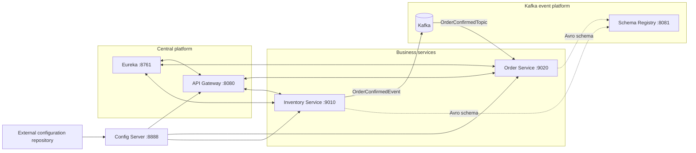
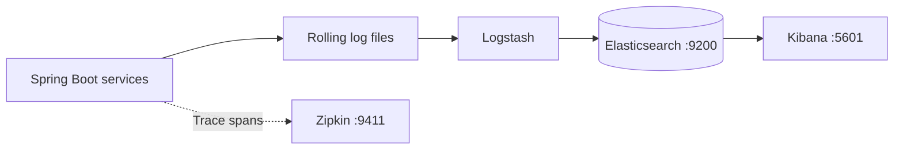

# Event-Driven E-commerce Application

## Introduction

This project is a Spring Boot e-commerce system built with a microservices
architecture. It demonstrates centralized configuration, service discovery,
gateway authentication, resilient HTTP communication, event-driven order
processing with Kafka and Avro, distributed tracing, and centralized logging.

The [learning journal](learnings/README.md) contains the chronological
implementation history, code examples, debugging notes, and detailed technical
explanations.

## Prerequisites

- Java 21
- Docker Desktop with Docker Compose v2
- PostgreSQL with `inventoryDB` and `orderDB` databases
- External service configuration; use the
  [configuration repository](https://github.com/shubhgaur37/ecommerce-config-server)
  as the sample

## Components

| Component | Responsibility | Local port |
|---|---|---:|
| API Gateway | Routes requests and applies gateway filters | `8080` |
| Config Server | Loads configuration from the external [configuration repository](https://github.com/shubhgaur37/ecommerce-config-server) | `8888` |
| Eureka | Registers and discovers application services | `8761` |
| Inventory Service | Owns products and stock and publishes confirmation events | `9010` |
| Order Service | Owns orders and consumes confirmation events | `9020` |
| Kafka | Transports events; host applications use `localhost:29092` | `29092` |
| Schema Registry | Stores Avro schemas | `8081` |
| Kafbat | Provides a Kafka management UI | `8085` |
| Elasticsearch | Stores aggregated application logs over HTTPS | `9200` |
| Kibana | Provides log search and visualization | `5601` |
| Zipkin | Displays distributed traces | `9411` |

The API Gateway currently uses Spring Boot's default port because no
`server.port` override is configured. Inventory uses the `/inventory` context
path, and order uses `/orders`.

## Architecture



## How order processing works

The configuration property `features.event_driven_order_flow.enabled` selects
the active flow:

- **Synchronous:** Order Service reserves stock through OpenFeign and then
  saves the confirmed order.
- **Event-driven:** Inventory Service reserves stock and publishes an Avro
  `OrderConfirmedEvent`; Order Service consumes the event and saves the order.

The synchronous inventory call is protected by a Resilience4J circuit breaker.
Kafka messages use Avro schemas generated from
`src/main/resources/avro/order-confirmed-event.avsc` and resolved through
Schema Registry.

## Distributed logging and tracing



Logback writes rolling service logs that Logstash sends to Elasticsearch for
searching in Kibana. Micrometer Observation and Brave propagate trace context
across HTTP and Kafka boundaries and report spans to Zipkin.

Zipkin is not included in the current Compose files. Run a local installation
or container on its default port, `9411`:

```bash
docker run -d --name zipkin -p 9411:9411 openzipkin/zipkin
```

The Zipkin UI is available at <http://localhost:9411>. In Kibana, create the
data view `ecommerce-spring-boot-logs-*` to inspect aggregated service logs.

## Basic configuration

Create an untracked `.env` file in the repository root:

```dotenv
ELASTIC_PASSWORD=choose-a-local-elastic-password
KIBANA_PASSWORD=choose-a-local-kibana-system-password
GIT_REPO_TOKEN=your-config-repository-read-token
```

If Config Server is launched from a terminal, export the token first:

```bash
export GIT_REPO_TOKEN='your-config-repository-read-token'
```

For an IDE launch, add `GIT_REPO_TOKEN` to the Config Server run configuration.
Do not commit real credentials.

The external configuration repository supplies database connections, context
paths, gateway routes, Eureka settings, management endpoints, and feature
flags. Each client imports its configuration from:

```properties
spring.config.import=configserver:http://localhost:8888
```

## Run the project

### 1. Start Kafka and Schema Registry

```bash
docker compose -f docker-compose.kafka.yml up -d
```

> **TODO:** Include the Kafbat configuration in this source repository and
> replace the machine-specific mount in `docker-compose.kafka.yml` with a
> repository-relative path.

### 2. Start ELK and Zipkin

```bash
docker compose up -d
docker run -d --name zipkin -p 9411:9411 openzipkin/zipkin
```

If Zipkin is already installed or running, only ensure it is available at
`http://localhost:9411`.

### 3. Start the Spring services

Use either IntelliJ IDEA run configurations or the Maven wrapper. In both
cases, start the services in the order shown below. When using Maven, run each
command in a separate terminal:

```bash
cd config-server && ./mvnw spring-boot:run
cd discovery-service && ./mvnw spring-boot:run
cd order-service && ./mvnw spring-boot:run
cd inventory-service && ./mvnw spring-boot:run
cd api-gateway && ./mvnw spring-boot:run
```

### 4. Verify the services

| Check | URL |
|---|---|
| Config Server | <http://localhost:8888/order-service/default> |
| Eureka dashboard | <http://localhost:8761> |
| Schema Registry | <http://localhost:8081> |
| Kafbat | <http://localhost:8085> |
| Kibana | <http://localhost:5601> |
| Zipkin | <http://localhost:9411> |


## Stop the project

```bash
docker compose down
docker compose -f docker-compose.kafka.yml down
docker stop zipkin
```
