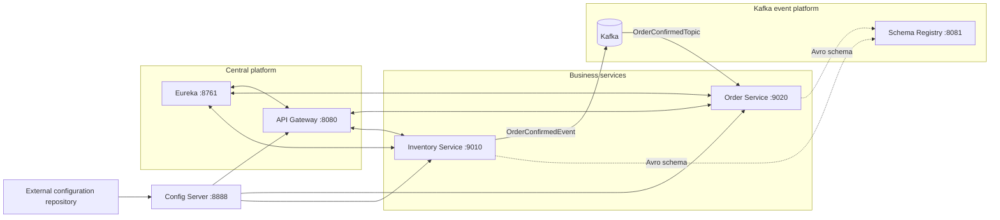
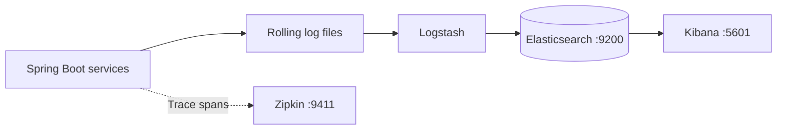

# Event-Driven E-commerce Application

## Introduction

This project is a Spring Boot e-commerce system built with a microservices
architecture. It demonstrates centralized configuration, service discovery,
gateway authentication, resilient HTTP communication, event-driven order
processing with Kafka and Avro, distributed tracing, and centralized logging.

The [learning journal](learnings/README.md) contains the chronological
implementation history, code examples, debugging notes, and detailed technical
explanations.

## Prerequisites

- Java 21 and Docker Desktop with Docker Compose v2
- Git credentials used by Config Server: `GIT_USERNAME` and `GIT_REPO_TOKEN`
- Elasticsearch credentials: `ELASTIC_PASSWORD` and `KIBANA_PASSWORD`
- The external
  [configuration repository](https://github.com/shubhgaur37/ecommerce-config-server)
  with these profile files:
  - `application.properties`
  - `application-prod.properties`
  - `inventory-service.properties`
  - `inventory-service-prod.properties`
  - `order-service.properties`
  - `order-service-prod.properties`
  - `api-gateway.yml`

The default files configure applications running on the host. The `*-prod`
files override Eureka, Zipkin, and database addresses with Docker service names
when `SPRING_PROFILES_ACTIVE=prod`.

## Architecture



## How order processing works

The property `features.event_driven_order_flow.enabled` selects the active
flow:

- **Synchronous:** Order Service reserves stock through OpenFeign and saves the
  confirmed order.
- **Event-driven:** Inventory Service reserves stock and publishes an Avro
  `OrderConfirmedEvent`; Order Service consumes the event and saves the order.

The synchronous inventory call is protected by a Resilience4J circuit breaker.
Kafka records use classes generated from
`src/main/resources/avro/order-confirmed-event.avsc` and schemas resolved
through Schema Registry.

## Distributed logging and tracing



Logstash sends rolling application logs to Elasticsearch for inspection in
Kibana. Micrometer Observation and Brave propagate trace context across HTTP
and Kafka and report spans to Zipkin.

## Container ports

The root `docker-compose.yml` includes the Kafka and ELK Compose files. Only
ports listed in the **Host port** column are reachable through `localhost`.

| Service | Container port | Host port |
|---|---:|---:|
| API Gateway | `8080` | `8080` |
| Config Server | `8888` | — |
| Eureka | `8761` | — |
| Inventory Service | `9010` | — |
| Order Service | `9020` | — |
| Kafka internal listener | `9092` | — |
| Kafka host listener | `29092` | `29092` |
| Schema Registry | `8081` | `8081` |
| Kafbat | `8080` | `8085` |
| Zipkin | `9411` | `9411` |
| Elasticsearch | `9200` | `9200` |
| Kibana | `5601` | `5601` |
| Product PostgreSQL | `5432` | `5433` |
| Order PostgreSQL | `5432` | `5434` |

Config Server, Eureka, Inventory Service, Order Service, and Logstash are
available only to other containers on the Compose network. External requests
enter through the API Gateway.

## Run with Docker (`prod` profile)

### 1. Export required configuration

Run these in the shell that will start Docker Compose:

```bash
export GIT_USERNAME='your-git-username'
export GIT_REPO_TOKEN='your-config-repository-token'
export ELASTIC_PASSWORD='your-elastic-password'
export KIBANA_PASSWORD='your-kibana-system-password'
```

Do not commit real credentials. You may alternatively place them in an
untracked local `.env` file for Docker Compose.

### 2. Build the application images

Build each image from its service directory. The tags must match the image
names in `docker-compose.yml`:

```bash
cd config-server
docker build -t config_server:1.0 .

cd ../discovery-service
docker build -t discovery_service:1.0 .

cd ../inventory-service
docker build -t inventory_service:1.0 .

cd ../order-service
docker build -t order_service:1.0 .

cd ../api-gateway
docker build -t api_gateway:1.0 .
```

### 3. Start the complete platform

Return to the e-commerce repository root. Stop any previous deployment, then
start the current one:

```bash
docker compose down
docker compose up -d
```

The services may take some time to download dependencies, initialize
databases, register with Eureka, and become ready.

Check overall status:

```bash
docker compose ps
```

Follow an individual service while it starts:

```bash
docker compose logs -f order-service
```

Replace `order-service` with another Compose service name when troubleshooting
that service. Press `Ctrl+C` to stop following logs without stopping the
container.

### 4. Open the exposed services

| Service | URL |
|---|---|
| API Gateway | <http://localhost:8080> |
| Schema Registry | <http://localhost:8081> |
| Kafbat | <http://localhost:8085> |
| Zipkin | <http://localhost:9411> |
| Elasticsearch | <http://localhost:9200> |
| Kibana | <http://localhost:5601> |

Product PostgreSQL is available at `localhost:5433`; order PostgreSQL is at
`localhost:5434`. In Kibana, create the data view
`ecommerce-spring-boot-logs-*` to inspect service logs.

## Run applications locally

### 1. Start supporting infrastructure

From the repository root, start Kafka/Schema Registry/Kafbat and the ELK stack:

```bash
docker compose -f docker-compose.kafka.yml up -d
docker compose -f docker-compose.elk.yml up -d
```

Ensure local PostgreSQL databases named `inventoryDB` and `orderDB` are running
on port `5432`. For tracing, also run Zipkin on its default port:

```bash
docker run -d --name zipkin -p 9411:9411 openzipkin/zipkin
```

### 2. Run the Spring applications

Use a separate terminal for each service and start them in this order:

```bash
cd config-server && ./mvnw spring-boot:run
cd discovery-service && ./mvnw spring-boot:run
cd order-service && ./mvnw spring-boot:run
cd inventory-service && ./mvnw spring-boot:run
cd api-gateway && ./mvnw spring-boot:run
```

The local configuration defaults to Config Server at `localhost:8888`, Kafka
at `localhost:29092`, Schema Registry at `localhost:8081`, Eureka at
`localhost:8761`, and Zipkin at `localhost:9411`.

## Stop the project

For the complete Docker deployment:

```bash
docker compose down
```

For locally run applications, stop the Java processes and then stop their
supporting infrastructure:

```bash
docker compose -f docker-compose.kafka.yml down
docker compose -f docker-compose.elk.yml down
docker stop zipkin
```
