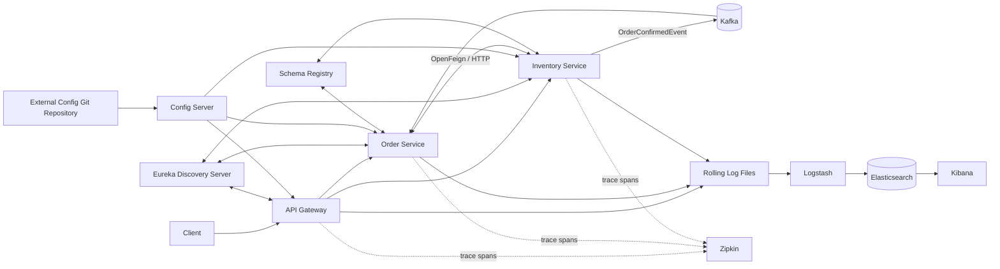
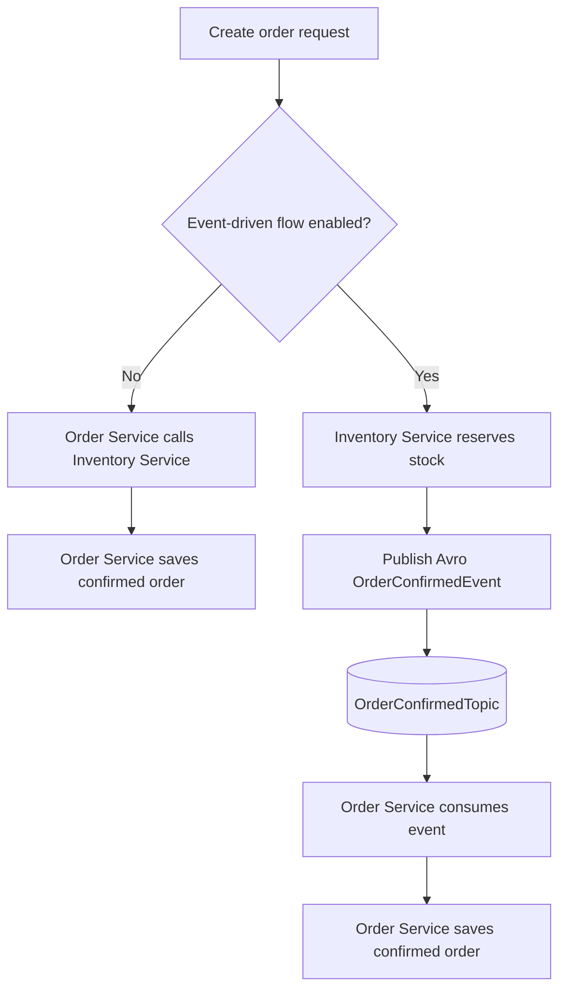

# Event-Driven E-commerce Application

## Introduction

This repository is a learning-oriented e-commerce microservices system built
with Java 21, Spring Boot, Spring Cloud, PostgreSQL, Apache Kafka, Avro, and a
Docker-based observability stack. It supports both synchronous and event-driven
order creation and demonstrates service discovery, centralized configuration,
gateway filters and authentication, resilience, distributed tracing, and
centralized logging.

The implementation was developed incrementally. The detailed, chronological
record of those changes and the lessons behind them lives in
[`learnings/README.md`](learnings/README.md).

## Architecture



### Components

| Component | Responsibility |
|---|---|
| `api-gateway` | Routes external traffic, applies global/route logging filters, validates JWTs, and forwards user identity. |
| `config-server` | Serves configuration from the external [`ecommerce-config-server`](https://github.com/shubhgaur37/ecommerce-config-server) repository on port `8888`. |
| `discovery-service` | Runs the Eureka registry on port `8761`. |
| `inventory-service` | Owns products and stock, reserves inventory, and publishes order-confirmation events. |
| `order-service` | Owns orders, calls inventory through OpenFeign, applies Resilience4J, and consumes order-confirmation events. |
| Kafka and Schema Registry | Transport and govern asynchronous event contracts; Avro-specific records are generated from `.avsc` schemas. |
| ELK | Logstash ingests rolling service logs into Elasticsearch; Kibana provides search and visualization. |
| Zipkin | Receives trace data from Micrometer Observation/Brave across HTTP and Kafka boundaries. |

### Order flows

The external feature flag `features.event_driven_order_flow.enabled` selects
the active flow.



## Technology stack

- Java 21 and Spring Boot 3.3.4
- Spring Cloud 2023.0.3: Config, Eureka, Gateway, and OpenFeign
- Spring Data JPA and PostgreSQL
- Resilience4J
- Apache Kafka, Confluent Schema Registry, and Apache Avro
- Micrometer Observation, Brave, and Zipkin
- Elasticsearch, Logstash, Kibana, and Docker Compose

## Prerequisites

- JDK 21
- Docker Desktop with Docker Compose v2
- PostgreSQL databases for the inventory and order services
- Git and access to the external configuration repository
- A Git token with read access to that repository
- One terminal per Spring service, or equivalent IDE run configurations

Create an untracked `.env` file at the repository root:

```dotenv
ELASTIC_PASSWORD=choose-a-local-elastic-password
KIBANA_PASSWORD=choose-a-local-kibana-system-password
GIT_REPO_TOKEN=your-config-repository-read-token
```

Compose automatically reads the ELK variables. A Config Server launched from a
terminal needs `GIT_REPO_TOKEN` exported into that process; an IDE launch needs
the same variable in its run configuration. Never commit real credentials. If
a credential reaches Git history, rotate it immediately—deleting it from the
latest version does not invalidate earlier commits or clones.

The external configuration repository supplies environment-specific values
such as service ports, gateway routes, database credentials, Eureka settings,
management endpoints, JWT configuration, and feature flags.

## Running the project

### Kafka platform

Start Kafka, Schema Registry, and Kafbat UI:

```bash
docker compose -f docker-compose.kafka.yml up -d
```

- Host-run Spring services connect to Kafka at `localhost:29092`.
- Docker containers connect to Kafka at `broker:9092`.
- Schema Registry is available at <http://localhost:8081>.
- Kafbat UI is available at <http://localhost:8085>.

`docker-compose.kafka.yml` currently contains a host-specific bind mount for
the Kafbat configuration. Change that path for your machine before starting
the stack.

### ELK platform

Start Elasticsearch, the one-time Kibana setup container, Logstash, and Kibana:

```bash
docker compose up -d
docker compose ps
```

Open Kibana at <http://localhost:5601>. Elasticsearch is exposed with a local
self-signed certificate at <https://localhost:9200>. In Kibana, create the data
view `ecommerce-spring-boot-logs-*` and use **Discover** to inspect service
logs. Logstash reads `logs/*/application-*.log` using
`elk-config/logstash.conf`.

### Spring services

Start the applications in dependency order, using a separate terminal for
each command:

```bash
cd config-server && ./mvnw spring-boot:run
cd discovery-service && ./mvnw spring-boot:run
cd order-service && ./mvnw spring-boot:run
cd inventory-service && ./mvnw spring-boot:run
cd api-gateway && ./mvnw spring-boot:run
```

Verify configuration before starting clients:

```bash
curl http://localhost:8888/order-service/default
```

The Eureka dashboard is at <http://localhost:8761>. Other application ports
and routes come from the external configuration repository.

## Configuration and runtime notes

- Config clients keep only their application name, Config Server import, and
  local Kafka client settings in this repository.
- Refresh-scoped feature values can be reloaded with each affected service's
  `POST /actuator/refresh` endpoint when that endpoint is exposed externally.
- Both order and inventory must receive a consistent feature-flag value.
- Avro classes are generated from each service's
  `src/main/resources/avro/order-confirmed-event.avsc` during Maven's
  `generate-sources` phase.
- Kafka topic names, key types, serializers, deserializers, schema-registry
  URL, and event schema must agree on both sides.
- The local Kafka and Elasticsearch deployments use one node and relaxed local
  TLS/networking choices; they are not production topologies.

## Build and verification

Run tests for each Maven module:

```bash
for service in config-server discovery-service order-service inventory-service api-gateway; do
  (cd "$service" && ./mvnw test)
done
```

Validate the Compose definitions after setting the required environment values:

```bash
docker compose config -q
docker compose -f docker-compose.kafka.yml config -q
```

Stop the platforms without deleting persisted Elasticsearch data:

```bash
docker compose down
docker compose -f docker-compose.kafka.yml down
```

Use `docker compose down -v` only when you intentionally want to delete the
ELK named volume and its indexed data.

## Repository structure

```text
.
├── api-gateway/
├── config-server/
├── discovery-service/
├── inventory-service/
├── order-service/
├── elk-config/
├── learnings/
├── docker-compose.yml
└── docker-compose.kafka.yml
```

## Learning journal

See [`learnings/README.md`](learnings/README.md) for the detailed chronological
development history, design lessons, debugging discoveries, and production
considerations derived from the commits in this repository.
