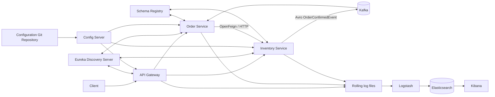
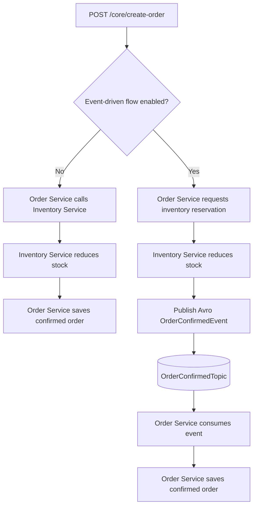
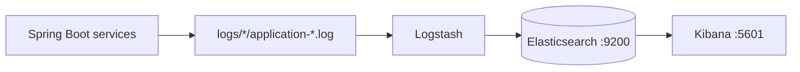

# Event-Driven E-commerce Platform

## Introduction

This repository demonstrates an e-commerce platform built as independently
deployable Spring Boot microservices. It supports synchronous and event-driven
order processing and includes service discovery, centralized configuration,
gateway authentication, resilience, schema-governed Kafka events, distributed
tracing, and centralized logging.

The project is intentionally incremental and learning-oriented, but its design
focuses on real distributed-system concerns: service ownership, partial
failure, runtime configuration, event contracts, trace propagation, and
operational visibility.

For the implementation history, debugging discoveries, and code examples, see
the [learning journal](learnings/README.md).

## Project highlights

- Five independent Java 21/Spring Boot applications.
- Eureka-based discovery and load-balanced service routing.
- Spring Cloud Config backed by an external Git repository.
- API Gateway filters for request logging and JWT authentication.
- OpenFeign communication protected by a Resilience4J circuit breaker.
- Feature-flagged synchronous and event-driven order workflows.
- Kafka events serialized with Avro and governed through Schema Registry.
- Trace propagation across HTTP and Kafka with Micrometer and Brave.
- Rolling application logs ingested by Logstash and searchable in Kibana.
- Docker Compose environments for Kafka infrastructure and the ELK stack.

## Architecture



### Service responsibilities

| Component | Responsibility |
|---|---|
| `api-gateway` | Routes requests through Eureka, applies request filters, validates JWTs, and forwards authenticated user identity. |
| `config-server` | Serves centralized configuration from the external configuration repository on port `8888`. |
| `discovery-service` | Runs the Eureka service registry on port `8761`. |
| `inventory-service` | Owns products and stock, reserves inventory, and publishes order-confirmation events. |
| `order-service` | Owns orders, calls inventory through OpenFeign, applies circuit breaking, and consumes confirmation events. |
| Kafka and Schema Registry | Transport asynchronous events and manage their Avro schemas. |
| Elasticsearch, Logstash, and Kibana | Aggregate, index, and expose application logs. |

Each business service owns its persistence model and PostgreSQL database. No
database is shared across the order and inventory service boundaries.

## Order processing

The external property `features.event_driven_order_flow.enabled` switches
between the two implemented workflows.



The event-driven path decouples final order persistence from the inventory
request. The current implementation remains a learning example: a production
version should add a stable event ID, idempotent consumption, transactional
outbox publishing, and retry/dead-letter policies.

## Technology stack

| Area | Technologies |
|---|---|
| Language and runtime | Java 21, Spring Boot 3.3.4 |
| Microservices | Spring Cloud 2023.0.3, Eureka, Config Server, Gateway, OpenFeign |
| Persistence | Spring Data JPA, Hibernate, PostgreSQL |
| Resilience | Resilience4J circuit breaker |
| Messaging | Apache Kafka, Spring Kafka, Apache Avro, Confluent Schema Registry |
| Observability | Micrometer Observation, Brave, Zipkin reporter, Logback, ELK |
| Local infrastructure | Docker, Docker Compose, Kafbat UI |

## Centralized configuration

The Config Server reads from the external
[`ecommerce-config-server`](https://github.com/shubhgaur37/ecommerce-config-server)
repository. Environment-specific values—including ports, database settings,
Eureka clients, gateway routes, JWT settings, management endpoints, and feature
flags—belong there.

Each client keeps only the bootstrap information needed to retrieve its remote
configuration:

```properties
spring.application.name=order-service
spring.config.import=configserver:http://localhost:8888
```

The Config Server receives its Git token from the launch environment:

```yaml
password: ${GIT_REPO_TOKEN}
```

Confirm that configuration is available before starting dependent services:

```bash
curl http://localhost:8888/order-service/default
```

### Runtime refresh and feature flags

The feature configuration bean uses `@RefreshScope`. After changing and
pushing configuration, refresh both services participating in the order-flow
protocol:

```bash
curl -X POST http://localhost:<order-service-port>/actuator/refresh
curl -X POST http://localhost:<inventory-service-port>/actuator/refresh
```

The refresh endpoint must be exposed in the relevant remote configuration.
Refreshing only one service can leave order and inventory following different
versions of the workflow.

## Kafka and Avro event contracts

Inventory declares two topics with three partitions and a replication factor
of one:

- `OrderCreatedItemsTopic` is a string-message demonstration used to explore
  consumer groups and record metadata.
- `OrderConfirmedTopic` carries the Avro `OrderConfirmedEvent` used by the
  event-driven order flow.

One replica matches the local single-broker environment and is not a
production fault-tolerance configuration.

### Avro contract

Both business services include
`src/main/resources/avro/order-confirmed-event.avsc`. The Avro Maven plugin
generates `OrderConfirmedEvent` and `OrderRequestItem` in the
`com.codingshuttle.ecommerce.events` namespace.

Inventory publishes using:

```properties
spring.kafka.producer.key-serializer=org.apache.kafka.common.serialization.LongSerializer
spring.kafka.producer.value-serializer=io.confluent.kafka.serializers.KafkaAvroSerializer
spring.kafka.producer.properties.schema.registry.url=http://localhost:8081
```

Order consumes generated specific records using:

```properties
spring.kafka.consumer.key-deserializer=org.apache.kafka.common.serialization.LongDeserializer
spring.kafka.consumer.value-deserializer=io.confluent.kafka.serializers.KafkaAvroDeserializer
spring.kafka.consumer.properties.schema.registry.url=http://localhost:8081
spring.kafka.consumer.properties.specific.avro.reader=true
```

Producer and consumer schemas must remain compatible. The duplicated schema is
acceptable for this learning repository; a shared, versioned contract artifact
or one authoritative schema source would reduce production drift risk.

### Consumer behavior

Different consumer groups receive independent copies of a record. Consumers
inside one group divide the group's assigned partitions. The order service uses
separate groups to demonstrate both behaviors.

`spring.kafka.consumer.auto-offset-reset=earliest` applies only when a consumer
group has no valid committed offset. It does not rewind an existing group; use
a new group or explicitly reset offsets when replay is required.

## Gateway security and service resilience

### API Gateway filters

The gateway implements three filters:

| Filter | Scope | Behavior |
|---|---|---|
| `GlobalLoggingFilter` | All gateway traffic | Logs the request URI before routing and response status afterward. |
| `LoggingOrdersFilter` | Configured routes | Adds route-specific request logging. |
| `AuthenticationGatewayFilterFactory` | Configured routes | Validates a Bearer JWT and forwards its subject through `X-User-Id`. |

Gateway routes are stored in the external configuration repository and use
Eureka-backed destinations such as `lb://order-service`.

Authentication at the edge is safe only when clients cannot bypass the gateway
and spoof forwarded identity headers. JWT signing secrets must be injected as
secrets and never committed.

### Circuit breaker

The order service protects its synchronous inventory call with the implemented
Resilience4J circuit breaker:

```java
@CircuitBreaker(
    name = "inventoryCircuitBreaker",
    fallbackMethod = "createOrderFallback"
)
public OrderRequestDto createOrder(OrderRequestDto orderRequestDto) {
    // reserve inventory and persist the order
}
```

Its thresholds and health exposure belong in the external order-service
configuration. Retry and rate-limiter annotations appear only as commented
experiments in the source and are not presented as active capabilities.

## Observability

### Distributed tracing

Gateway, order, and inventory include Micrometer/Brave tracing dependencies and
Zipkin reporting support. Kafka producer and listener observations are enabled
to propagate trace context across asynchronous boundaries:

```properties
spring.kafka.template.observation-enabled=true
spring.kafka.listener.observation-enabled=true
```

Trace headers are binary metadata and may be sensitive. They should not be
blindly converted and logged in production.

### Centralized logging



Logback writes rolling, service-specific log files. Logstash mounts `./logs`
read-only and indexes matching events under:

```text
ecommerce-spring-boot-logs-YYYY.MM.dd
```

Create the following Kibana data view and open **Discover**:

```text
ecommerce-spring-boot-logs-*
```

The local Elasticsearch deployment uses HTTPS with a self-signed certificate.
`elk-config/logstash.conf` disables certificate verification for local
development; production environments should validate a trusted certificate.

## Running locally

### Prerequisites

- JDK 21
- Docker Desktop with Docker Compose v2
- PostgreSQL databases for order and inventory
- Git access to the external configuration repository
- A read token for that repository
- Separate terminals or IDE run configurations for the Spring applications

Create an untracked `.env` file in the repository root:

```dotenv
ELASTIC_PASSWORD=choose-a-local-elastic-password
KIBANA_PASSWORD=choose-a-local-kibana-system-password
GIT_REPO_TOKEN=your-config-repository-read-token
```

Docker Compose reads the ELK values automatically. A Config Server launched
from a terminal needs `GIT_REPO_TOKEN` exported into that process. An IDE-run
Config Server needs the same variable in its run configuration.

Never commit real credentials. If a token reaches Git history, revoke or rotate
it immediately; removing it from the latest file does not remove it from prior
commits, clones, or forks.

### Start Kafka and Schema Registry

```bash
docker compose -f docker-compose.kafka.yml up -d
docker compose -f docker-compose.kafka.yml ps
```

| Service | Address |
|---|---|
| Kafka from host applications | `localhost:29092` |
| Kafka inside the Docker network | `broker:9092` |
| Schema Registry | <http://localhost:8081> |
| Kafbat UI | <http://localhost:8085> |

`docker-compose.kafka.yml` currently contains a machine-specific Kafbat bind
mount. Update that path before running it on another workstation.

### Start the ELK stack

```bash
docker compose up -d
docker compose ps
```

Kibana is available at <http://localhost:5601>. Elasticsearch is exposed at
<https://localhost:9200>. A command-line health check needs `-k` for the local
self-signed certificate:

```bash
curl -k -u "elastic:$ELASTIC_PASSWORD" https://localhost:9200
```

The one-time `setup` container waits for Elasticsearch, configures the
`kibana_system` password, and exits successfully before Kibana starts.

### Start the Spring services

Run the applications in dependency order, using a separate terminal for each:

```bash
cd config-server && ./mvnw spring-boot:run
cd discovery-service && ./mvnw spring-boot:run
cd order-service && ./mvnw spring-boot:run
cd inventory-service && ./mvnw spring-boot:run
cd api-gateway && ./mvnw spring-boot:run
```

The Eureka dashboard is available at <http://localhost:8761>. Service ports and
gateway routes are supplied by the external configuration repository.

### Stop local infrastructure

```bash
docker compose down
docker compose -f docker-compose.kafka.yml down
```

The ELK named volume is retained. Use `docker compose down -v` only when you
intentionally want to delete indexed Elasticsearch data.

## Build and verification

Run each module's tests:

```bash
for service in config-server discovery-service order-service inventory-service api-gateway; do
  (cd "$service" && ./mvnw test)
done
```

Validate the Compose definitions after setting the required environment values:

```bash
docker compose config -q
docker compose -f docker-compose.kafka.yml config -q
```

Follow Logstash while verifying log ingestion:

```bash
docker compose logs -f logstash
```

## Repository structure

```text
.
├── api-gateway/             Gateway application and filters
├── config-server/           Git-backed Spring Cloud Config Server
├── discovery-service/      Eureka server
├── inventory-service/      Inventory domain and Kafka producer
├── order-service/          Order domain and Kafka consumer
├── elk-config/             Logstash pipeline configuration
├── learnings/              Chronological engineering journal
├── docker-compose.yml      Elasticsearch, Logstash, Kibana, and setup
└── docker-compose.kafka.yml Kafka, Schema Registry, and Kafbat
```

## Learning journal

The [learning journal](learnings/README.md) documents the commits authored for
this project in sequence, including relevant snippets, debugging observations,
design trade-offs, and improvements identified for production use.
