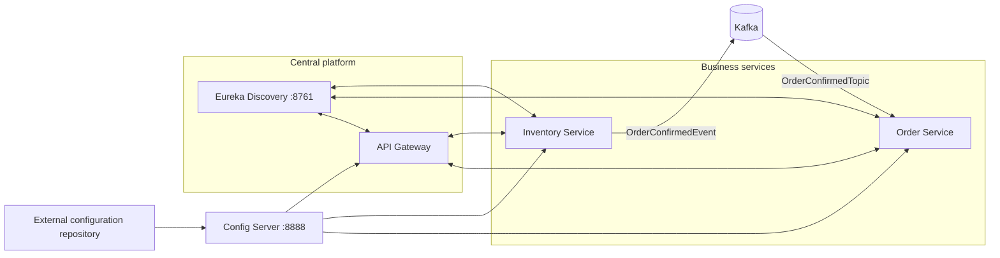
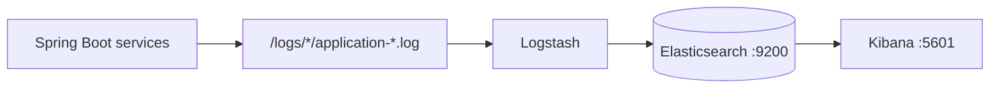
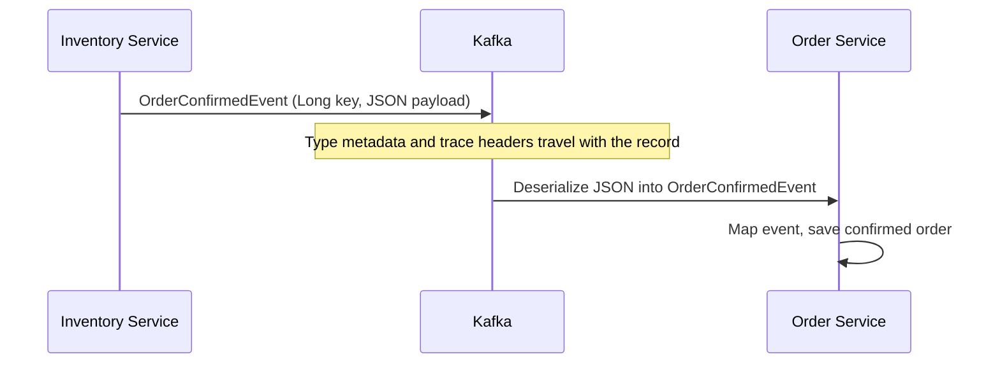

# Event-Driven E-commerce Application

An event-driven Spring Boot e-commerce system built with Spring Cloud, Kafka,
and Docker-based observability. It demonstrates synchronous and asynchronous
order flows, centralized configuration, runtime feature toggles, tracing, and
ELK log aggregation.

## What is in this repository

| Area                      | Implementation                                              | Purpose                                                                                                                    |
|---------------------------|-------------------------------------------------------------|----------------------------------------------------------------------------------------------------------------------------|
| Service discovery         | `discovery-service` (Eureka, port `8761`)                   | Lets services register and locate one another.                                                                             |
| Centralized configuration | `config-server` (port `8888`)                               | Serves configuration from the separate [configuration repository](https://github.com/shubhgaur37/ecommerce-config-server). |
| Edge service              | `api-gateway`                                               | Spring Cloud Gateway with logging and JWT-related filters.                                                                 |
| Business services         | `inventory-service`, `order-service`                        | Inventory and order APIs, PostgreSQL/JPA support, and OpenFeign clients.                                                   |
| Event messaging           | Apache Kafka                                                | Inventory publishes order-item events; order service consumes them in independent consumer groups.                         |
| Distributed tracing       | Micrometer Observation, Brave, Zipkin reporter dependencies | Propagates trace context across HTTP and Kafka when observation is enabled.                                                |
| Log aggregation           | Elasticsearch, Logstash, Kibana                             | Reads local service log files and makes them searchable in Kibana.                                                         |

## Architecture at a glance



The request and event paths are shown separately below, keeping service setup
and runtime behavior easy to follow.

### Log aggregation and Observability



The ELK containers communicate over the Compose `elk` network using service
names such as `elasticsearch`; `localhost` is only for access from your host
machine.

To view application logs in Kibana, create a data view that matches the
Elasticsearch index configured in [`elk-config/logstash.conf`](elk-config/logstash.conf):

```text
ecommerce-spring-boot-logs-*
```

Logstash creates daily indexes using the pattern
`ecommerce-spring-boot-logs-%{+YYYY.MM.dd}`. After creating the data view,
open **Discover** in Kibana to search the aggregated service logs.

## Prerequisites

- Docker Desktop with Docker Compose v2
- Java version compatible with the Maven projects (the projects use Spring
  Boot `3.2.5`)
- A reachable configuration Git repository and a token that can read it
- PostgreSQL instances/settings supplied through the configuration repository
  for the order and inventory services

Create a local `.env` file in the repository root. It is intentionally not a
place to commit real credentials.

```dotenv
ELASTIC_PASSWORD=choose-a-local-elastic-password
KIBANA_PASSWORD=choose-a-local-kibana-system-password
GIT_REPO_TOKEN=your-read-token-for-the-config-repository
```

`docker-compose.yml` consumes the first two values. The Config Server consumes
`GIT_REPO_TOKEN` when it clones/reads its configured Git repository. The token
must be available to the Config Server process, but how it is supplied depends
on how the service is started:

- **IntelliJ IDEA:** configure the run configuration to load the repository's
  `.env` file; IntelliJ passes its values to the application process.
- **Terminal:** export the variable before starting the Config Server:

```bash
export GIT_REPO_TOKEN='your-read-token-for-the-config-repository'
```

## Credential safety

The local ELK passwords can be kept in `.env` for this learning setup. Never
place a GitHub access token, private key, or production credential in a tracked
file. `GIT_REPO_TOKEN` should be supplied as an environment variable when the
Config Server starts, or injected by a secret manager in a deployed
environment.

If an access token reaches a commit, revoke or rotate it immediately. Removing
it from the latest file does **not** remove it from Git history, cloned
repositories, or remote forks; history cleanup and a forced push may also be
needed. Scan before pushing with a secret-scanning tool such as Gitleaks,
GitHub secret scanning, or your CI provider's equivalent.

## Run the ELK stack with Docker Compose

Start the log platform from the repository root:

```bash
docker compose up -d
docker compose ps
```

Open Kibana at <http://localhost:5601>. Elasticsearch is exposed over HTTPS at
<https://localhost:9200>; it uses a local self-signed certificate, so command
line checks need `-k`.

```bash
curl -k -u "elastic:$ELASTIC_PASSWORD" https://localhost:9200
```

The Compose services have the following responsibilities:

1. `elasticsearch` runs as a single-node local cluster and persists data in
   the named `elastic_search_data` Docker volume.
2. `setup` waits for Elasticsearch, then sets the `kibana_system` password.
   It is expected to exit successfully after this one-time initialization.
3. `kibana` starts only after `setup` finishes successfully.
4. `logstash` mounts `elk-config/logstash.conf` and the local `./logs`
   directory read-only, tails `application-*.log` files, and indexes events as
   `ecommerce-spring-boot-logs-YYYY.MM.dd`.

In Kibana, create a data view matching:

```text
ecommerce-spring-boot-logs-*
```

Then use **Discover** to search the application logs. `docker compose logs -f
logstash` is useful while confirming that files are being read and indexed.

Stop the stack while keeping indexed data:

```bash
docker compose down
```

To intentionally discard the local Elasticsearch data as well:

```bash
docker compose down -v
```

## Run the Spring services

Run each service from its own directory using the Maven wrapper. The order is
important because the order, inventory, and gateway applications import their
configuration from the Config Server at startup.

```bash
cd config-server && ./mvnw spring-boot:run
cd discovery-service && ./mvnw spring-boot:run
cd order-service && ./mvnw spring-boot:run
cd inventory-service && ./mvnw spring-boot:run
cd api-gateway && ./mvnw spring-boot:run
```

Use a separate terminal for each command. Confirm the Config Server can return
an application's configuration before starting clients:

```bash
curl http://localhost:8888/order-service/default
```

The Eureka dashboard is available at <http://localhost:8761>. Application
ports, routes, database connections, Eureka-client settings, and management
endpoint exposure may be supplied by the external configuration repository,
not by the small bootstrap configuration stored here.

## Centralized configuration

`config-server/src/main/resources/application.yml` enables Spring Cloud Config
Server and points it at the
[`ecommerce-config-server`](https://github.com/shubhgaur37/ecommerce-config-server)
Git repository. Each config client identifies itself using
`spring.application.name` and imports:

```properties
spring.config.import=configserver:http://localhost:8888
```

For example, `order-service` requests its `order-service` configuration from
the Config Server. This keeps environment-specific service configuration out
of the application source repositories. A service cannot start normally if it
cannot resolve this required Config Server import.

## Kafka event messaging and tracing

The `features.event_driven_order_flow.enabled` feature flag selects the order
flow. When it is disabled, the order service synchronously reserves inventory
and persists the order. When enabled, it requests inventory reservation first;
after stock is reduced, inventory publishes an `OrderConfirmedEvent`, and the
order service persists the order from `OrderConfirmedTopic`.


The inventory service explicitly declares `OrderCreatedItemsTopic` and
`OrderConfirmedTopic`, each with three partitions and a replication factor of
one. Explicit topic creation avoids depending on broker auto-creation; one
replica is appropriate only for the local single-broker setup. Topic names are
externalized, so producer and consumer properties must resolve to the same
topic name.

`OrderCreatedItemsTopic` remains a simple string-message demonstration. The
order service consumes it through two independent groups:

- `order-service-logger` records the message in application logs.
- `order-service` prints the message and record metadata for troubleshooting.

Different consumer groups each receive a copy of a record. Consumers in the
same group share partitions and divide the work.

### JSON event contracts

`OrderConfirmedEvent` is published with a `Long` key and JSON value. The
producer uses `LongSerializer` and Spring Kafka's `JsonSerializer`; the order
consumer uses the matching `LongDeserializer` and `JsonDeserializer`.



Spring's JSON deserializer accepts type metadata only from trusted packages.
Because `inventory-service` and `order-service` are separate Maven modules and
do not currently depend on a shared event-contract module,
`OrderConfirmedEvent` is declared in **both** services. The consumer-side copy
deliberately uses the same fully qualified class name as the producer-side
copy:

```text
com.codingshuttle.ecommerce.inventory_service.events.OrderConfirmedEvent
```

Spring Kafka's producer adds that class name to the `__TypeId__` header. Keeping
the same package and class name on the consumer classpath lets the JSON
deserializer resolve the type. The consumer was also refactored to receive the
typed event, map its `items` and `totalPrice`, set the order status to
`CONFIRMED`, and persist the resulting order.

The order service supplies the matching consumer configuration:

```properties
spring.kafka.consumer.key-deserializer=org.apache.kafka.common.serialization.LongDeserializer
spring.kafka.consumer.value-deserializer=org.springframework.kafka.support.serializer.JsonDeserializer
spring.kafka.consumer.properties.spring.json.trusted.packages=com.codingshuttle.ecommerce.*
```

The trusted-package property is required because `JsonDeserializer` does not
instantiate classes named by message headers unless their package is trusted.
Keep this scope as narrow as practical; setting it to a global `*` would allow
arbitrary packages and weaken that deserialization safeguard. Duplicating the
class is acceptable for this learning project, but a production system should
move the event and its nested contract types into a dedicated, versioned
module shared by producers and consumers.

### Database and event consistency

`KafkaTemplate.send()` is asynchronous: calling it does not prove that Kafka
has accepted the event, and seeing a record only after the inventory method
returns does not make the database update and Kafka publish atomic. A failed
asynchronous publish after the stock transaction commits can leave stock
reduced without an `OrderConfirmedEvent`. Use the outbox pattern in production:
write the business update and an outbox record in one database transaction,
then publish that record reliably in a separate step.

### Connecting to the local broker

Services run directly on the host, so they use the host-facing Kafka listener:

```properties
spring.kafka.bootstrap-servers=localhost:29092
```

Containers on the Docker network must instead use the internal listener (for
example, `broker:9092`). `broker` is resolvable only inside that Docker network;
from a host process it is not a valid broker address. This is why local Kafka
setups commonly advertise separate host and Docker listeners.

### Consumer offsets: the important caveat

The order service configures:

```properties
spring.kafka.consumer.auto-offset-reset=earliest
```

`earliest` applies only when a consumer group has no committed offset for a
partition. It does not rewind an existing group. If a group has already
started at `latest` (or has consumed records), changing this property later
will not replay earlier events. For a deliberate replay in local development,
use a new group ID or explicitly reset that group's offsets with Kafka tooling.

### Kafka trace propagation

Both services enable Micrometer Observation for Kafka templates and listeners:

```properties
spring.kafka.template.observation-enabled=true
spring.kafka.listener.observation-enabled=true
```

With the existing Micrometer/Brave/Zipkin dependencies and tracing exporter
configuration, these settings create producer and consumer observations and
propagate trace context in Kafka headers. The order service receives a
`ConsumerRecord` in one listener so its value, topic, partition, offset,
timestamp, and headers can be inspected while troubleshooting. Header values
are binary data in general, so production logging should avoid blindly
rendering sensitive or non-text headers.

## Refresh scope: update configuration without a restart

`FeaturesEnableConfig` and `ProductService` are annotated with `@RefreshScope`.
The controller reads the refresh-scoped configuration bean, so it does not need
its own `@RefreshScope` annotation. The feature flag and sample variable are
externally supplied properties:

```properties
my.variable=...
features.event_driven_order_flow.enabled=false
```

The `/core/helloOrders` endpoint reflects the current values. The same flag
must be refreshed consistently in order and inventory services: order uses it
to choose the request path, while inventory uses it to decide whether to emit
`OrderConfirmedEvent`. To test a refresh:

1. Change and push the relevant service configuration in the
   [external configuration repository](https://github.com/shubhgaur37/ecommerce-config-server).
2. Ensure the affected service exposes the Spring Boot Actuator refresh endpoint
   (typically `management.endpoints.web.exposure.include=refresh`).
3. Trigger the refresh on each affected running service:

   ```bash
   curl -X POST http://localhost:<order-service-port>/actuator/refresh
   curl -X POST http://localhost:<inventory-service-port>/actuator/refresh
   ```

4. Call `GET /core/helloOrders` again. The refreshed `my.variable` and
   feature flag are used without restarting the service.

`@RefreshScope` recreates the scoped bean on refresh, so its injected `@Value`
properties do not remain stale. The service ports are externalized and should
be taken from the configuration repository or service startup logs.

## API Gateway configuration and filters

`api-gateway` is a Config Server client. The committed configuration only sets
its application name and Config Server import; routes, JWT settings, and
environment-specific gateway configuration are expected in the external
configuration repository.

| Component                            | Scope                                  | Current behavior                                                                                                                                                                                 |
|--------------------------------------|----------------------------------------|--------------------------------------------------------------------------------------------------------------------------------------------------------------------------------------------------|
| `GlobalLoggingFilter`                | Every gateway request                  | Logs the request URI before routing and the response status after completion. Its order is `5`.                                                                                                  |
| `LoggingOrdersFilter`                | A route that declares `LoggingOrders`  | Logs the request URI before forwarding.                                                                                                                                                          |
| `AuthenticationGatewayFilterFactory` | A route that declares `Authentication` | When `enabled`, requires an `Authorization: Bearer <JWT>` header, validates it with `jwt.secretKey`, and adds `X-User-Id` to the forwarded request. A missing header returns `401 Unauthorized`. |
| `OrdersService` circuit breaker      | Order-to-inventory Feign call          | The active `inventoryCircuitBreaker` invokes `createOrderFallback` when the inventory call fails.                                                                                                |

Here is a representative gateway configuration to place in the external
`api-gateway` configuration. Filter names are derived from the factory class
names with `GatewayFilterFactory` removed.

```yaml
spring:
  cloud:
    gateway:
      routes:
        - id: orders
          uri: lb://order-service
          predicates:
            - Path=/orders/**
          filters:
            - name: Authentication
              args:
                enabled: true
            - name: LoggingOrders

jwt:
  secretKey: ${JWT_SECRET_KEY}
```

`lb://order-service` resolves instances through service discovery. Store
`JWT_SECRET_KEY` outside this repository and make sure it is long enough for
the JWT signing algorithm in use.

### Circuit breaker and rate limiting

Circuit breaking is currently implemented in `order-service`, not at the
gateway. The active annotation is:

```java
@CircuitBreaker(name = "inventoryCircuitBreaker", fallbackMethod = "createOrderFallback")
```

Its instance configuration belongs in the external `order-service`
configuration, for example:

```yaml
resilience4j:
  circuitbreaker:
    instances:
      inventoryCircuitBreaker:
        sliding-window-size: 10
        minimum-number-of-calls: 5
        failure-rate-threshold: 50
        wait-duration-in-open-state: 10s
        permitted-number-of-calls-in-half-open-state: 3
```

The `@RateLimiter` and `@Retry` annotations in `OrdersService` are present but
currently commented out, so their configuration has no runtime effect. To
enable the service-side rate limiter, uncomment the annotation and configure a
matching `inventoryRateLimiter` instance:

```yaml
resilience4j:
  ratelimiter:
    instances:
      inventoryRateLimiter:
        limit-for-period: 20
        limit-refresh-period: 1s
        timeout-duration: 0s
```

Gateway request rate limiting is not yet wired into this repository. A typical
production setup uses Spring Cloud Gateway's `RequestRateLimiter` filter with
Redis and a `KeyResolver` (for example, user ID or client IP). That requires a
Redis service and the reactive Redis dependency before adding this route
configuration:

```yaml
filters:
  - name: RequestRateLimiter
    args:
      redis-rate-limiter.replenishRate: 10
      redis-rate-limiter.burstCapacity: 20
      key-resolver: "#{@userKeyResolver}"
```

This keeps rate limiting at the edge, while the active service-side circuit
breaker protects the order service from a failing inventory service.

## Learnings from the incremental commits

This project was built one capability at a time. The following section
consolidates the main lessons from those commits so they can be reviewed
without reconstructing the Git history.

### Service boundaries and synchronous communication

- **Start with explicit service ownership.** Order and inventory keep their
  own controllers, DTOs, persistence models, and databases. A microservice
  boundary is useful only when data and responsibilities are not silently
  shared through implementation classes.
- **Discovery removes fixed service locations.** Eureka allows clients and the
  gateway to address an application by service name instead of maintaining a
  list of host-and-port pairs.
- **OpenFeign makes HTTP calls convenient, not reliable.** A declarative
  client reduces boilerplate, but the remote call can still time out, fail, or
  partially complete. Failure behavior must be designed explicitly.
- **Resilience policies serve different purposes.** A circuit breaker prevents
  repeated calls to an unhealthy dependency, retries handle selected transient
  failures, and rate limiters protect capacity. Enabling all three without
  understanding their interaction can amplify traffic or hide failures.

### Gateway, filters, and authentication

- **Global and route filters have different scope.** A global filter observes
  every request, while a named `GatewayFilterFactory` runs only on routes that
  declare it. Filter order determines when logging, authentication, and routing
  behavior execute.
- **Authentication at the edge must pass identity safely.** The gateway
  validates the bearer token before adding `X-User-Id`; downstream services
  should trust that header only when direct, unauthenticated access to them is
  prevented.
- **Circuit breaking and edge rate limiting solve different problems.** The
  current circuit breaker protects the order-to-inventory dependency. Gateway
  rate limiting would additionally require a key strategy and shared state
  such as Redis.

### Centralized configuration and refresh scope

- **Bootstrap configuration must remain local.** A client needs its
  `spring.application.name` and Config Server import before it can retrieve the
  rest of its configuration.
- **External configuration introduces startup dependencies.** Config clients
  cannot start normally until the Config Server can reach its Git repository,
  so startup order, repository access, and credentials are operational
  concerns.
- **`@RefreshScope` belongs on the bean holding refreshed values.** Refreshing
  recreates that scoped bean; callers such as controllers do not also require
  the annotation merely because they inject it.
- **A distributed feature flag must be consistent.** Both order and inventory
  participate in the event-driven order flow. Refreshing only one service can
  leave them following different protocols.

### Kafka messaging and event contracts

- **Topics, serializers, and deserializers form one contract.** Producer and
  consumer must agree on the topic name, key type, value format, and event
  shape. A `LongSerializer`/`JsonSerializer` producer therefore needs the
  corresponding `LongDeserializer`/`JsonDeserializer` consumer.
- **Consumer groups control delivery and progress.** Different groups each
  receive a record; instances in one group divide partitions. Offsets belong
  to the group and partition, not to a particular application instance.
- **`auto-offset-reset=earliest` is not a replay switch.** It applies only when
  the group has no committed offset. Use a new group or explicitly reset
  offsets when a local replay is intended.
- **Spring JSON type headers couple the consumer to a Java type name.** In the
  current design, `OrderConfirmedEvent` exists in both Maven modules with the
  same fully qualified name so the consumer can resolve the producer's
  `__TypeId__`. The consumer must also trust that package. A shared, versioned
  contract module—or an explicitly mapped schema-based contract—is a cleaner
  production design.
- **Trust only the required deserialization packages.** The current
  `com.codingshuttle.ecommerce.*` scope permits this project's event class.
  Trusting every package with `*` removes an important defense against
  untrusted type metadata.
- **Publishing after a database update is not atomic.** An asynchronous Kafka
  send and a database transaction can succeed independently. The transactional
  outbox pattern closes the gap when reliable event publication is required.
- **Observability crosses asynchronous boundaries through headers.** Enabling
  observation on both `KafkaTemplate` and listeners propagates trace context,
  but application logging must treat arbitrary Kafka headers as binary and
  potentially sensitive.

### Logging and distributed observability

- **Correlation matters more than isolated log lines.** Trace and span IDs
  connect gateway, service-to-service HTTP, and Kafka activity into one request
  story.
- **Structured, service-specific log files simplify ingestion.** Logback writes
  each application's rolling files below `logs/`; Logstash tails those mounts
  and sends events to date-based Elasticsearch indexes for Kibana discovery.
- **Tracing and logging complement each other.** Zipkin explains request and
  span timing, while Elasticsearch retains searchable application context and
  errors.

### Docker, networking, and secrets

- **Compose service discovery is network-local.** Containers on the same
  custom network use service names such as `elasticsearch` or `broker`;
  processes on the host use published ports such as `localhost:9200` or
  `localhost:29092`.
- **Named volumes and bind mounts have different lifecycles.** The
  `elastic_search_data` volume preserves indexed data, while Logstash receives
  repository-owned configuration and logs through read-only bind mounts.
- **Startup order is not readiness.** The one-time `setup` container checks
  Elasticsearch readiness before configuring Kibana. `depends_on` by itself
  only controls container start ordering unless paired with a health condition.
- **Secrets should enter through the launch environment.** Compose reads local
  values from `.env`; an IDE-run Java process needs those values configured in
  its run configuration, and a terminal-run process needs them exported.
- **Removing a leaked secret from the latest file is insufficient.** Rotate it
  immediately and clean Git history where necessary because earlier commits,
  clones, and forks may still contain it.
- **Local TLS shortcuts are not production defaults.** Disabling certificate
  verification can be acceptable for this self-signed learning environment,
  but deployed systems should validate certificates.

## Useful development checks

```bash
# Validate resolved Docker Compose syntax (requires the environment values).
docker compose config -q

# Follow the ELK pipeline.
docker compose logs -f logstash

# Run one service's tests.
cd order-service && ./mvnw test
```

## Repository layout

```text
api-gateway/        Gateway filters and gateway application
config-server/      Git-backed Spring Cloud Config Server
discovery-service/  Eureka Server
elk-config/         Logstash pipeline configuration
inventory-service/  Inventory API and order-service Feign client
logs/               Runtime logs consumed by Logstash (generated locally)
order-service/      Order API, Feign client, and refresh-scope example
docker-compose.yml  Elasticsearch, Logstash, Kibana, and setup container
```
