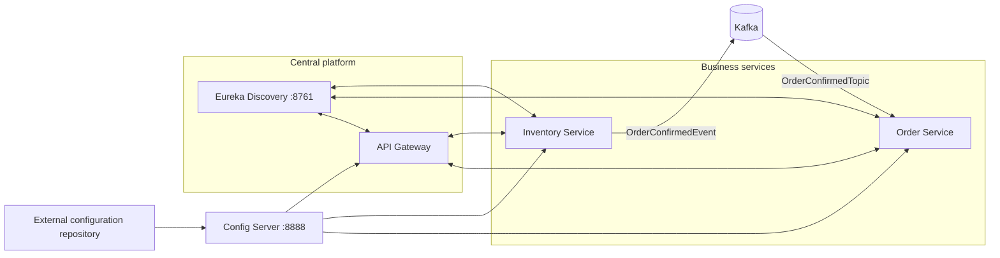
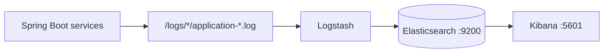
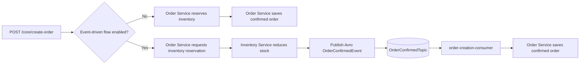

# Event-Driven E-commerce Application

An event-driven Spring Boot e-commerce system built with Spring Cloud, Kafka,
and Docker-based observability. It demonstrates synchronous and asynchronous
order flows, centralized configuration, runtime feature toggles, tracing, and
ELK log aggregation.

The chronological implementation notes and code examples are maintained separately in
[`learnings/README.md`](learnings/README.md).

## What is in this repository

| Area                      | Implementation                                              | Purpose                                                                                                                    |
|---------------------------|-------------------------------------------------------------|----------------------------------------------------------------------------------------------------------------------------|
| Service discovery         | `discovery-service` (Eureka, port `8761`)                   | Lets services register and locate one another.                                                                             |
| Centralized configuration | `config-server` (port `8888`)                               | Serves configuration from the separate [configuration repository](https://github.com/shubhgaur37/ecommerce-config-server). |
| Edge service              | `api-gateway`                                               | Spring Cloud Gateway with logging and JWT-related filters.                                                                 |
| Business services         | `inventory-service`, `order-service`                        | Inventory and order APIs, PostgreSQL/JPA support, and OpenFeign clients.                                                   |
| Event messaging           | Apache Kafka                                                | Inventory publishes order-item events; order service consumes them in independent consumer groups.                         |
| Distributed tracing       | Micrometer Observation, Brave, Zipkin reporter dependencies | Propagates trace context across HTTP and Kafka when observation is enabled.                                                |
| Log aggregation           | Elasticsearch, Logstash, Kibana                             | Reads local service log files and makes them searchable in Kibana.                                                         |

## Architecture at a glance



The request and event paths are shown separately below, keeping service setup
and runtime behavior easy to follow.

### Log aggregation and Observability



The ELK containers communicate over the Compose `elk` network using service
names such as `elasticsearch`; `localhost` is only for access from your host
machine.

To view application logs in Kibana, create a data view that matches the
Elasticsearch index configured in [`elk-config/logstash.conf`](elk-config/logstash.conf):

```text
ecommerce-spring-boot-logs-*
```

Logstash creates daily indexes using the pattern
`ecommerce-spring-boot-logs-%{+YYYY.MM.dd}`. After creating the data view,
open **Discover** in Kibana to search the aggregated service logs.

## Prerequisites

- Docker Desktop with Docker Compose v2
- Java version compatible with the Maven projects (the projects use Spring
  Boot `3.2.5`)
- A reachable configuration Git repository and a token that can read it
- PostgreSQL instances/settings supplied through the configuration repository
  for the order and inventory services

Create a local `.env` file in the repository root. It is intentionally not a
place to commit real credentials.

```dotenv
ELASTIC_PASSWORD=choose-a-local-elastic-password
KIBANA_PASSWORD=choose-a-local-kibana-system-password
GIT_REPO_TOKEN=your-read-token-for-the-config-repository
```

`docker-compose.yml` consumes the first two values. The Config Server consumes
`GIT_REPO_TOKEN` when it clones/reads its configured Git repository. The token
must be available to the Config Server process, but how it is supplied depends
on how the service is started:

- **IntelliJ IDEA:** configure the run configuration to load the repository's
  `.env` file; IntelliJ passes its values to the application process.
- **Terminal:** export the variable before starting the Config Server:

```bash
export GIT_REPO_TOKEN='your-read-token-for-the-config-repository'
```

## Credential safety

The local ELK passwords can be kept in `.env` for this learning setup. Never
place a GitHub access token, private key, or production credential in a tracked
file. `GIT_REPO_TOKEN` should be supplied as an environment variable when the
Config Server starts, or injected by a secret manager in a deployed
environment.

If an access token reaches a commit, revoke or rotate it immediately. Removing
it from the latest file does **not** remove it from Git history, cloned
repositories, or remote forks; history cleanup and a forced push may also be
needed. Scan before pushing with a secret-scanning tool such as Gitleaks,
GitHub secret scanning, or your CI provider's equivalent.

## Run the ELK stack with Docker Compose

Start the log platform from the repository root:

```bash
docker compose up -d
docker compose ps
```

Open Kibana at <http://localhost:5601>. Elasticsearch is exposed over HTTPS at
<https://localhost:9200>; it uses a local self-signed certificate, so command
line checks need `-k`.

```bash
curl -k -u "elastic:$ELASTIC_PASSWORD" https://localhost:9200
```

The Compose services have the following responsibilities:

1. `elasticsearch` runs as a single-node local cluster and persists data in
   the named `elastic_search_data` Docker volume.
2. `setup` waits for Elasticsearch, then sets the `kibana_system` password.
   It is expected to exit successfully after this one-time initialization.
3. `kibana` starts only after `setup` finishes successfully.
4. `logstash` mounts `elk-config/logstash.conf` and the local `./logs`
   directory read-only, tails `application-*.log` files, and indexes events as
   `ecommerce-spring-boot-logs-YYYY.MM.dd`.

In Kibana, create a data view matching:

```text
ecommerce-spring-boot-logs-*
```

Then use **Discover** to search the application logs. `docker compose logs -f
logstash` is useful while confirming that files are being read and indexed.

Stop the stack while keeping indexed data:

```bash
docker compose down
```

To intentionally discard the local Elasticsearch data as well:

```bash
docker compose down -v
```

## Run the Spring services

Run each service from its own directory using the Maven wrapper. The order is
important because the order, inventory, and gateway applications import their
configuration from the Config Server at startup.

```bash
cd config-server && ./mvnw spring-boot:run
cd discovery-service && ./mvnw spring-boot:run
cd order-service && ./mvnw spring-boot:run
cd inventory-service && ./mvnw spring-boot:run
cd api-gateway && ./mvnw spring-boot:run
```

Use a separate terminal for each command. Confirm the Config Server can return
an application's configuration before starting clients:

```bash
curl http://localhost:8888/order-service/default
```

The Eureka dashboard is available at <http://localhost:8761>. Application
ports, routes, database connections, Eureka-client settings, and management
endpoint exposure may be supplied by the external configuration repository,
not by the small bootstrap configuration stored here.

## Centralized configuration

`config-server/src/main/resources/application.yml` enables Spring Cloud Config
Server and points it at the
[`ecommerce-config-server`](https://github.com/shubhgaur37/ecommerce-config-server)
Git repository. Each config client identifies itself using
`spring.application.name` and imports:

```properties
spring.config.import=configserver:http://localhost:8888
```

For example, `order-service` requests its `order-service` configuration from
the Config Server. This keeps environment-specific service configuration out
of the application source repositories. A service cannot start normally if it
cannot resolve this required Config Server import.

## Kafka event messaging, Avro, and tracing

The `features.event_driven_order_flow.enabled` feature flag selects the order
flow. When disabled, the order service synchronously reserves inventory and
persists the order. When enabled, inventory reserves stock and publishes an
Avro `OrderConfirmedEvent`; the order service consumes the event and persists
the confirmed order.



### Local Kafka platform

The repository includes `docker-compose.kafka.yml` for a single-node KRaft
Kafka broker, Confluent Schema Registry, and Kafbat UI.

```bash
docker compose -f docker-compose.kafka.yml up -d
docker compose -f docker-compose.kafka.yml ps
```

Host-run Spring services connect to `localhost:29092`. Schema Registry and
other containers use `broker:9092` because Docker service names resolve only
inside the Compose network. Schema Registry is exposed at
<http://localhost:8081>, and Kafbat is exposed at <http://localhost:8085>.

The Kafbat volume in `docker-compose.kafka.yml` currently uses a
machine-specific absolute path. Update it for your workstation before starting
the stack.

### Topics and consumer groups

Inventory explicitly declares `OrderCreatedItemsTopic` and
`OrderConfirmedTopic`, each with three partitions and replication factor one.
Explicit creation avoids broker auto-creation defaults. One replica is suitable
only for this local single-broker setup.

`OrderCreatedItemsTopic` remains a string-message demonstration. Two
independent order-service consumer groups show Kafka delivery semantics:

- `order-service-logger` receives and logs its own copy.
- `order-service` consumes the same topic and inspects record metadata.

Different groups each receive a record; consumers in the same group divide the
partitions. `auto-offset-reset=earliest` applies only when a group has no valid
committed offset—it does not rewind an existing group.

### Avro event contract

Both services contain the schema at
`src/main/resources/avro/order-confirmed-event.avsc`. Maven's
`avro-maven-plugin` generates `OrderConfirmedEvent` and
`OrderRequestItem` under `com.codingshuttle.ecommerce.events`.

Inventory publishes with:

```properties
spring.kafka.producer.key-serializer=org.apache.kafka.common.serialization.LongSerializer
spring.kafka.producer.value-serializer=io.confluent.kafka.serializers.KafkaAvroSerializer
spring.kafka.producer.properties.schema.registry.url=http://localhost:8081
```

Order consumes with:

```properties
spring.kafka.consumer.key-deserializer=org.apache.kafka.common.serialization.LongDeserializer
spring.kafka.consumer.value-deserializer=io.confluent.kafka.serializers.KafkaAvroDeserializer
spring.kafka.consumer.properties.schema.registry.url=http://localhost:8081
spring.kafka.consumer.properties.specific.avro.reader=true
```

`specific.avro.reader=true` tells the consumer to return the generated
specific record rather than a generic Avro record. Producer and consumer
schemas must remain compatible. Duplicating the schema in both modules is
acceptable for this learning project, but a shared, versioned contract artifact
or one authoritative schema source is safer.

### Database and event consistency

`KafkaTemplate.send()` is asynchronous. A database transaction that reduces
stock and a Kafka publish are not automatically atomic: stock can commit while
publishing fails. A production implementation should use a transactional
outbox, make the consumer idempotent with a stable event identifier, and define
retry/dead-letter handling.

### Kafka trace propagation

Both services enable Micrometer Observation:

```properties
spring.kafka.template.observation-enabled=true
spring.kafka.listener.observation-enabled=true
```

Together with the Micrometer, Brave, and Zipkin dependencies, these settings
create producer and consumer observations and propagate trace context in Kafka
headers. Kafka headers are binary and may be sensitive, so production logging
should not blindly render every header.

## Refresh scope: update configuration without a restart

`FeaturesEnableConfig` and `ProductService` are annotated with `@RefreshScope`.
The controller reads the refresh-scoped configuration bean, so it does not need
its own `@RefreshScope` annotation. The feature flag and sample variable are
externally supplied properties:

```properties
my.variable=...
features.event_driven_order_flow.enabled=false
```

The `/core/helloOrders` endpoint reflects the current values. The same flag
must be refreshed consistently in order and inventory services: order uses it
to choose the request path, while inventory uses it to decide whether to emit
`OrderConfirmedEvent`. To test a refresh:

1. Change and push the relevant service configuration in the
   [external configuration repository](https://github.com/shubhgaur37/ecommerce-config-server).
2. Ensure the affected service exposes the Spring Boot Actuator refresh endpoint
   (typically `management.endpoints.web.exposure.include=refresh`).
3. Trigger the refresh on each affected running service:

   ```bash
   curl -X POST http://localhost:<order-service-port>/actuator/refresh
   curl -X POST http://localhost:<inventory-service-port>/actuator/refresh
   ```

4. Call `GET /core/helloOrders` again. The refreshed `my.variable` and
   feature flag are used without restarting the service.

`@RefreshScope` recreates the scoped bean on refresh, so its injected `@Value`
properties do not remain stale. The service ports are externalized and should
be taken from the configuration repository or service startup logs.

## API Gateway configuration and filters

`api-gateway` is a Config Server client. The committed configuration only sets
its application name and Config Server import; routes, JWT settings, and
environment-specific gateway configuration are expected in the external
configuration repository.

| Component                            | Scope                                  | Current behavior                                                                                                                                                                                 |
|--------------------------------------|----------------------------------------|--------------------------------------------------------------------------------------------------------------------------------------------------------------------------------------------------|
| `GlobalLoggingFilter`                | Every gateway request                  | Logs the request URI before routing and the response status after completion. Its order is `5`.                                                                                                  |
| `LoggingOrdersFilter`                | A route that declares `LoggingOrders`  | Logs the request URI before forwarding.                                                                                                                                                          |
| `AuthenticationGatewayFilterFactory` | A route that declares `Authentication` | When `enabled`, requires an `Authorization: Bearer <JWT>` header, validates it with `jwt.secretKey`, and adds `X-User-Id` to the forwarded request. A missing header returns `401 Unauthorized`. |
| `OrdersService` circuit breaker      | Order-to-inventory Feign call          | The active `inventoryCircuitBreaker` invokes `createOrderFallback` when the inventory call fails.                                                                                                |

Here is a representative gateway configuration to place in the external
`api-gateway` configuration. Filter names are derived from the factory class
names with `GatewayFilterFactory` removed.

```yaml
spring:
  cloud:
    gateway:
      routes:
        - id: orders
          uri: lb://order-service
          predicates:
            - Path=/orders/**
          filters:
            - name: Authentication
              args:
                enabled: true
            - name: LoggingOrders

jwt:
  secretKey: ${JWT_SECRET_KEY}
```

`lb://order-service` resolves instances through service discovery. Store
`JWT_SECRET_KEY` outside this repository and make sure it is long enough for
the JWT signing algorithm in use.

### Circuit breaker and rate limiting

Circuit breaking is currently implemented in `order-service`, not at the
gateway. The active annotation is:

```java
@CircuitBreaker(name = "inventoryCircuitBreaker", fallbackMethod = "createOrderFallback")
```

Its instance configuration belongs in the external `order-service`
configuration, for example:

```yaml
resilience4j:
  circuitbreaker:
    instances:
      inventoryCircuitBreaker:
        sliding-window-size: 10
        minimum-number-of-calls: 5
        failure-rate-threshold: 50
        wait-duration-in-open-state: 10s
        permitted-number-of-calls-in-half-open-state: 3
```

The `@RateLimiter` and `@Retry` annotations in `OrdersService` are present but
currently commented out, so their configuration has no runtime effect. To
enable the service-side rate limiter, uncomment the annotation and configure a
matching `inventoryRateLimiter` instance:

```yaml
resilience4j:
  ratelimiter:
    instances:
      inventoryRateLimiter:
        limit-for-period: 20
        limit-refresh-period: 1s
        timeout-duration: 0s
```

Gateway request rate limiting is not yet wired into this repository. A typical
production setup uses Spring Cloud Gateway's `RequestRateLimiter` filter with
Redis and a `KeyResolver` (for example, user ID or client IP). That requires a
Redis service and the reactive Redis dependency before adding this route
configuration:

```yaml
filters:
  - name: RequestRateLimiter
    args:
      redis-rate-limiter.replenishRate: 10
      redis-rate-limiter.burstCapacity: 20
      key-resolver: "#{@userKeyResolver}"
```

This keeps rate limiting at the edge, while the active service-side circuit
breaker protects the order service from a failing inventory service.

## Useful development checks

```bash
# Validate resolved Docker Compose syntax (requires the environment values).
docker compose config -q

# Follow the ELK pipeline.
docker compose logs -f logstash

# Run one service's tests.
cd order-service && ./mvnw test
```

## Repository layout

```text
api-gateway/        Gateway filters and gateway application
config-server/      Git-backed Spring Cloud Config Server
discovery-service/  Eureka Server
elk-config/         Logstash pipeline configuration
inventory-service/  Inventory API and order-service Feign client
logs/               Runtime logs consumed by Logstash (generated locally)
order-service/      Order API, Feign client, and refresh-scope example
docker-compose.yml  Elasticsearch, Logstash, Kibana, and setup container
```
