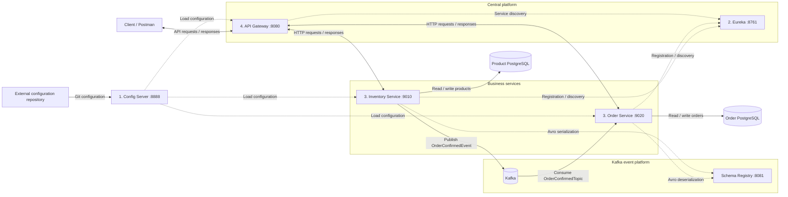
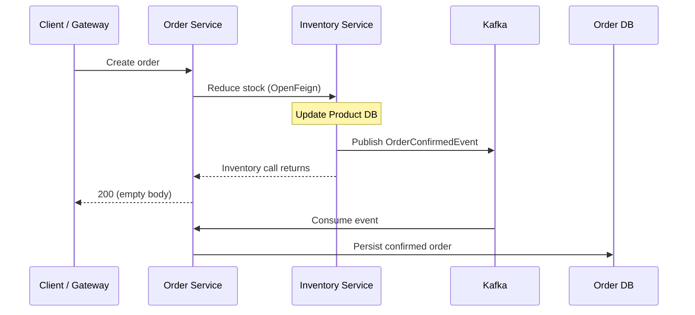
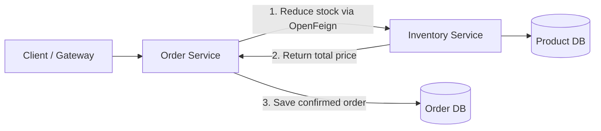
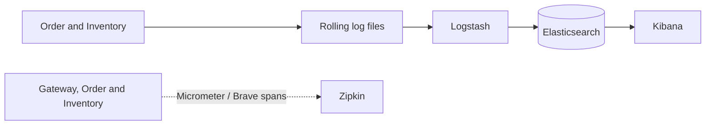

# E-commerce Microservices Platform

A Java backend combining service-owned PostgreSQL databases, Kafka-driven order
processing, and a containerized infrastructure stack. Centralized configuration,
service discovery, distributed tracing, and log aggregation support the system
across host and Docker environments.

## Architecture



**Startup order:** **1. Config Server → 2. Eureka → 3. Order and Inventory →
4. API Gateway.** Start the supporting databases, Kafka, and Schema Registry
   before the business services. Verify each stage is ready before proceeding;
   the numbers describe the recommended startup sequence, not automatic readiness
   guarantees from Compose. Client requests begin after startup.

**Arrow key:** solid lines show API, database, and event traffic; dotted lines
show configuration, discovery, and schema dependencies. Double-headed HTTP
connections represent requests and responses.

Order and Inventory own separate databases. The gateway routes client requests
through Eureka-backed service discovery; Config Server supplies shared and
environment-specific settings from Git.

## Engineering highlights

- **Event-driven persistence:** Kafka/KRaft, Avro contracts, Schema Registry, and separate consumer groups.
- **Service integration:** OpenFeign, Eureka-backed gateway routing, and Resilience4j integration in synchronous order creation.
- **Runtime configuration:** Git-backed Config Server and refresh-scoped feature flags, updated without service restarts.
- **Infrastructure and observability:** Docker Compose, environment-specific networking, PostgreSQL volumes, ELK log aggregation, and Micrometer/Brave with Zipkin.

## Order workflow

### Event-driven flow



HTTP completion and Kafka consumption run independently; their relative order
can vary.

### Synchronous flow



Order Service returns the created order after persistence. The feature flag
selects which workflow handles new requests and can be refreshed at runtime.

## Change the workflow without restarting services

**Switch between synchronous and event-driven processing without rebuilding images or restarting services.**

The flag `features.event_driven_order_flow.enabled` is managed through Config Server and applied at runtime using Actuator refresh. To update it:

1. Update `features.event_driven_order_flow.enabled` in both services' external configuration files: `true` for event mode, `false` for synchronous mode. Commit and push to `main`, accounting for any active-profile overrides.
2. Send both refresh requests in Postman or a terminal, with no body:

```bash
curl -X POST http://localhost:8080/api/v1/orders/actuator/refresh
curl -X POST http://localhost:8080/api/v1/inventory/actuator/refresh
```

3. Check the responses for changed property keys (`[]` means no changes detected). After both refreshes complete, submit a new order. `GET /api/v1/orders/core/helloOrders` also reports Order Service's flag state.

Actuator refresh reloads configuration and refresh-scoped beans pick up the new
flag. Complete both refreshes between test orders to keep the workflow consistent.

## Logging and tracing



Rolling-log pattern: `logs/${applicationName}/application-%d{yyyy-MM-dd}.%i.log`,
with `order-service` and `inventory-service` folders. Logstash reads
`/logs/*/application-*.log`.

Business-service logs include trace/span IDs and are collected from `logs/`
locally or `PROD_LOGS/` in the container setup. In Kibana, create the data view
`ecommerce-spring-boot-logs-*`. Kafka producer/listener observations and Zipkin
support following requests across service and messaging boundaries.

---

## Run details

The sections below cover prerequisites, configuration, and running the system.

---

## Prerequisites

- Docker Compose 2.20.3+ and **Postman** for API testing.
- Java 21 and PostgreSQL for local service execution; Maven Wrapper is included.
- Configuration setup: use the [configuration repository](https://github.com/shubhgaur37/ecommerce-config-server) as a template for a Git-backed Config Server, or combine the shared and service-specific properties locally as described below.
### Environment variables

Create a file named `.env` in the repository root, beside `docker-compose.yml`:

```dotenv
GIT_USERNAME=your-git-username
GIT_REPO_TOKEN=your-config-repository-token
ELASTIC_PASSWORD=choose-an-elastic-password
KIBANA_PASSWORD=choose-a-kibana-system-password
```

Docker Compose reads this file automatically. Replace the placeholders with
your Git credentials and the passwords you want to set. Keep `.env` untracked
and do not commit it.

| Variable | Purpose |
|---|---|
| `GIT_USERNAME` / `GIT_REPO_TOKEN` | Credentials supplied to Config Server for its Git backend |
| `ELASTIC_PASSWORD` | Password to set for Elasticsearch's `elastic` user; also used to sign in to Kibana |
| `KIBANA_PASSWORD` | Password to set for the internal `kibana_system` account; the setup container configures it so Kibana can connect to Elasticsearch |

**Kibana login:** open `http://localhost:5601`, use username **`elastic`**, and
enter the password you chose for **`ELASTIC_PASSWORD`**. `KIBANA_PASSWORD` is
for Kibana's internal connection, not the browser login.

For locally launched Java services, `.env` is not loaded automatically. Export
`GIT_USERNAME` and `GIT_REPO_TOKEN` in the terminal that starts Config Server,
or configure them as environment variables in your IDE.

## Run

### Configuration setup

**Git-backed configuration:** clone or fork the configuration repository, adapt
the database settings to your environment, and set
`spring.cloud.config.server.git.uri` in Config Server to your repository URL.
Provide its Git credentials through `.env` for Compose, or through terminal/IDE environment variables for local execution. The
checked-in URL can also be used directly for the supplied demo configuration.

**Local properties alternative:** merge shared `application.properties` with
each service's configuration into that service's local resources, preserving
its checked-in Kafka and bootstrap settings. For Gateway, combine the shared
properties with its `api-gateway.yml` settings. Remove the `configserver:` import
when running without Config Server. For container addresses, also apply the
shared and service-specific `prod` overrides. The Git-backed refresh walkthrough
below uses Config Server; the local-file alternative is for standalone setup.

### Start the complete system

Run all application services and supporting infrastructure together with Docker
Compose. The `prod` profile selects container addresses automatically.

#### Build images

Build the application images from the repository root:

```bash
docker build -t config_server:1.0 ./config-server
docker build -t discovery_service:1.0 ./discovery-service
docker build -t inventory_service:1.0 ./inventory-service
docker build -t order_service:1.0 ./order-service
docker build -t api_gateway:1.0 ./api-gateway
```

#### Start and inspect

Start the entire stack from the repository root:

```bash
docker compose up -d
docker compose ps -a
```

Allow services to load configuration and register with Eureka before testing. Compose startup ordering
does not itself establish readiness; inspect startup with
`docker compose logs -f order-service` or the relevant service name.

#### Stop

```bash
docker compose down
```

### Run services locally

Run Java services on the host while Kafka and ELK run in Docker. Start this
workflow separately from the complete container stack.

#### Start supporting infrastructure

```bash
docker compose -f docker-compose.kafka.yml -f docker-compose.elk.yml up -d
docker run -d --name zipkin -p 9411:9411 openzipkin/zipkin
```

Create two databases in your local PostgreSQL instance on port `5432`:
`inventoryDB` and `orderDB`. Set the datasource username and password in the
configuration repository to match your local PostgreSQL credentials.

**For local runs, leave `SPRING_PROFILES_ACTIVE` and `CONFIG_SERVER_URL` unset**
in the terminal or IDE. The applications use the default profile and connect
to Config Server at `http://localhost:8888` automatically. Docker Compose sets
`SPRING_PROFILES_ACTIVE=prod` and `CONFIG_SERVER_URL=http://config-server:8888`
for containerized runs; do not copy these settings into your local run configuration.

If these variables were previously exported in your terminal, clear them before
starting the local services:

```bash
unset SPRING_PROFILES_ACTIVE CONFIG_SERVER_URL
```

#### Start application services

Use a separate terminal for each command, with the repository root as the
working directory so log paths match the Logstash mount. Start Config Server,
then Eureka, then the business services and Gateway:

```bash
./config-server/mvnw -f config-server/pom.xml spring-boot:run
./discovery-service/mvnw -f discovery-service/pom.xml spring-boot:run
./inventory-service/mvnw -f inventory-service/pom.xml spring-boot:run
./order-service/mvnw -f order-service/pom.xml spring-boot:run
./api-gateway/mvnw -f api-gateway/pom.xml spring-boot:run
```

Host services use Kafka at `localhost:29092` and Schema Registry at
`localhost:8081`; containers use `broker:9092` and `schema-registry:8081`.
Eureka is available locally at `http://localhost:8761`.

#### Stop

End the Java processes and run:

```bash
docker compose -f docker-compose.kafka.yml -f docker-compose.elk.yml down
docker stop zipkin
```

### Service addresses

Each row is a separate service. Kafbat is the Kafka UI; Schema Registry is the
Avro schema API. They use the same host with different published ports.

| Service | Local workflow: host address | Complete container stack: host address | Address inside Compose |
|---|---|---|---|
| API Gateway | `http://localhost:8080` | `http://localhost:8080` | `api-gateway:8080` |
| Config Server | `http://localhost:8888` | Not published | `config-server:8888` |
| Eureka | `http://localhost:8761` | Not published | `discovery-service:8761` |
| Inventory | `http://localhost:9010/inventory` | Through Gateway | `inventory-service:9010/inventory` |
| Order | `http://localhost:9020/orders` | Through Gateway | `order-service:9020/orders` |
| Kafka | `localhost:29092` | `localhost:29092` | `broker:9092` |
| Kafbat | `http://localhost:8085` | `http://localhost:8085` | `kafbat:8080` |
| Schema Registry | `http://localhost:8081` | `http://localhost:8081` | `schema-registry:8081` |
| Zipkin | `http://localhost:9411` | `http://localhost:9411` | `zipkin:9411` |
| Elasticsearch | `http://localhost:9200` | `http://localhost:9200` | `elasticsearch:9200` |
| Kibana | `http://localhost:5601` | `http://localhost:5601` | `kibana:5601` |
| Product database | `localhost:5432/inventoryDB` | `localhost:5433/Product_Prod` | `product-db:5432/Product_Prod` |
| Order database | `localhost:5432/orderDB` | `localhost:5434/Orders_Prod` | `orders-db:5432/Orders_Prod` |

Use the host-address columns from Postman or a browser. Container-to-container
connections use Compose service names. The local Config Server entry applies
to the Git-backed setup.

## Test the APIs

In Postman, use `http://localhost:8080` with these gateway paths:

| Method | Path |
|---|---|
| GET | `/api/v1/inventory/products` |
| POST | `/api/v1/orders/core/create-order` |
| GET | `/api/v1/orders/core` |

For creation, send JSON with an existing product ID:

```json
{"items":[{"productId":1,"quantity":1}]}
```

Set `Content-Type: application/json`. Read stock and orders before and after
creation; inspect events in Kafbat and logs/traces in Kibana and Zipkin.
Gateway authentication is currently disabled for this walkthrough.

## Configuration and operations

Config Server supplies default and `prod` settings from Git. Compose passes
`CONFIG_SERVER_URL=http://config-server:8888`.

PostgreSQL and Elasticsearch use named volumes; business-service logs use bind
mounts. The current database setup uses `create-drop` and seeds inventory, so
run against disposable databases. `docker compose down` retains named volumes;
use `-v` only for an intentional data reset.

For configuration errors, inspect Config Server logs and the requested
`/{application}/{profile}` configuration. For routing failures, check Eureka
registration. For missing events or logs, inspect the relevant service,
Kafka listener address, and Logstash mount using `docker compose logs`.

## Learning

The [learning journal](learnings/README.md) records implementation decisions,
infrastructure setup, and debugging lessons from building the system.
