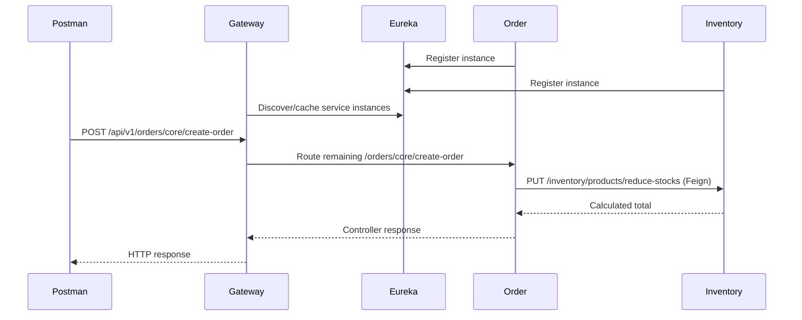
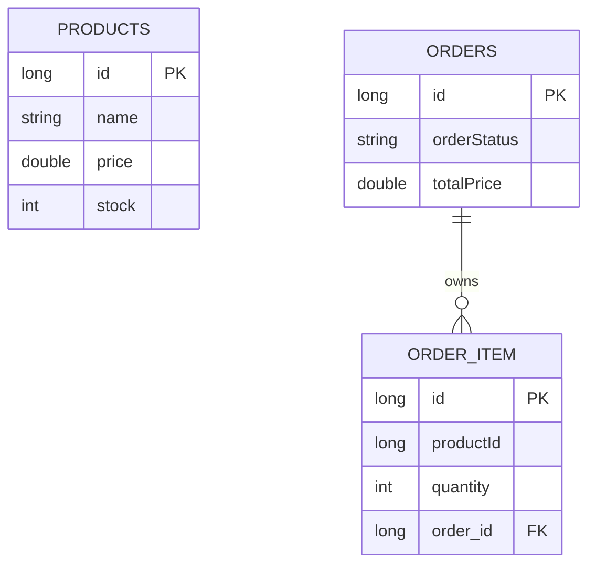
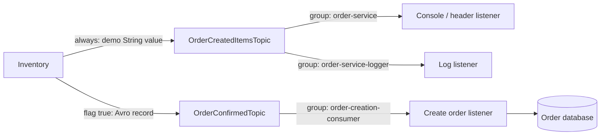
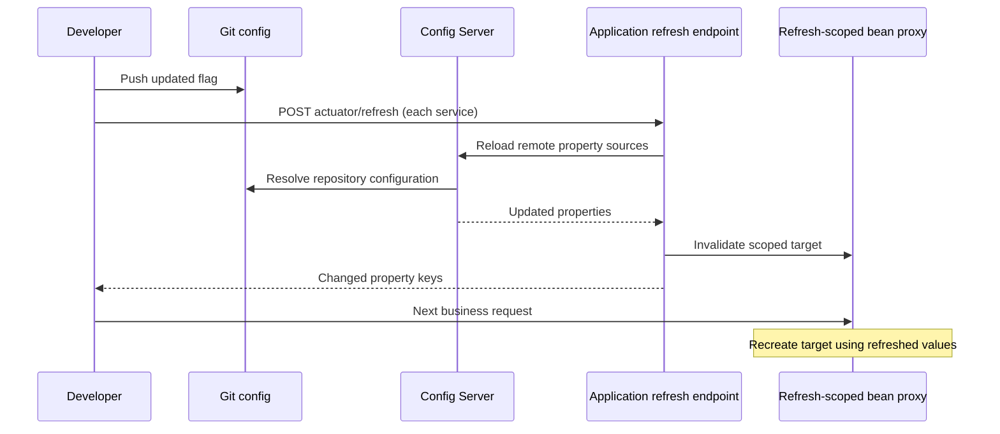
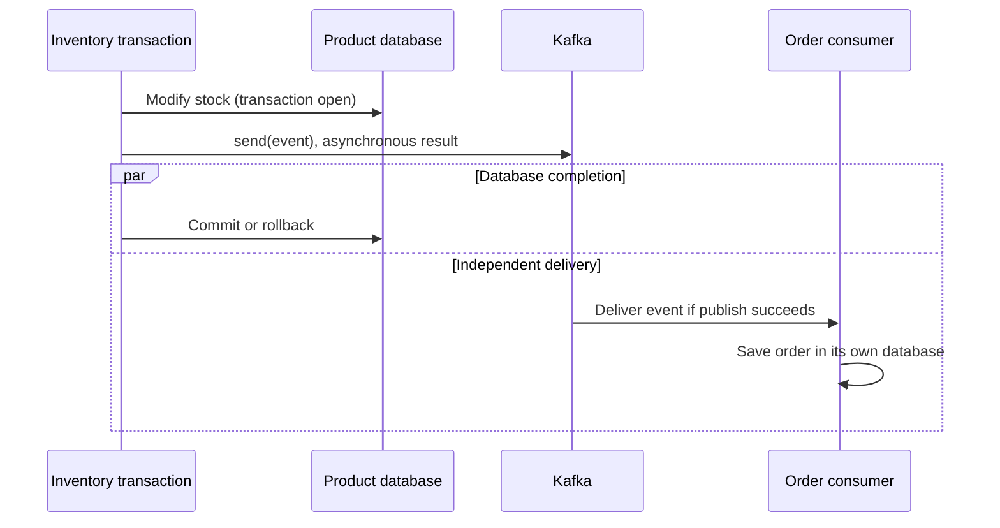
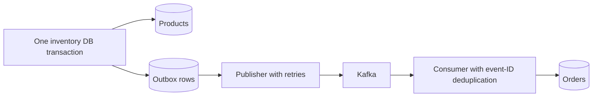
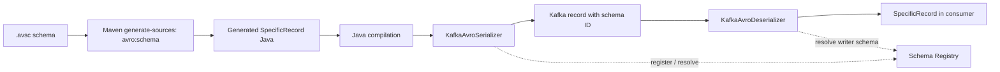
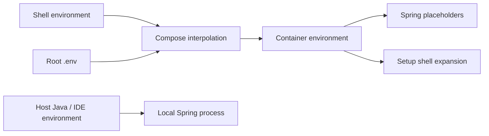
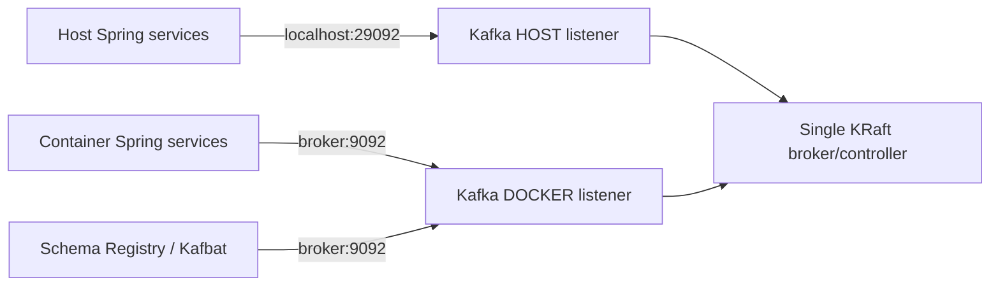
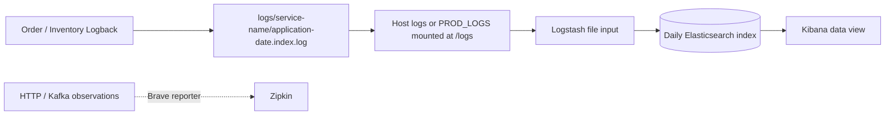

# E-commerce Project Learnings

An incremental record of configuration, messaging, persistence, and infrastructure
work in this project. Historical steps are distinguished from current behavior;
proposed improvements are labeled separately. Commit links open the corresponding
parent-to-commit comparison, and file links open the implementation.

## Contents

- [Configuration and ELK](#phase-1--hardening-configuration-and-adding-elk)
- [Kafka and event-driven flow](#phase-2--kafka-and-the-event-driven-flow)
- [Avro migration](#phase-3--migrating-event-contracts-to-avro)
- [Container infrastructure](#phase-4--containerizing-the-production-profile-deployment)
- [Implementation reference](#implementation-reference--what-each-layer-actually-does)
- [Experiments and observations](#observation-notebook--repeatable-exercises)
- [Preserved source notes](#preserved-source-notes)

## Foundation inherited before the author changes

| Commit | Existing foundation |
|---|---|
| [4e126cd](https://github.com/shubhgaur37/eCommerce/commit/4e126cd8f245f886043f877e6991e531041adf02) | Initial e-commerce services and persistence |
| [d8ea76a](https://github.com/shubhgaur37/eCommerce/compare/4e126cd8f245f886043f877e6991e531041adf02...d8ea76a3f87c469bafbbce9406f0f54f1a9a1a3b) | Eureka discovery server |
| [363088c](https://github.com/shubhgaur37/eCommerce/compare/d8ea76a3f87c469bafbbce9406f0f54f1a9a1a3b...363088ca7bf12cecbb222a17c4d1eddb5db9607b) | API Gateway |
| [96b3929](https://github.com/shubhgaur37/eCommerce/compare/363088ca7bf12cecbb222a17c4d1eddb5db9607b...96b392966da4ade9caf9444cef9d7a08cdf86872) | OpenFeign service calls |
| [c2a58cb](https://github.com/shubhgaur37/eCommerce/compare/96b392966da4ade9caf9444cef9d7a08cdf86872...c2a58cb4d0ef9cc02c117172181be798ba481ed1) | Resilience4j integration |
| [e972c26](https://github.com/shubhgaur37/eCommerce/compare/c2a58cb4d0ef9cc02c117172181be798ba481ed1...e972c26a559434b6978752c1cbcd07a257fd0f28) | Gateway filters |
| [ab61c97](https://github.com/shubhgaur37/eCommerce/compare/e972c26a559434b6978752c1cbcd07a257fd0f28...ab61c97ce54efb90f0ce55c0e7eaee89817a1280) | Gateway JWT filter |
| [8186197](https://github.com/shubhgaur37/eCommerce/compare/ab61c97ce54efb90f0ce55c0e7eaee89817a1280...8186197d4a859c444f5cf3984c5615051ef136f4) | Config Server |
| [1bb7e87](https://github.com/shubhgaur37/eCommerce/compare/8186197d4a859c444f5cf3984c5615051ef136f4...1bb7e8702c28866fe66ea62a892c01321d7755d8) | Refresh-scoped configuration |
| [068dfc0](https://github.com/shubhgaur37/eCommerce/compare/1bb7e8702c28866fe66ea62a892c01321d7755d8...068dfc0713243c7cbaea9d526845199267f6a35b) | Zipkin tracing |
| [c60f259](https://github.com/shubhgaur37/eCommerce/compare/068dfc0713243c7cbaea9d526845199267f6a35b...c60f259c39b97d56d89932adbeb1241edba027d5) | ELK/logging foundation |

These components are reviewed in the implementation reference because later
changes depend on them. Their introduction is not counted as an author change.

## Phase 1 — Hardening configuration and adding ELK

### Completing the configuration move ([03995f3](https://github.com/shubhgaur37/eCommerce/compare/c60f259c39b97d56d89932adbeb1241edba027d5...03995f332938631729b449c97c6c65919b747488), [27b4cfd](https://github.com/shubhgaur37/eCommerce/compare/03995f332938631729b449c97c6c65919b747488...27b4cfda7f873bd51cff9c4ac8d5656429bf521e))

[03995f3](https://github.com/shubhgaur37/eCommerce/compare/c60f259c39b97d56d89932adbeb1241edba027d5...03995f332938631729b449c97c6c65919b747488) removed the hard-coded `spring.profiles.active=dev` from Order
Service, added bootstrap explanations in inventory, and adjusted Gateway
formatting. The import already existed. [27b4cfd](https://github.com/shubhgaur37/eCommerce/compare/03995f332938631729b449c97c6c65919b747488...27b4cfda7f873bd51cff9c4ac8d5656429bf521e) changed the Git repository,
label `master` → `main`, and credential settings, moved the port declaration,
and removed the Config Server's explicit Eureka URL. The title "moving
configuration" should not be read as proof that every remote property moved
within this commit; the external repository is separate.

Key learnings:

- Bootstrap settings and environment settings have different lifecycles.
  Keeping only the former locally makes ownership easier to understand.
- Branch labels matter: a server pointed at `master` will not find a repository
  whose active configuration is on `main`.
- Configuration should be tested directly with
  `/{application}/{profile}` before diagnosing every downstream client.

Historical client bootstrap at [03995f3](https://github.com/shubhgaur37/eCommerce/compare/c60f259c39b97d56d89932adbeb1241edba027d5...03995f332938631729b449c97c6c65919b747488) (later externalized in [abd9cb7](https://github.com/shubhgaur37/eCommerce/compare/b0ae9a5a0947492a2c52ed02afcd8d4de1b85490...abd9cb7065bada9ac59ba14824e17f139f35a888)), in
[inventory-service/src/main/resources/application.properties](../inventory-service/src/main/resources/application.properties):

```properties
spring.application.name=inventory-service
spring.config.import=configserver:http://localhost:8888
```

Current Config Server Git backend in
[config-server/src/main/resources/application.yml](../config-server/src/main/resources/application.yml):

```yaml
server.port: 8888
spring:
  cloud:
    config:
      server:
        git:
          uri: https://github.com/shubhgaur37/ecommerce-config-server
          password: ${GIT_REPO_TOKEN}
          default-label: main
```

The resulting local service addresses are split between bootstrap configuration
in this repository and environment configuration in the external repository:

| Component | Port | Source of configuration |
|---|---:|---|
| API Gateway | `8080` | Spring Boot default; no `server.port` override is currently configured |
| Config Server | `8888` | Local `config-server/application.yml` |
| Eureka | `8761` | Local discovery-service properties |
| Inventory Service | `9010` | External `inventory-service.properties` |
| Order Service | `9020` | External `order-service.properties` |

Inventory uses the `/inventory` context path and order uses `/orders`. This is
why gateway path rewriting and downstream controller paths must be evaluated
together rather than looking only at controller annotations.

### Refresh-scope placement ([f4df81e](https://github.com/shubhgaur37/eCommerce/compare/27b4cfda7f873bd51cff9c4ac8d5656429bf521e...f4df81e9496952b8e7e1a0b6044dacc631534b5a))

This commit only added `// make this bean refreshable` beside an existing
`@RefreshScope` on `OrdersController`. It did not introduce the annotation or
move the feature flag. That distinction matters when reconstructing the work.
[24d6b92](https://github.com/shubhgaur37/eCommerce/compare/7b917cbf0c722b1a107837f3e987756cc376da8a...24d6b9232730174e1b6b29ad3ca9a4d24b9d3ccc) later removed controller refresh scope and used the existing scoped
feature bean. The current arrangement is shown below for comparison.

Current reference: [order-service/src/main/java/com/shubh/ecommerce/order_service/config/FeaturesEnableConfig.java](../order-service/src/main/java/com/shubh/ecommerce/order_service/config/FeaturesEnableConfig.java).

```java
@Configuration
@RefreshScope
public class FeaturesEnableConfig {
    @Value("${features.event_driven_order_flow.enabled}")
    private boolean eventDrivenOrderFlowEnabled;
}
```

### Config Server removed from Eureka ([8ba9f75](https://github.com/shubhgaur37/eCommerce/compare/f4df81e9496952b8e7e1a0b6044dacc631534b5a...8ba9f754f0aa8cdd8b27932d6b92c3fc631dcd25))

The Config Server's Eureka-client dependency was removed. Clients already used
the fixed bootstrap URL `http://localhost:8888`, so registration added no value
to the current topology.

Key learnings:

- Discovery-first Config Server lookup is useful when its address changes or it
  has multiple instances, but fixed-URL bootstrap is simpler locally.
- Infrastructure should not advertise capabilities the system does not use.
- Removing a client dependency also removes its transitive behavior and avoids
  confusing registration failures during startup.

The change was a dependency-level correction in [config-server/pom.xml](../config-server/pom.xml): the
Config Server retains `spring-cloud-config-server` but no longer declares
`spring-cloud-starter-netflix-eureka-client`.

### Logstash pipeline and secure Elasticsearch connection ([30194b6](https://github.com/shubhgaur37/eCommerce/compare/8ba9f754f0aa8cdd8b27932d6b92c3fc631dcd25...30194b6a65759d87f780b3eb69b502d96ae91e5c), [d34318d](https://github.com/shubhgaur37/eCommerce/compare/075965f879768c931097c28cf79b59bac8511e72...d34318d2916d46d619a75f6ada3ac0f268c7eefe))

`elk-config/logstash.conf` was created to tail service log files and emit
daily `ecommerce-spring-boot-logs-*` indexes. It was then adapted for
Elasticsearch's HTTPS endpoint and the local self-signed certificate.

Key learnings:

- A Logstash pipeline has input, optional filter, and output stages. File
  inputs maintain read position, so an unchanged file may not be reprocessed
  merely because Logstash restarts.
- Container paths must match bind-mounted paths, not host paths.
- `elasticsearch` resolves through Compose DNS inside the network; `localhost`
  inside Logstash refers to the Logstash container itself.
- Disabling certificate verification is a local-development concession. A
  production pipeline should trust and verify the correct certificate chain.

At this stage, the pipeline in `elk-config/logstash.conf` used:

```conf
input {
  file {
    path => "/logs/*/application-*.log"
  }
}

output {
  elasticsearch {
    hosts => ["https://elasticsearch:9200"]
    index => "ecommerce-spring-boot-logs-%{+YYYY.MM.dd}"
    ssl_verification_mode => "none"
  }
}
```

This HTTPS/self-signed configuration records the behavior at these commits. A
later production-preparation commit moved the file to
[infrastructure_config/logstash.conf](../infrastructure_config/logstash.conf), kept Elasticsearch authentication
enabled, and deliberately changed its internal HTTP endpoint; that current
state is documented in Phase 4.

### Compose environment and ELK orchestration ([075965f](https://github.com/shubhgaur37/eCommerce/compare/30194b6a65759d87f780b3eb69b502d96ae91e5c...075965f879768c931097c28cf79b59bac8511e72), [249324f](https://github.com/shubhgaur37/eCommerce/compare/d34318d2916d46d619a75f6ada3ac0f268c7eefe...249324f055fc198a8065c9a86f1de9288b7f862f), [89155c4](https://github.com/shubhgaur37/eCommerce/compare/249324f055fc198a8065c9a86f1de9288b7f862f...89155c4a08986678e2809ca1375e65e321e55a7e))

Environment variables and `docker-compose.yml` were added for Elasticsearch,
a one-time setup container, Logstash, and Kibana. Elasticsearch data uses a
named volume; Logstash receives its pipeline and application logs through
read-only bind mounts. The setup job waits for Elasticsearch and configures the
`kibana_system` password before Kibana starts.

Key learnings:

- Compose substitutes `${NAME}` from the shell first and then its `.env` file;
  this does not automatically inject those values into Java processes launched
  by an IDE or terminal.
- `depends_on` controls ordering, not readiness, unless paired with a health or
  completion condition. The setup script therefore performs its own readiness
  probe.
- One-shot initialization belongs in a job that can complete successfully,
  while long-running services should remain independently restartable.
- Named volumes preserve managed data across container replacement. Bind
  mounts expose host-owned files and should be read-only when mutation is not
  required.
- Kibana connects with `kibana_system`; the `elastic` superuser is reserved for
  administrative work.

The one-shot dependency is expressed in `docker-compose.yml`:

```yaml
kibana:
  depends_on:
    setup:
      condition: service_completed_successfully

setup:
  depends_on:
    elasticsearch:
      condition: service_started
```

The setup command adds its own `curl` loop because `service_started` alone does
not mean Elasticsearch is ready to accept authenticated API calls.

At this stage, Elasticsearch was exposed to the host over HTTPS with a
self-signed certificate. A direct local check therefore used:

```bash
curl -k -u "elastic:$ELASTIC_PASSWORD" https://localhost:9200
```

The `-k` flag disables certificate verification and should not become a
production default. The later ELK update switched the current Compose endpoint
to authenticated HTTP, so the present-day check no longer uses `-k` or
`https://`.

The ELK stack was started from the repository root with:

```bash
docker compose up -d
```

### Passing the Git token safely ([d4c3a61](https://github.com/shubhgaur37/eCommerce/compare/89155c4a08986678e2809ca1375e65e321e55a7e...d4c3a614395f2c14057d351e2206b629e051f859), [f9df95a](https://github.com/shubhgaur37/eCommerce/compare/d4c3a614395f2c14057d351e2206b629e051f859...f9df95a5c6cf806fc40a197e6172a8635d6ac71b))

The Config Server changed from an embedded credential to
`${GIT_REPO_TOKEN}`, and the repository documentation was created alongside
history cleanup intended to remove the exposed token.

Key learnings:

- Replacing a secret in the current file is not enough: earlier commits,
  reflogs, clones, caches, and forks may retain it.
- The first response to exposure is revocation or rotation. History rewriting
  reduces disclosure but cannot guarantee deletion from copies already made.
- Secret scanning belongs before push and in CI.
- `.env` is a local convenience, not a production secret manager, and it must
  remain untracked.

Safe indirection in [config-server/src/main/resources/application.yml](../config-server/src/main/resources/application.yml):

```yaml
password: ${GIT_REPO_TOKEN}
```

Launch examples:

```bash
export GIT_REPO_TOKEN='replace-with-a-read-only-token'
cd config-server
./mvnw spring-boot:run
```

The placeholder may be committed; the real value must not be.

## Phase 2 — Kafka and the event-driven flow

### Producer configuration deep dive ([200007f](https://github.com/shubhgaur37/eCommerce/compare/f9df95a5c6cf806fc40a197e6172a8635d6ac71b...200007f30cd476a1fac9652f85efd681b8946adb))

Spring Kafka was added to inventory with a host-facing bootstrap address and
producer properties. This established the distinction between a bootstrap
server, topic, record key, serializer, and message value.

Key learnings:

- Bootstrap servers are an entry point for metadata discovery, not necessarily
  the only broker a client will use.
- Kafka returns its advertised listener addresses to clients. Those addresses
  must be resolvable from the client's network.
- Host-run Spring applications use `localhost:29092`; containers on the Docker
  network use `broker:9092`.
- Producer key and value serializers must match the Java types sent through
  `KafkaTemplate`.

Historical configuration introduced by this phase in
[inventory-service/src/main/resources/application.properties](../inventory-service/src/main/resources/application.properties):

```properties
spring.kafka.bootstrap-servers=localhost:29092
```

At this stage the commit established only the broker connection; topic
externalization arrived in [1b1df49](https://github.com/shubhgaur37/eCommerce/compare/45c409f4edb38d1e8074e60aef0b0ec9fcdac58a...1b1df4901869d7854d1cbcd712fcc86519aed65d), and explicit serializer configuration
arrived in [c371334](https://github.com/shubhgaur37/eCommerce/compare/f13830f3dc4f5e9e9531031b3dd500343064bead...c37133474364806cb4da2e4331c2f1b69936ac15). The business event ultimately changed to a `Long` key and
an Avro value. This snippet represents the initial Kafka learning path, not the
current `OrderConfirmedEvent` settings.

### First success message ([45c409f](https://github.com/shubhgaur37/eCommerce/compare/200007f30cd476a1fac9652f85efd681b8946adb...45c409f4edb38d1e8074e60aef0b0ec9fcdac58a))

After inventory was successfully reduced, `ProductService` published a simple
Kafka message. This connected a database-side business action to asynchronous
notification.

Key learnings:

- `KafkaTemplate.send()` is asynchronous. Calling it does not itself prove the
  broker acknowledged the record; completion should be observed when delivery
  matters.
- A Spring database transaction and Kafka publish are not automatically one
  atomic operation. Stock can commit while publishing fails.
- The transactional outbox pattern addresses that gap by committing the
  business change and an outbox row together, then publishing reliably.

Historical publishing pattern after topic externalization (the first [45c409f](https://github.com/shubhgaur37/eCommerce/compare/200007f30cd476a1fac9652f85efd681b8946adb...45c409f4edb38d1e8074e60aef0b0ec9fcdac58a) send hard-coded `"OrderCreatedItems"`):

```java
kafkaTemplate.send(
    orderCreatedItemsTopicName,
    "Order Created for items: " + productNames
);
```

To observe asynchronous failure instead of ignoring it, a producer can handle
the returned future:

```java
kafkaTemplate.send(topic, message)
    .whenComplete((result, error) -> {
        if (error != null) {
            log.error("Kafka publish failed", error);
        }
    });
```

This improves visibility but still does not make the database and Kafka write
atomic.

### Explicit topic beans ([1b1df49](https://github.com/shubhgaur37/eCommerce/compare/45c409f4edb38d1e8074e60aef0b0ec9fcdac58a...1b1df4901869d7854d1cbcd712fcc86519aed65d))

Inventory gained a Kafka configuration class declaring the topic and moved the
topic name into configuration.

Key learnings:

- Explicit topic creation documents partitions and replication instead of
  relying on broker auto-creation defaults.
- A replication factor of one is suitable only for the single-broker local
  environment.
- Externalizing a topic name helps environments differ, but producer and
  consumer property names and resolved values must still agree.
- Partition count sets the upper bound on useful parallelism for one consumer
  group at a point in time.

Current reference:
[inventory-service/src/main/java/com/shubh/ecommerce/inventory_service/config/KafkaConfig.java](../inventory-service/src/main/java/com/shubh/ecommerce/inventory_service/config/KafkaConfig.java).

```java
@Bean
public NewTopic orderCreatedItemTopic() {
    return new NewTopic(orderCreatedItemsTopicName, 3, (short) 1);
}
```

### Consumers, groups, and offsets ([21eb2c2](https://github.com/shubhgaur37/eCommerce/compare/1b1df4901869d7854d1cbcd712fcc86519aed65d...21eb2c2f8f20beff82d0032a81f3328066e6deb9))

Order gained Spring Kafka consumers. Separate listeners/groups demonstrated
that different groups each receive their own copy, while members of one group
divide partitions. Both listeners initially accepted `String`; [92bc934](https://github.com/shubhgaur37/eCommerce/compare/21eb2c2f8f20beff82d0032a81f3328066e6deb9...92bc9346429334b4d2098c00fc286b483b560bf8) later changed the
console listener to `ConsumerRecord` for metadata and header inspection.

Key learnings:

- Ordering is guaranteed only within a partition, not across an entire topic.
- Offsets track a consumer group's progress per partition.
- `auto-offset-reset=earliest` applies only when the group has no valid committed
  offset. It does not rewind an existing group. For replay, reset offsets or
  use a new group ID.
- Record headers are binary and may be sensitive; diagnostic logging should not
  assume every header is safe UTF-8 text.

Illustrative listener examples matching the current roles (method names and diagnostic logging simplified), based on
[order-service/src/main/java/com/shubh/ecommerce/order_service/service/OrdersService.java](../order-service/src/main/java/com/shubh/ecommerce/order_service/service/OrdersService.java):

```java
@KafkaListener(
    topics = "${kafka.topic.OrderCreatedItemsTopic}",
    groupId = "order-service-logger"
)
public void logMessage(String message) {
    log.info("OrderCreated Logger Message: {}", message);
}

@KafkaListener(topics = "${kafka.topic.OrderCreatedItemsTopic}")
public void inspectRecord(ConsumerRecord<String, String> record) {
    log.info("topic={}, partition={}, offset={}, value={}",
        record.topic(), record.partition(), record.offset(), record.value());
}
```

With three partitions, at most three active consumers in the same group can
process this topic concurrently; additional group members remain idle.

### Trace propagation over Kafka ([92bc934](https://github.com/shubhgaur37/eCommerce/compare/21eb2c2f8f20beff82d0032a81f3328066e6deb9...92bc9346429334b4d2098c00fc286b483b560bf8))

Micrometer Observation was enabled on both `KafkaTemplate` and Kafka listeners.
This extended trace context beyond synchronous HTTP into producer and consumer
spans carried through Kafka headers.

Key learnings:

- An asynchronous consumer runs later and possibly elsewhere, so thread-local
  HTTP context cannot bridge the boundary by itself.
- Producer instrumentation injects context into headers; consumer
  instrumentation extracts it and starts related work.
- Both ends must enable compatible observation/propagation for a connected
  trace rather than unrelated spans.

Properties added to both producer and consumer applications:

```properties
spring.kafka.template.observation-enabled=true
spring.kafka.listener.observation-enabled=true
```

For each service, the setting for its active side is the relevant one:
inventory produces and order consumes. Both properties were added to both
services, but this does not create an inventory consumer or an order producer.

### Documentation consolidation ([06b73a1](https://github.com/shubhgaur37/eCommerce/compare/92bc9346429334b4d2098c00fc286b483b560bf8...06b73a121c6286563a55ee5b0c58dd84067a6da7)) and import cleanup ([f13830f](https://github.com/shubhgaur37/eCommerce/compare/06b73a121c6286563a55ee5b0c58dd84067a6da7...f13830f3dc4f5e9e9531031b3dd500343064bead))

[06b73a1](https://github.com/shubhgaur37/eCommerce/compare/92bc9346429334b4d2098c00fc286b483b560bf8...06b73a121c6286563a55ee5b0c58dd84067a6da7) changes only the main README, whose content is excluded here.
[f13830f](https://github.com/shubhgaur37/eCommerce/compare/06b73a121c6286563a55ee5b0c58dd84067a6da7...f13830f3dc4f5e9e9531031b3dd500343064bead) removes unused imports in Gateway's route filter and Order's controller,
**and changes `OrderRequestDto.totalPrice` from `BigDecimal` to `Double`**.
This is a DTO type change, not merely import cleanup. It aligns the DTO with
the existing service/entity calculations but uses binary floating-point for
money. Preserve the difference when discussing the commit.

```diff
- private BigDecimal totalPrice;
+ private Double totalPrice;
```

### Typed JSON serialization ([c371334](https://github.com/shubhgaur37/eCommerce/compare/f13830f3dc4f5e9e9531031b3dd500343064bead...c37133474364806cb4da2e4331c2f1b69936ac15))

The producer used a `LongSerializer` plus Spring's `JsonSerializer`; the order
consumer used matching deserializers. Spring's JSON type metadata and trusted
package rules became part of the event contract.

Key learnings:

- Topic, key type, value type, serializers, and deserializers must be treated as
  one end-to-end contract.
- Spring JSON may add `__TypeId__` with a fully qualified Java class name. This
  couples consumers to producer package names unless type mappings are used.
- `JsonDeserializer` rejects types outside trusted packages as a safety
  measure. Trust should be narrow; `*` removes that protection.
- Copying the same Java event class into two services can work for a learning
  project but creates drift. A shared versioned contract or schema system is
  cleaner.

Historical JSON configuration before the Avro migration:

```properties
# Inventory producer
spring.kafka.producer.key-serializer=org.apache.kafka.common.serialization.LongSerializer
spring.kafka.producer.value-serializer=org.springframework.kafka.support.serializer.JsonSerializer

# Order consumer
spring.kafka.consumer.key-deserializer=org.apache.kafka.common.serialization.LongDeserializer
spring.kafka.consumer.value-deserializer=org.springframework.kafka.support.serializer.JsonDeserializer
spring.kafka.consumer.properties.spring.json.trusted.packages=com.codingshuttle.ecommerce.*
```

The typed business template was added subsequently in [9157316](https://github.com/shubhgaur37/eCommerce/compare/24d6b9232730174e1b6b29ad3ca9a4d24b9d3ccc...9157316d24eeb37948dd55d8be7f576b90de9800):

```java
private final KafkaTemplate<Long, OrderConfirmedEvent> kafkaTemplate;
```

This entire JSON setup was superseded by [8e06d59](https://github.com/shubhgaur37/eCommerce/compare/075a2bcbb18eedc2a597747316a9eb3056f13b8f...8e06d59783800288d8377b05394cde41910d0957).

### Event-flow feature flag ([b5d5713](https://github.com/shubhgaur37/eCommerce/compare/c37133474364806cb4da2e4331c2f1b69936ac15...b5d57136579988c405ffd6c5dae9c7b843b7e2e6))

The generic feature toggle was renamed to describe its purpose:
`features.event_driven_order_flow.enabled`. The flag selected between the
existing synchronous flow and the developing event-driven flow.

Key learnings:

- Feature flags should name business behavior, not implementation trivia.
- A flag that changes a distributed protocol is not local state. If order and
  inventory disagree, one may expect an event the other never emits.
- Rollout, rollback, default values, and refresh order should be designed along
  with the flag.

Current decision point in
[order-service/src/main/java/com/shubh/ecommerce/order_service/controller/OrdersController.java](../order-service/src/main/java/com/shubh/ecommerce/order_service/controller/OrdersController.java):

```java
if (featuresEnableConfig.isEventDrivenOrderFlowEnabled()) {
    orderService.reserveInventory(orderRequestDto);
    return ResponseEntity.ok(null);
}

return ResponseEntity.ok(orderService.createOrder(orderRequestDto));
```

This also exposes a current API-design limitation: the asynchronous branch
returns `200` with a null body. A production API would usually return `202
Accepted` with an order/correlation identifier that clients can query.

### Second topic ([7b917cb](https://github.com/shubhgaur37/eCommerce/compare/b5d57136579988c405ffd6c5dae9c7b843b7e2e6...7b917cbf0c722b1a107837f3e987756cc376da8a))

`OrderConfirmedTopic` was explicitly declared alongside the earlier
`OrderCreatedItemsTopic`. The first remained useful as a string/group-learning
example; the second carried the business event that completes an order.

Key learning: topics should represent stable streams of facts. Separating the
demonstration message from the order-confirmation event avoids overloading one
topic with incompatible meanings and schemas.

Current topic declaration:

```java
@Bean
public NewTopic orderConfirmedTopic() {
    return new NewTopic(orderConfirmedTopicName, 3, (short) 1);
}
```

### Refresh-scope mechanics ([24d6b92](https://github.com/shubhgaur37/eCommerce/compare/7b917cbf0c722b1a107837f3e987756cc376da8a...24d6b9232730174e1b6b29ad3ca9a4d24b9d3ccc))

This commit removed controller refresh scope, updated the hello response to
use the renamed flag, and added the create-order branch. The branch called
`reserveInventory`, which was introduced in the following [9157316](https://github.com/shubhgaur37/eCommerce/compare/24d6b9232730174e1b6b29ad3ca9a4d24b9d3ccc...9157316d24eeb37948dd55d8be7f576b90de9800) commit;
intermediate commits should not automatically be assumed to compile independently.
The current code demonstrates which beans need `@RefreshScope`. The order service keeps
the feature flag in `FeaturesEnableConfig`, while inventory reads the same flag
inside `ProductService`:

```java
// order-service
@Configuration
@RefreshScope
public class FeaturesEnableConfig {
    @Value("${features.event_driven_order_flow.enabled}")
    private boolean eventDrivenOrderFlowEnabled;
}

// inventory-service
@Service
@RefreshScope
public class ProductService {
    @Value("${features.event_driven_order_flow.enabled}")
    private boolean eventDrivenFlowEnabled;
}
```

`OrdersController` does not need `@RefreshScope` merely because it injects
`FeaturesEnableConfig`. Spring injects a scoped proxy, and after refresh the
next call through that proxy reaches the recreated configuration bean.

Illustrative values supplied by the external configuration repository (the
inspected current defaults set the flag to `true`):

```properties
my.variable=...
features.event_driven_order_flow.enabled=false
management.endpoints.web.exposure.include=refresh
```

The management property is required for `POST /actuator/refresh` to be
available over HTTP. Exposing sensitive Actuator endpoints should be restricted
appropriately outside local development.

#### Testing configuration refresh

1. Change the relevant service configuration in the external configuration
   repository and push the change.
2. Confirm the Config Server returns the updated property source.
3. Refresh every running service that participates in the changed behavior:

```bash
curl -X POST http://localhost:8080/api/v1/orders/actuator/refresh
curl -X POST http://localhost:8080/api/v1/inventory/actuator/refresh
```

4. Call `GET /api/v1/orders/core/helloOrders` through the gateway and exercise order creation to verify that both
   services now follow the refreshed feature flag.

The gateway strips `/api/v1`. Direct host alternatives are
`http://localhost:9020/orders/actuator/refresh` and
`http://localhost:9010/inventory/actuator/refresh`; omitting the servlet context
path targets the wrong endpoint. Neither service port is published by full Compose.

`@RefreshScope` refresh is lazy: the refresh operation invalidates the scoped
target, and the next use recreates it with the new `@Value` properties. The
endpoint's response may list changed property keys, but the behavior should
still be tested.

There is an important nuance in the current code. `my.variable` is injected
directly into `OrdersController`, which is no longer refresh-scoped:

```java
public class OrdersController {
    @Value("${my.variable}")
    private String myVariable;

    private final FeaturesEnableConfig featuresEnableConfig;
}
```

Therefore the feature flag can refresh through the scoped
`FeaturesEnableConfig` proxy, but the controller's direct `my.variable` value
can remain stale. To make the sample variable refresh reliably, either move it
into `FeaturesEnableConfig` and read it through the proxy, or place the
controller itself back under `@RefreshScope`. Moving all refreshable settings
into the dedicated configuration bean keeps the lifecycle more focused.

Finally, the feature flag changes a distributed protocol: order uses it to
select the request path, while inventory uses it to decide whether to publish
`OrderConfirmedEvent`. Refreshing only one service can leave the system in an
inconsistent state, so both services must be refreshed together.

### Full event-driven order completion ([9157316](https://github.com/shubhgaur37/eCommerce/compare/24d6b9232730174e1b6b29ad3ca9a4d24b9d3ccc...9157316d24eeb37948dd55d8be7f576b90de9800))

Inventory now calculated the total, reduced stock, created an
`OrderConfirmedEvent`, and published it when the flag was enabled. Order
consumed that event, mapped items, set bidirectional entity ownership, marked
the order `CONFIRMED`, and persisted it. The same event class was temporarily
duplicated under a matching fully qualified name in both modules to satisfy
Spring JSON type resolution.

Key learnings:

- Events should describe completed facts—inventory has been reserved—rather
  than remotely command the consumer's internal implementation.
- A consumer should be idempotent because Kafka delivery can be repeated. The
  current flow needs an event/order identifier and uniqueness strategy before
  it is production-safe.
- Mapping nested DTO/event objects to JPA entities requires setting the owning
  side of relationships explicitly.
- Convention mapping can confuse `productId` with an entity primary key `id`;
  generated entity IDs must be cleared or explicitly mapped.
- Database update plus publish remains a dual-write risk; database save in the
  consumer also needs retry/dead-letter and poison-message policies.

Illustrative historical producer flow based on [9157316](https://github.com/shubhgaur37/eCommerce/compare/24d6b9232730174e1b6b29ad3ca9a4d24b9d3ccc...9157316d24eeb37948dd55d8be7f576b90de9800) (pseudocode, not
a replacement body for the current `reduceStocks` method):

```java
Double totalPrice = reduceStocks(orderRequestDto);
OrderConfirmedEvent event = modelMapper.map(
    orderRequestDto, OrderConfirmedEvent.class
);
event.setTotalPrice(totalPrice);
kafkaTemplateOrderConfirmed.send(orderConfirmedTopicName, event);
```

Historical consumer flow, simplified from `OrdersService` at the same commit:

```java
@KafkaListener(
    topics = "${kafka.topic.OrderConfirmedTopic}",
    groupId = "${kafka.consumer.order_creation.group.id}"
)
public void createOrderFromEvent(OrderConfirmedEvent event) {
    Orders order = modelMapper.map(event, Orders.class);
    order.getItems().forEach(item -> item.setOrder(order));
    order.setOrderStatus(OrderStatus.CONFIRMED);
    orderRepository.save(order);
}
```

These examples show the flow but predate Avro and omit the later fix that clears
incorrectly mapped item IDs.

### README and architecture refinements ([288ec65](https://github.com/shubhgaur37/eCommerce/compare/9157316d24eeb37948dd55d8be7f576b90de9800...288ec65834eafbeff61f78719e92e6f79e5b419e), [412f1a3](https://github.com/shubhgaur37/eCommerce/compare/9157316d24eeb37948dd55d8be7f576b90de9800...412f1a3de5eb2aa4c0844017e501788831033f01), [3a46814](https://github.com/shubhgaur37/eCommerce/compare/aa0244cc5ce4d3de5258cf841174c39072cfe635...3a468142bf11181b40e96da5a391ff3fa02eb7d0), [61f2795](https://github.com/shubhgaur37/eCommerce/compare/3a468142bf11181b40e96da5a391ff3fa02eb7d0...61f27952933f20f367c8d5c5d3ab44519164fa2b), [f61ec64](https://github.com/shubhgaur37/eCommerce/compare/61f27952933f20f367c8d5c5d3ab44519164fa2b...f61ec64876b712834b23facd86f129da8b3eade7))

Several commits reorganized project documentation, corrected architecture
diagrams, documented the ELK index/data-view flow, and clarified that `.env`
loading depends on whether Compose, an IDE, or a terminal launches a process.
These commits captured an important engineering lesson: operational behavior
is part of the system and should be documented alongside code.

Three merge commits ([b094448](https://github.com/shubhgaur37/eCommerce/compare/412f1a3de5eb2aa4c0844017e501788831033f01...b09444844019724d8329e6ed170bfeff83d27ed3), [f689f94](https://github.com/shubhgaur37/eCommerce/compare/412f1a3de5eb2aa4c0844017e501788831033f01...f689f94180b389d0489274e988c2ed39945ce8b4), [aa0244c](https://github.com/shubhgaur37/eCommerce/compare/f689f94180b389d0489274e988c2ed39945ce8b4...aa0244cc5ce4d3de5258cf841174c39072cfe635)) reconciled the local and
remote `main` histories around the README work. They introduced no distinct
runtime capability beyond their merged parents. Their lesson is procedural:
parallel documentation edits can conflict just like code, so resolve them by
checking the resulting document for duplicated, stale, or contradictory
sections rather than trusting a clean textual merge alone.

### Introducing a dedicated learning section ([075a2bc](https://github.com/shubhgaur37/eCommerce/compare/f61ec64876b712834b23facd86f129da8b3eade7...075a2bcbb18eedc2a597747316a9eb3056f13b8f))

The main README first gained a consolidated learning section. This established
the distinction between describing the current project and preserving the
reasoning behind its incremental implementation. Later documentation commits
completed the physical separation after the Avro work.

## Phase 3 — Migrating event contracts to Avro

### Avro, generated records, and Schema Registry ([8e06d59](https://github.com/shubhgaur37/eCommerce/compare/075a2bcbb18eedc2a597747316a9eb3056f13b8f...8e06d59783800288d8377b05394cde41910d0957))

The JSON `OrderConfirmedEvent` contract was replaced with an Avro schema in
both producer and consumer modules. The schema defines an array of nested
`OrderRequestItem` records and a `double` total price. At this commit its
namespace was `com.codingshuttle.ecommerce.events`; [02cff48](https://github.com/shubhgaur37/eCommerce/compare/f7769de6245d0fe15c659c196433e59d60a76f3d...02cff487dd07a5a75f41c1ef8ac756c88b22795e) changed it to
`com.shubh.ecommerce.events`. The schema example below uses the current namespace. The Avro Maven plugin generates
`SpecificRecord` Java classes; inventory uses `KafkaAvroSerializer`, and order
uses `KafkaAvroDeserializer` with `specific.avro.reader=true`. Both use Schema
Registry at `http://localhost:8081`.

Key learnings:

- Avro moves the contract from a producer Java class name to a schema with a
  namespace, fields, and governed evolution rules.
- Confluent's wire format carries a schema identifier; consumers retrieve the
  corresponding schema from Schema Registry rather than requiring Spring JSON
  type headers.
- `specific.avro.reader=true` is necessary when the consumer wants generated
  `SpecificRecord` instances instead of `GenericRecord`.
- Producer and consumer need compatible schemas. Keeping duplicate `.avsc`
  files works only while they remain identical; a shared contract artifact or
  registry-driven build process would reduce drift.
- The schema namespace controls the generated Java package, so handwritten
  services in other packages need explicit imports.
- Maven must bind `avro:schema` to `generate-sources` before compilation. If the
  plugin is absent from one module, generated event classes will not exist
  there.
- Generated code and the Avro runtime/plugin versions must align. Stale output
  can produce confusing missing-API errors, so `mvn clean` and regeneration are
  important.
- Generated sources are normally cleaner under
  `target/generated-sources/avro` than `src/main/java`; the current POM writes
  them into `src/main/java`, so generated files are committed and can become
  stale.
- Recorded POM observation: a Confluent 8.3.x experiment encountered a missing
  `org.apache.kafka.common.metrics.Monitorable` class; 7.7.11 was selected.
  The comments attribute this to a Kafka-client API mismatch. The actual
  resolved dependency tree from that failed run is not supplied: do not infer
  a Kafka client version solely from Spring Kafka's version. Boot dependency
  management, explicit pins and transitive dependencies all affect resolution.
- Recorded POM observation: an Avro 1.12.2 experiment reported a forbidden-class
  `SecurityException`; the project pinned runtime and plugin to 1.12.1. The
  comment names `org.apache.avro.SERIALIZABLE_CLASSES` and
  `org.apache.avro.SERIALIZABLE_PACKAGES` as settings to investigate. Preserve
  this as debugging history; verify version-specific documentation and the
  actual failing path before treating those settings as a fix.
- Nested record mapping needed enrichment of item names in inventory. On the
  order side, mapped entity IDs are reset before JPA persistence and the owning
  relationship is established explicitly.

Schema source in
[inventory-service/src/main/resources/avro/order-confirmed-event.avsc](../inventory-service/src/main/resources/avro/order-confirmed-event.avsc) (also
present in the order service):

```json
{
  "type": "record",
  "name": "OrderConfirmedEvent",
  "namespace": "com.shubh.ecommerce.events",
  "fields": [
    {
      "name": "items",
      "type": {
        "type": "array",
        "items": {
          "type": "record",
          "name": "OrderRequestItem",
          "fields": [
            { "name": "productId", "type": "long" },
            { "name": "name", "type": "string" },
            { "name": "quantity", "type": "int" }
          ]
        }
      }
    },
    { "name": "totalPrice", "type": "double" }
  ]
}
```

Maven generation in each service's `pom.xml`:

```xml
<plugin>
  <groupId>org.apache.avro</groupId>
  <artifactId>avro-maven-plugin</artifactId>
  <version>1.12.1</version>
  <executions>
    <execution>
      <phase>generate-sources</phase>
      <goals><goal>schema</goal></goals>
    </execution>
  </executions>
</plugin>
```

Current wire configuration:

```properties
# Inventory producer
spring.kafka.producer.value-serializer=io.confluent.kafka.serializers.KafkaAvroSerializer
spring.kafka.producer.properties.schema.registry.url=http://localhost:8081

# Order consumer
spring.kafka.consumer.value-deserializer=io.confluent.kafka.serializers.KafkaAvroDeserializer
spring.kafka.consumer.properties.schema.registry.url=http://localhost:8081
spring.kafka.consumer.properties.specific.avro.reader=true
```

The local Kafka Compose environment exposes the broker to host-run Spring
applications at `localhost:29092`, Schema Registry at `localhost:8081`, and
Kafbat at `localhost:8085`. Containers use `broker:9092` instead of the host
listener. Start the environment with:

```bash
docker compose -f docker-compose.kafka.yml up -d
```

The current Kafbat mount is relative:
`./infrastructure_config/kafbat_config.yml:/tmp/config.yml`. The earlier journal
warning about a current absolute path is stale; it is not true of [2145c19](https://github.com/shubhgaur37/eCommerce/compare/50086db38135836b5b29094a4ca2f8802b987880...2145c191f83fc5af9b08fd1452e1db192c3f9899)/HEAD.

Current mapping correction in `OrdersService`:

ModelMapper caused the ID issue. Its implicit matching treated the source
event's `productId` as a match for the destination entity's `id` because the
names are similar and both values are compatible `Long` types. That copied a
product identifier into `OrderItem.id`, which is a separate JPA-generated
primary key. Setting it back to `null` lets Hibernate generate the correct row
identifier. The `setOrder(orders)` call solves a different problem: it sets the
owning side of the bidirectional JPA relationship.

```java
for (OrderItem item : orders.getItems()) {
    item.setId(null);       // undo ModelMapper's productId -> id mapping
    item.setOrder(orders);  // establish the JPA owning relationship
}
```

A cleaner long-term fix is to configure ModelMapper to skip the entity ID
instead of repairing it after every mapping:

```java
modelMapper.typeMap(OrderRequestItem.class, OrderItem.class)
    .addMappings(mapper -> mapper.skip(OrderItem::setId));
```

**Proposed alternative, not implemented:** MapStruct with explicit ignored IDs
could prevent this accidental mapping when converting events into JPA entities.
MapStruct generates mapping code at compile time and normally requires an
explicit rule when source and destination property names differ. Therefore,
`productId` would not ordinarily be mapped into `id` merely because the names
look similar. The intent can be made unambiguous:

```java
@Mapper(componentModel = "spring")
public interface OrderMapper {

    @Mapping(target = "id", ignore = true)
    @Mapping(target = "order", ignore = true)
    OrderItem toEntity(OrderRequestItem item);

    Orders toEntity(OrderConfirmedEvent event);

    @AfterMapping
    default void connectItems(@MappingTarget Orders order) {
        order.getItems().forEach(item -> item.setOrder(order));
    }
}
```

Ignoring `id` leaves the new entity transient so Hibernate can generate its
primary key. The `@AfterMapping` method establishes the owning side of the JPA
relationship. MapStruct does not inherently understand Hibernate entity
states, however: an explicit `productId -> id` mapping could still recreate
the same problem. Its advantage here is deterministic, reviewable,
compile-time-generated mapping instead of ModelMapper's runtime name
heuristics.

### Learning-journal iterations and merges

[8eaa65e](https://github.com/shubhgaur37/eCommerce/compare/8e06d59783800288d8377b05394cde41910d0957...8eaa65ec072b26987ccd788f21699ac2ddffc67c) and [5807085](https://github.com/shubhgaur37/eCommerce/compare/8e06d59783800288d8377b05394cde41910d0957...5807085f23c2ae97dfe9ef71fde767aab6be718a) introduced separate journal snapshots on the two branches;
[8f7b5b6](https://github.com/shubhgaur37/eCommerce/compare/5807085f23c2ae97dfe9ef71fde767aab6be718a...8f7b5b639581d5fcdcf1b970a927764bd933d400) reconciled them. [cf55877](https://github.com/shubhgaur37/eCommerce/compare/8f7b5b639581d5fcdcf1b970a927764bd933d400...cf5587716d66b3cc90cdc2a0cef7db607547759a) expanded the ModelMapper ID explanation;
[d45ef64](https://github.com/shubhgaur37/eCommerce/compare/8f7b5b639581d5fcdcf1b970a927764bd933d400...d45ef647cc761b312f5deb74afd38ddb16f2b383) added the proposed MapStruct alternative. [33fd8d9](https://github.com/shubhgaur37/eCommerce/compare/b3905b02fecc3e063b5c3e550b12078a98e1d2af...33fd8d905b1e01219df652054f5a431b6581c5a9) reconciled later
branches. [45be5d6](https://github.com/shubhgaur37/eCommerce/compare/5dc2728e8605c4931308a0c072e14a9b7e922030...45be5d69fcf9a86901c804509499094740491194) expanded endpoint, tracing/ELK, and refresh explanations;
[f90cde6](https://github.com/shubhgaur37/eCommerce/compare/45be5d69fcf9a86901c804509499094740491194...f90cde62b2b85dbf1bb6a0a854e73bd2a07378f1) added saga/compensation as future work. [f7769de](https://github.com/shubhgaur37/eCommerce/compare/e928ee9b8c05aea2e4b139bb86121b82f843ec3c...f7769de6245d0fe15c659c196433e59d60a76f3d) later updated the
journal for Docker/HTTP ELK behavior. None of these documentation changes
implements MapStruct, an outbox, or a saga. Main-README-only changes are outside these implementation notes.

## Phase 4 — Containerizing the production-profile deployment

### Adding environment-specific service configuration ([21edcc9](https://github.com/shubhgaur37/eCommerce/compare/f90cde62b2b85dbf1bb6a0a854e73bd2a07378f1...21edcc916eab48650bdb207832c45032864080d8))

Production profile files were added for order and inventory. The important
distinction is network identity: a host-run application reaches dependencies
through `localhost` and published ports, while a container reaches other
Compose services through their service names and container ports.

For example, the inventory production profile overrides Kafka and Schema
Registry without duplicating the common application configuration:

```yaml
spring:
  kafka:
    bootstrap-servers: broker:9092
    producer:
      properties:
        schema.registry.url: http://schema-registry:8081
```

The matching external configuration repository now provides:

- `application-prod.properties` for Docker-network Eureka and Zipkin URLs.
- `inventory-service-prod.properties` for the `product-db` connection.
- `order-service-prod.properties` for the `orders-db` connection.

Spring combines the default and `prod` property sources. Shared values remain
in the default files; only environment-dependent addresses need production
overrides.

### Reusing Compose's default network ([b51db33](https://github.com/shubhgaur37/eCommerce/compare/21edcc916eab48650bdb207832c45032864080d8...b51db330d7a31b906581576696748ea70f5c75b7))

The standalone ELK definition was moved to `docker-compose.elk.yml`, and its
explicit custom network was removed. Compose automatically creates a project
network and connects services to it unless configured otherwise.

Key learning: an explicit network is useful when isolation, a stable external
network, or custom networking settings are required. For one composed
application, the default network is simpler and still provides DNS resolution
by service name. This also allows services from the root Compose file and its
included Kafka/ELK files to communicate on the same project network.

### Keeping infrastructure configuration together ([b64cfaf](https://github.com/shubhgaur37/eCommerce/compare/b51db330d7a31b906581576696748ea70f5c75b7...b64cfaf2cf637ff03ff213aa92acc89c70ce95e9))

The Logstash pipeline moved from `elk-config/` to
[infrastructure_config/logstash.conf](../infrastructure_config/logstash.conf), alongside the Kafbat configuration.
The mount was **not** updated in [b64cfaf](https://github.com/shubhgaur37/eCommerce/compare/b51db330d7a31b906581576696748ea70f5c75b7...b64cfaf2cf637ff03ff213aa92acc89c70ce95e9); [eba3475](https://github.com/shubhgaur37/eCommerce/compare/abd9cb7065bada9ac59ba14824e17f139f35a888...eba34757fb68e5c8899651c9f4f99bc9cc540a38) later changed the
Compose mount from `./elk-config/logstash.conf` to the new path. This explains
why reviewing a rename without its consuming configuration can miss a broken
intermediate state.

Key learning: bind-mounted configuration is resolved from the host path in the
Compose file. Moving a file without updating the mount causes the container to
start with a missing file, an empty directory mount, or its image defaults.

### Removing local-only artifacts ([0007d47](https://github.com/shubhgaur37/eCommerce/compare/f90cde62b2b85dbf1bb6a0a854e73bd2a07378f1...0007d47ae686ad8d4c770c1347914515055673ad), [43f920c](https://github.com/shubhgaur37/eCommerce/compare/0007d47ae686ad8d4c770c1347914515055673ad...43f920c7b1c45b294210ab55383ddddc076c7015), [b324f92](https://github.com/shubhgaur37/eCommerce/compare/b64cfaf2cf637ff03ff213aa92acc89c70ce95e9...b324f922fdc207a4246bfc865d1f0dc9ef6aa90c))

The GitHub noreply-author commits removed the tracked `.env` and `.DS_Store`.
[b324f92](https://github.com/shubhgaur37/eCommerce/compare/b64cfaf2cf637ff03ff213aa92acc89c70ce95e9...b324f922fdc207a4246bfc865d1f0dc9ef6aa90c) merged those deletions into the container work. [b0ae9a5](https://github.com/shubhgaur37/eCommerce/compare/b324f922fdc207a4246bfc865d1f0dc9ef6aa90c...b0ae9a5a0947492a2c52ed02afcd8d4de1b85490) then changed
only Config Server's username to `${GIT_USERNAME}`; despite its title, the
`.env` deletion belongs to [0007d47](https://github.com/shubhgaur37/eCommerce/compare/f90cde62b2b85dbf1bb6a0a854e73bd2a07378f1...0007d47ae686ad8d4c770c1347914515055673ad) and the merge. The supplied working tree
still contains an untracked `.env`; its values are not copied into this journal.

### Externalizing Config Server Git credentials ([b0ae9a5](https://github.com/shubhgaur37/eCommerce/compare/b324f922fdc207a4246bfc865d1f0dc9ef6aa90c...b0ae9a5a0947492a2c52ed02afcd8d4de1b85490))

The Config Server now receives both Git credentials from its environment:

```yaml
username: ${GIT_USERNAME}
password: ${GIT_REPO_TOKEN}
```

This removed machine-specific identity from application configuration. The
values are supplied to the container by the root Compose file and should come
from the deployment environment or an untracked local `.env` file.

### Resolving Config Server correctly in both environments ([abd9cb7](https://github.com/shubhgaur37/eCommerce/compare/b0ae9a5a0947492a2c52ed02afcd8d4de1b85490...abd9cb7065bada9ac59ba14824e17f139f35a888))

Config Data imports are processed early in Spring Boot startup. Defining one
Config Server import in the default file and another in a production profile
caused the application to process an unwanted `localhost:8888` location inside
the container. Inside a container, `localhost` points back to that same
container—not to the Config Server service.

The fix was one import with an environment override and a local fallback:

```properties
spring.config.import=configserver:${CONFIG_SERVER_URL:http://localhost:8888}
```

For Docker, Compose supplies:

```yaml
environment:
  CONFIG_SERVER_URL: http://config-server:8888
```

For a host-run application, the variable can be omitted and the expression
falls back to `http://localhost:8888`. This keeps a single Config Data import
and varies only its address.

### Updating ELK security and resource usage ([eba3475](https://github.com/shubhgaur37/eCommerce/compare/abd9cb7065bada9ac59ba14824e17f139f35a888...eba34757fb68e5c8899651c9f4f99bc9cc540a38))

Elasticsearch authentication remains enabled, but HTTP TLS is now explicitly
disabled for this Compose environment. Logstash, Kibana, and the setup job
therefore use `http://elasticsearch:9200` while still authenticating with
credentials.

```yaml
environment:
  - xpack.security.enabled=true
  - xpack.security.http.ssl.enabled=false
  - ES_JAVA_OPTS=-Xms512m -Xmx512m
mem_limit: 1g
```

Current host check:

```bash
curl -u "elastic:$ELASTIC_PASSWORD" http://localhost:9200
```

This is different from the earlier self-signed HTTPS setup. Authentication and
transport encryption are separate controls: enabling security does not require
disabling TLS, and a real production deployment should normally use both
authentication and verified TLS. The heap and container memory limits make
the learning stack less resource-intensive but must be sized from workload
measurements in a real environment.

### Adding application Dockerfiles ([6b51bf7](https://github.com/shubhgaur37/eCommerce/compare/eba34757fb68e5c8899651c9f4f99bc9cc540a38...6b51bf776ddc0f39b60c92be25a646e09a301c0e))

Each Spring application gained a Dockerfile based on Maven and JDK 21. The
build copies Maven metadata first, resolves dependencies in a cacheable layer,
then copies the source:

```dockerfile
FROM maven:3.9.6-eclipse-temurin-21
WORKDIR /app
COPY .mvn .mvn
COPY mvnw pom.xml ./
RUN ./mvnw dependency:go-offline
COPY src ./src
CMD ["./mvnw", "spring-boot:run"]
```

The cache boundary avoids downloading every dependency again when only source
code changes. This is suitable for demonstrating containerized services, but a
production-optimized image would normally use a multi-stage build: compile the
JAR in a Maven builder image, then run it in a smaller JRE-only image rather
than starting through Maven.

### Removing a redundant gateway production file ([50086db](https://github.com/shubhgaur37/eCommerce/compare/6b51bf776ddc0f39b60c92be25a646e09a301c0e...50086db38135836b5b29094a4ca2f8802b987880))

The deleted file was not empty. It contained
`config.import=configserver:http://localhost:8888`, which lacks the `spring.`
prefix required by Spring Boot's Config Data import property. [50086db](https://github.com/shubhgaur37/eCommerce/compare/6b51bf776ddc0f39b60c92be25a646e09a301c0e...50086db38135836b5b29094a4ca2f8802b987880) removed
this misleading file after the real import became environment-driven.

Key learning: profile files should contain valid overrides. A misspelled
property can suggest behavior that Spring does not apply, obscuring the real
bootstrap configuration.

### Defining the Kafka platform in Compose ([2145c19](https://github.com/shubhgaur37/eCommerce/compare/50086db38135836b5b29094a4ca2f8802b987880...2145c191f83fc5af9b08fd1452e1db192c3f9899))

`docker-compose.kafka.yml` now defines a single-node KRaft broker, Schema
Registry, and Kafbat. The broker advertises separate listeners:

```yaml
KAFKA_LISTENERS: DOCKER://:9092,HOST://:29092,CONTROLLER://:9093
KAFKA_ADVERTISED_LISTENERS: DOCKER://broker:9092,HOST://localhost:29092
```

Host-run applications use `localhost:29092`; containers use `broker:9092`.
Schema Registry is published on `8081`, and Kafbat maps host port `8085` to its
container port `8080`. Its configuration is now committed under
[infrastructure_config/kafbat_config.yml](../infrastructure_config/kafbat_config.yml) and mounted through a relative path,
making the Compose file portable across workstations.

### Composing the complete production-profile platform ([e928ee9](https://github.com/shubhgaur37/eCommerce/compare/2145c191f83fc5af9b08fd1452e1db192c3f9899...e928ee9b8c05aea2e4b139bb86121b82f843ec3c))

The root `docker-compose.yml` includes the Kafka and ELK definitions and adds
two PostgreSQL databases, all five Spring services, Zipkin, production log
mounts, and named database volumes.

```yaml
include:
  - docker-compose.kafka.yml
  - docker-compose.elk.yml

services:
  order-service:
    image: order_service:1.0
    environment:
      SPRING_PROFILES_ACTIVE: prod
      CONFIG_SERVER_URL: http://config-server:8888
```

Important operational learnings:

- Compose image names must match the tags built from each service directory.
- Only API Gateway is published for application traffic; Config Server,
  Eureka, Order, and Inventory remain internal to the Compose network.
- Product and order PostgreSQL publish different host ports (`5433` and
  `5434`) while both listen on `5432` inside their containers.
- Application logs are written into `./PROD_LOGS`, and the root Compose service
  overrides Logstash's local log mount to ingest that directory.
- Named volumes preserve database files. Both externally configured services
  inherit `ddl-auto=create-drop` in `prod`, so table data is still recreated/
  dropped by Hibernate; volume persistence alone is not business-data durability.
- `depends_on` expresses startup ordering, but the application dependencies do not wait for
  application readiness. Services can take time to compile, boot, fetch remote
  configuration, register with Eureka, and connect to infrastructure.
- `docker compose ps` shows container state, while
  `docker compose logs -f order-service` reveals application-level startup
  progress and failures.

The database credentials in the current Compose and external production
properties are fixed demonstration values. A real production deployment must
inject them through secrets rather than commit them.

## Cross-cutting conclusions and next steps

The history shows a progression from independent CRUD services, through
synchronous distributed calls, toward asynchronous schema-governed messaging
and full-stack observability. The most important next production steps are:

1. Add an event/order identifier and make the consumer idempotent.
2. Replace the database-plus-Kafka dual write with a transactional outbox.
3. Introduce a saga pattern as the workflow expands across more services and
   Kafka topics, including compensating events for partially completed steps.

## Implementation reference — what each layer actually does

This section preserves the code-level knowledge used throughout the chronology.
It describes HEAD, including inherited code, without attributing all foundations
to later commits. Snippets marked “illustrative” demonstrate a lesson rather
than claiming an additional implementation exists.

### Application entry points and dependencies

| Module | Entry-point annotation / dependencies | Role |
|---|---|---|
| Config Server | `@EnableConfigServer`, Config Server starter | Serves Git property sources on 8888; no active Eureka client dependency |
| Discovery | `@EnableEurekaServer`, Eureka Server starter | Registry on 8761; `register-with-eureka=false`, `fetch-registry=false` |
| Gateway | Gateway, Eureka client, Config client, JJWT, Actuator, tracing | Reactive HTTP routing and filters; no JPA database |
| Inventory | Web, JPA, PostgreSQL, OpenFeign, Kafka, Config/Eureka clients | Product reads, stock changes, message production |
| Order | Web, JPA, PostgreSQL, OpenFeign, Kafka, Resilience4j, Config/Eureka clients | HTTP order submission, reads, event consumers |

The services are separate Maven projects, not children of a root aggregator
POM. All use Spring Boot parent 3.3.4, Java 21 and Spring Cloud BOM 2023.0.3.
Inventory and Order explicitly pin Spring Kafka 3.3.4, Confluent libraries
7.7.11 and Avro runtime/plugin 1.12.1. Those are **declared versions**, not a
complete resolved dependency tree. Their Confluent Maven repository is
`https://packages.confluent.io/maven/`.

Each `mvnw`/`mvnw.cmd` is standard wrapper infrastructure; the wrapper properties
pin Maven 3.9.9 with wrapper 3.3.2 (`only-script`). The Docker base image includes
Maven 3.9.6, but its command uses `./mvnw`, so the wrapper distribution matters.
Wrapper licenses and generated-code notices are not tutorial comments to remove.

Read-only build investigation commands (run from the appropriate module):

```bash
./mvnw help:effective-pom
./mvnw dependency:tree -Dincludes=org.apache.kafka:*,org.springframework.kafka:*,org.apache.avro:*,io.confluent:*
```

These commands may download dependencies. Use the resulting resolved tree when
investigating missing APIs; do not infer compatibility from a comment alone.

### Request paths, gateway routing and discovery

The external gateway configuration matches `/api/v1/orders/**` and
`/api/v1/inventory/**` and applies `StripPrefix=2`. Servlet context paths then
match the remaining first segment:

```text
POST /api/v1/orders/core/create-order
       remove /api/v1
POST /orders/core/create-order
     context /orders + controller /core + method /create-order
```



Eureka does not proxy the HTTP request. The diagram's discovery step represents
registry/cache interaction, not a required registry round trip for every request.
The `lb://ORDER-SERVICE` route and `@FeignClient(name="inventory-service")`
resolve service instances; their service names are not Java package names.

Controller inventory, including demo endpoints:

| Controller | Mappings | Learning |
|---|---|---|
| `ProductController` | GET `/products`, `/products/{id}` | Repository → entity → DTO read path |
| `ProductController` | PUT `/products/reduce-stocks` | Stock mutation and event-triggering business operation |
| `ProductController` | GET `/products/fetchOrders` | Calls `OrdersFeignClient.helloOrders()`; logs the custom gateway header |
| `OrdersController` | POST `/core/create-order` | Branches on the feature flag |
| `OrdersController` | GET `/core`, `/core/{id}` | List/read persisted orders |
| `OrdersController` | GET `/core/helloOrders` | Reports the flag and directly injected sample variable |

Inventory's commented earlier discovery example picked
`discoveryClient.getInstances("order-service").getFirst()` and used a
`RestClient` with the discovered URI. OpenFeign replaced that manual selection.
The fields and a plain `RestClient.builder().build()` bean remain for the demo.
Manual `getFirst()` assumes a nonempty registry result and provides no deliberate
instance-selection policy; a plain builder alone is not proof of an instrumented
or load-balanced client.

### Gateway filters and JWT observations

`GlobalLoggingFilter` has order `5`, logs before `chain.filter(exchange)`, then
logs the response status using `.then(Mono.fromRunnable(...))`. The `.then`
callback follows successful completion; it is not a universal error/finally hook.
`LoggingOrdersFilter` is a route filter that logs before forwarding. It is
referenced by name in external order-route configuration.

The custom authentication factory injects `JwtService`, checks its enabled
flag, obtains `Authorization`, parses a signed JWT and reads the subject as a
Long user ID. `JwtService` constructs an HMAC key from UTF-8 secret bytes and
calls `Jwts.parser().verifyWith(...).build().parseSignedClaims(...)`. Its role
reader exists but is not used for an authorization decision.

Exact current mutation pattern:

```java
exchange.getRequest()
        .mutate()
        .header("X-User-Id", userId.toString())
        .build();
return chain.filter(exchange);
```

The new request is discarded. **Illustrative correction, not applied here:**

```java
var request = exchange.getRequest().mutate()
        .header("X-User-Id", userId.toString()).build();
return chain.filter(exchange.mutate().request(request).build());
```

The header split `authorizationHeader.split("Bearer ")[1]` assumes correct
formatting, and parse exceptions are not handled as controlled 401 responses.
Current external config explicitly disables the order filter; inventory's
missing enable argument leaves Java's boolean at false. Thus the filter code
exists but neither route enforces it in the inspected settings. Preserve that
difference when cleaning comments or demonstrating requests.

### Persistence, entity ownership and calculations



Product lives in a separate service database. `ORDER_ITEM.productId` is a
logical product reference, not a cross-database JPA relationship/foreign key.
Order's `@OneToMany(mappedBy="order", cascade=ALL, orphanRemoval=true)` is the
inverse collection. Each item's `@ManyToOne` plus `@JoinColumn(name="order_id")`
is the owning side; setting the collection alone does not set that foreign key.
Cascade allows the order save to persist its new items. `OrderStatus` lists
`CONFIRMED`, `CANCELLED`, `PENDING`, `DELIVERED`; only confirmed creation is
implemented in the current service methods.

`ProductService.reduceStocks` is transactional: load each product, compare
stock with the requested quantity, decrement it, save, and add
`quantity * price` to `Double totalPrice`. Product names are collected in request
order and later inserted into the corresponding generated Avro items.

```java
if (product.getStock() < quantity) {
    throw new RuntimeException("Product cannot be fulfilled for given quantity");
}
product.setStock(product.getStock() - quantity);
productRepository.save(product);
totalPrice += quantity * product.getPrice();
```

Runtime exceptions in this transaction normally roll back its database changes.
That does not validate quantities, lock concurrent stock reservations, or roll
back a successful call in another service. There is no `@Version`, locking
query or conditional decrement in `ProductRepository`; both repositories extend
`JpaRepository`. DTOs have no validation annotations and controllers do not
use `@Valid`. Negative quantities can increase stock; nulls can cause failures.
These are inference-based review findings from the code, not executed tests.

Order request DTOs include `id`, item IDs and `totalPrice`; Inventory's request
DTO contains only items, each with `productId` and `quantity`. The authoritative
total is calculated by inventory, not copied from the submitted order total.
Entity IDs should be controlled by persistence, independent of client-supplied
IDs and product identifiers. Explicit mapping rules would make that intent clear.

### Two order modes, three consumer groups, two topics



Both topics are declared as three partitions and replication factor one. Group
identity is independent of listener method name. The two demo groups each read
the stream; replicas in one group share partitions. Three partitions permit up
to three active consumer instances for that topic/group, but the application
code does not explicitly configure three listener threads or deploy replicas.
Topic declarations do not mean messages are already being processed in parallel.

Inventory calls the two-argument send overload `(topic, value)`, so neither
current send supplies a record key. `LongSerializer` is configured, but a
configured key type does not manufacture an order ID or partitioning guarantee.
The two templates' Java generic parameters also do not create independent
serializer configurations. The globally configured Avro serializer handles the
demo String as a primitive Avro value and the business event as a record.
The order demo listeners' `ConsumerRecord<String, String>` type declaration
should not be mistaken for evidence that non-null String keys are produced;
the configured key deserializer is Long and current keys are null.

The confirmed-event listener stays active even when the HTTP feature flag is
false. The complete coordination matrix is therefore:

| Order flag | Inventory flag | New request behavior |
|---|---|---|
| false | false | Synchronous reservation and one direct order save |
| true | true | Reservation via HTTP; event consumer saves the order |
| true | false | HTTP reservation but no confirmation event from this request |
| false | true | Direct save plus event-driven save can create two orders |

This explains why refresh is performed on both services between demonstration
requests. Outstanding Kafka events can still be consumed after switching modes.

### Refresh lifecycle and initialization versus runtime state



This is a conceptual lifecycle diagram; Git caching/fetch policy determines
whether a network fetch occurs on a given request. The refresh endpoint is not
a restart endpoint. The exposed shared setting is
`management.endpoints.web.exposure.include=refresh`; a successful response lists
changed keys or `[]` when none were detected. Git commits alone do not broadcast
refresh to running services; Spring Cloud Bus is not present.

The external snapshot sets both flags true, inventory context `/inventory`,
order context `/orders`, and `my.variable=orders-github-default`. The dev file
only changes the sample variable. Both default datasource files set
`ddl-auto=create-drop`; inventory additionally uses `spring.sql.init.mode=always`,
`spring.jpa.defer-datasource-initialization=true` and `classpath:data.sql`.
Its SQL seeds 20 sample product rows. No explicit IDs are inserted, so clients
should query products before constructing a sample order rather than assume IDs
in a previously used database. Production-profile datasource overrides change
connection settings but do not replace the inherited DDL/seed policy.

### Failure windows: what the transaction comment means



**Recorded observation from [9157316](https://github.com/shubhgaur37/eCommerce/compare/24d6b9232730174e1b6b29ad3ca9a4d24b9d3ccc...9157316d24eeb37948dd55d8be7f576b90de9800):** while debugging, the message was not
visible until the transactional method returned. That observation is preserved;
it does not establish an after-commit callback, coordinated DB/Kafka transaction,
or atomicity. The code calls send inside the DB transaction and does not await
or handle the future. Serializing a value or finding broker metadata can also
fail before an asynchronous delivery result; not every failure occurs later.
[Spring Kafka's sending API](https://docs.spring.io/spring-kafka/reference/kafka/sending-messages.html)
documents the future result and callbacks.

| Failure window | Result to reason about |
|---|---|
| DB commits; Kafka publish fails | Stock reduced without a persisted order from that event |
| Kafka delivers; DB later rolls back | Consumer may create an order for stock that was not committed |
| Consumer saves; process dies before offset progress is committed | Replay may save a second order |
| Synchronous inventory succeeds; order DB save fails | Stock reduced with no compensation |
| Circuit-breaker fallback is returned | Controller wraps an empty DTO as HTTP 200 |

**Proposed next design, not implemented:** write stock changes and an outbox row
in the same DB transaction; a publisher relays the row and retries; consumers
use a unique event ID to make repeats harmless. Publisher retries still require
consumer deduplication. A saga adds explicit compensating actions across business
steps; it is not provided automatically by Kafka, JPA or the circuit breaker.



### Avro generation and recorded errors



Current generated classes include `SCHEMA$`, `SpecificData`, indexed `get/put`,
getters/setters, builders, custom encode/decode support and binary-message
helpers. They are derived from `.avsc`, not handwritten business logic. The
builder validates schema fields; the default constructor does not fill schema
defaults. `items` is an array of nested records; `name` is a required Avro string,
`quantity` an int and `totalPrice` a double. Inventory enriches names before
sending the record.

The generated `toByteBuffer()` binary-message helper is not the same serialization
path as the configured Confluent Kafka serializer. Do not replace
`KafkaAvroSerializer` with a raw byte conversion and assume Schema Registry
framing remains identical. The configured serializer includes the registry
schema identifier; [Confluent's serialization reference](https://docs.confluent.io/platform/current/schema-registry/fundamentals/serdes-develop/index.html)
explains the wire format and subjects.

| Recorded symptom | Lesson preserved from POM/source comments | Status in this audit |
|---|---|---|
| `OrderConfirmedEvent` cannot be found before generation | Bind Avro generation in both modules before compilation | Plugin and schema are present |
| Class exists but import cannot resolve | Schema namespace and service package differ; add an explicit import | Imports use `com.shubh.ecommerce.events` |
| Missing `JsonSchemaParser` API | Generated output and runtime classpath may be inconsistent | Recorded failure; no failed dependency tree reproduced |
| Missing Kafka `Monitorable` class | Inspect effective Kafka/Confluent dependency versions | Recorded experiment; current pins listed above |
| Avro forbidden-class exception | Investigate version-specific deserialization restrictions | Recorded experiment; do not copy allow-list advice blindly |
| Mapped product ID becomes order-item primary key | Separate business identifier from persistence ID | Consumer explicitly resets item ID |

Current POM comments propose `target/generated-sources/avro` while the actual
`outputDirectory` remains `src/main/java`. Consequently `mvn clean` does not
remove those generated source files. Renaming a schema can leave stale Java
behind until explicitly reconciled. Keep generator and runtime versions aligned,
but do not assume alignment alone proves every transitive dependency compatible.

### Docker interpolation, networking, and persistence



Preserve these easily confused syntax details:

| Syntax / setting | Meaning in this project |
|---|---|
| `${ELASTIC_PASSWORD}` in Compose environment | Compose resolves the value and supplies it to a container |
| `$${ELASTIC_PASSWORD}` inside Compose command | Escape Compose's dollar; the container shell expands the variable later |
| `${ELASTIC_PASSWORD}` in Logstash pipeline | Logstash resolves its environment variable when reading the mounted pipeline |
| `command: [bash, -c, script]` with a YAML literal block | The pipe marker passes the multiline script as one shell argument |
| `./PROD_LOGS:/app/logs` | Host source directory to container target |
| `:ro` | Read-only mount for the receiving container |
| `5433:5432` | Published host port to database container port |
| `container_name` | Explicit name avoids automatic project prefix for that container |
| Named volume without explicit external name | Compose typically scopes its name to the project |

The shell/`.env` precedence here describes ordinary Compose interpolation; it
is not a complete statement of every CLI/env-file/runtime override. Host Java
processes do not automatically load Compose's `.env`. With local execution,
unset `SPRING_PROFILES_ACTIVE` and `CONFIG_SERVER_URL` to use the checked-in
localhost fallback. With full Compose, those variables select `prod` and
`http://config-server:8888` for Gateway and business services.

The ELK setup shell polls for `cluster_name`, then changes `kibana_system`'s
password and checks the response. Its Bash arguments, curl options and JSON
quoting form executable code. The current script interpolates the password into
JSON text and leaves some shell expansions unquoted; unusual password characters
can expose quoting bugs. A robust implementation would encode JSON safely and
bound retries. This is a review observation, not an implemented replacement.

Kibana connects internally with `kibana_system` and `KIBANA_PASSWORD`. For the
current demo browser login, use `elastic` with `ELASTIC_PASSWORD`. `elastic` is
also used by Logstash; backend credentials and human login are distinct roles.
Changing PostgreSQL init environment variables does not reset an existing data
volume's users/passwords. `create-drop` can destroy table state even while volume
files persist. Kafka has no declared data volume, Zipkin has no persistent
storage backend, and Logstash's file offsets have no persistent data mount.

### Broker listener anatomy



`KAFKA_NODE_ID=1`, `KAFKA_PROCESS_ROLES=broker,controller`,
`KAFKA_CONTROLLER_QUORUM_VOTERS=1@broker:9093`, controller listener 9093, and the
configured cluster ID establish the single-node KRaft setup. There is no
ZooKeeper container. The listener-security map uses PLAINTEXT, including the
controller listener; it does not provide TLS or SASL authentication.

`KAFKA_LISTENERS` controls bind addresses; `KAFKA_ADVERTISED_LISTENERS` controls
addresses returned in metadata. A bootstrap connection can succeed and subsequent
connections fail if metadata advertises a name the client cannot resolve.
`KAFKA_OFFSETS_TOPIC_REPLICATION_FACTOR=1` and transaction-state replication/min
ISR of one accommodate the single broker. They do not turn application sends
into transactions. `KAFKA_GROUP_INITIAL_REBALANCE_DELAY_MS=0` removes the initial
waiting delay; it does not disable later rebalances. Kafbat's config has root INFO,
UI DEBUG, JMX enabled and broker access; no Schema Registry UI integration is
configured there.

### Logs, spans and health are different evidence



Exact file pattern:

```text
logs/${applicationName}/application-%d{yyyy-MM-dd}.%i.log
```

The application name comes from `spring.application.name`, with `UNKNOWN` as
Logback's fallback. The rolling policy uses 10 MB and 30 days. Logstash matches
`/logs/*/application-*.log`, reads new file discoveries from the beginning, and
writes `ecommerce-spring-boot-logs-%{+YYYY.MM.dd}`. File positions (“sincedb”) are
separate from application rolling history; `start_position=beginning` is not a
force-replay instruction for already tracked files. The pipeline includes no
filter/date parser, so the line's printed timestamp/trace ID stays in message
text rather than being parsed into a dedicated field. Stack traces are not
combined by a multiline codec. stdout `rubydebug` provides pipeline diagnostics.

Gateway has rolling-log configuration too, but no `PROD_LOGS` bind mount in
Compose. Only inventory/order are collected by that container file pipeline.
All three can write beneath root `logs/` when their working directories are
set consistently during local execution. The raw `.log` files supplied in the
ZIP are historical observations; they are not source configuration or proof of
the latest deployment's health.

Micrometer's `MeterRegistry` and Feign `MicrometerCapability` beans support
instrumentation, while Brave/Zipkin dependencies and Kafka observation properties
supply tracing integration. Do not equate meters with spans. The external snapshot
sets 100% trace sampling and `/api/v2/spans` endpoints for host/container Zipkin.
Verify actual parent/child trace continuity with requests rather than infer it
from the presence of dependencies alone.

Current readiness details to retain when removing misleading comments:

- Root Compose's application dependencies are short form (`service_started`).
  The Gateway comment saying it waits for Config Server health is incorrect.
- Config Server has a curl healthcheck, but its POM has no explicit Actuator
  starter. Endpoint/tool availability needs validation before relying on it.
- The clients' shared external Actuator exposure lists only `refresh`;
  do not assume a public client health/readiness URL from the dependency alone.
- Kibana's `service_completed_successfully` waits for setup completion. The
  setup job itself polls Elasticsearch, unlike the other short-form dependencies.
- Startup includes Maven, JVM boot, remote config, datasource initialization and
  registration. A running container or quiet Compose validation is not proof
  of a successful order flow.

### Tests, ancillary files and authorship boundaries

The five tests are `@SpringBootTest` context-load methods with no business
assertions. They require suitable configuration/dependencies and do not establish
concurrent stock correctness, schema compatibility or consumer idempotency.
No CI workflow, migrations, outbox, custom retry/DLT handler, payment service or
implemented authorization policy is included in the inspected source.

`.idea` XML files describe IDE modules, encodings, compiler/project SDK,
repositories and tooling preferences, not deployed behavior. Per-service
`.gitignore` files exclude common build/IDE artifacts. The root untracked
`.gitignore` contains `.env`; the archive still physically includes an `.env`
and generated/log artifacts. Tracked historical logs remain in Git even though
some are absent from the supplied working tree. Do not remove upstream licenses
or authorship notices as part of tutorial-comment cleanup.

## Observation notebook — repeatable exercises

These are **exercises to run**, not claims of successful execution in this audit.
Use disposable databases/topics; current application initialization recreates
business tables. Record the active profiles, commit, dependency tree and logs
alongside any result.

| Exercise | Procedure | What it distinguishes |
|---|---|---|
| Config import | Inspect Config Server's `/order-service/default` and `/order-service/prod`; start host service with Docker URL unset | Bootstrap URL vs runtime properties |
| Config startup failure | Start a client while Config Server is unavailable; compare with bundled `ConfigClientFailFastException` logs | Mandatory import vs optional dependency |
| Refresh proxy | Change flag and sample `my.variable`, refresh Order, call hello endpoint | Scoped bean refresh vs stale direct controller injection |
| Coordinated mode switch | Set/refresh both flags between submissions; compare sync DTO with event-mode empty response | Runtime switch vs automatic Git push propagation |
| Consumer groups | Submit a demo message and inspect both demo groups | Each group gets a copy; listeners in a group share partitions |
| Offset reset | Compare existing committed group with a new group after setting earliest | Reset policy vs actual offset rewind |
| Publish failure | Interrupt broker connectivity during a disposable stock operation and inspect both DB/event outcomes | Send invocation vs acknowledged delivery |
| Event replay | Replay a confirmed event against a disposable database | Offset progress vs application idempotency |
| JPA mapping | Inspect mapped item IDs before reset and generated IDs after persistence | Product reference vs OrderItem primary key |
| Stock contention | Concurrently request the last unit and check orders/stock | Transaction boundary vs concurrency protection |
| Logging path | Start once from module root, once with shared working directory; inspect mount contents | Relative paths vs file input glob |
| Trace linkage | Compare producer/listener observations enabled vs disabled; inspect headers and Zipkin | Connected trace vs unrelated log statements |
| Restart/storage | Compare process restart, container replacement and schema initialization | Named-volume files vs table retention |
| Namespace migration | Read old-schema records with the renamed consumer in an isolated setup | Package refactor vs Avro compatibility |

Useful read-only inspection commands from repository root:

```bash
docker compose ps -a
docker compose logs --tail=100 config-server inventory-service order-service
docker compose exec broker kafka-topics --bootstrap-server broker:9092 --describe --topic OrderConfirmedTopic
docker compose exec broker kafka-consumer-groups --bootstrap-server broker:9092 --describe --group order-creation-consumer
```

Bundled failure logs include Config Server calls to `localhost:8888` refused
inside previous runs. The source comments record the same symptom and the
`CONFIG_SERVER_URL` change. The audit did not rerun those failures or launch the
stack. Secret-bearing config responses and full diagnostic logs should not be
copied into the public journal.

## Preserved source notes

These notes retain the lessons from source comments, with inaccurate or incomplete
wording corrected against the code. They are edited explanations, not verbatim
comment copies. Historical examples are labeled and describe the linked revision. Keep concise
comments for non-obvious decisions in the code itself; wrapper licenses and
generated-code notices should remain intact.

<details>
<summary>api-gateway/Dockerfile</summary>

[api-gateway/Dockerfile](../api-gateway/Dockerfile) · [config-server/Dockerfile](../config-server/Dockerfile) · [discovery-service/Dockerfile](../discovery-service/Dockerfile) · [inventory-service/Dockerfile](../inventory-service/Dockerfile) · [order-service/Dockerfile](../order-service/Dockerfile)

```text
Base image provides Maven 3.9.6 and JDK 21.
```

```text
Set the working directory inside the container.
```

```text
Copy Maven Wrapper configuration.
```

```text
Copy Maven Wrapper and project configuration.
```

```text
Download dependencies during image build so this layer can be cached.
```

```text
Copy application source code.
```

```text
Runs when the container starts.
Spring automatically picks up SPRING_PROFILES_ACTIVE from Docker Compose.
```

</details>

<details>
<summary>api-gateway/pom.xml</summary>

[api-gateway/pom.xml](../api-gateway/pom.xml) · [config-server/pom.xml](../config-server/pom.xml) · [discovery-service/pom.xml](../discovery-service/pom.xml) · [inventory-service/pom.xml](../inventory-service/pom.xml) · [order-service/pom.xml](../order-service/pom.xml)

```text
lookup parent from repository
```

</details>

<details>
<summary>api-gateway/src/main/java/com/shubh/ecommerce/api_gateway/filters/GlobalLoggingFilter.java</summary>

[api-gateway/src/main/java/com/shubh/ecommerce/api_gateway/filters/GlobalLoggingFilter.java](../api-gateway/src/main/java/com/shubh/ecommerce/api_gateway/filters/GlobalLoggingFilter.java)

```text
pre-filter
```

</details>

<details>
<summary>api-gateway/src/main/resources/logback-spring.xml</summary>

[api-gateway/src/main/resources/logback-spring.xml](../api-gateway/src/main/resources/logback-spring.xml) · [inventory-service/src/main/resources/logback-spring.xml](../inventory-service/src/main/resources/logback-spring.xml) · [order-service/src/main/resources/logback-spring.xml](../order-service/src/main/resources/logback-spring.xml)

```text
Trigger for rolling logs every day and limit size to 10 MB
```

```text
rollover daily
```

```text
keep 30 days' worth of history
```

</details>

<details>
<summary>config-server/pom.xml</summary>

[config-server/pom.xml](../config-server/pom.xml)

```text
The Config Server URL is explicitly specified in this project.
Alternatively, the Config Server can be registered with the Discovery Server
so that services can locate it dynamically instead of hardcoding its URL.
This is useful when the Config Server runs on multiple instances or its
address may change across environments.
for all services
```

```text
<dependency>
```

```text
<groupId>org.springframework.cloud</groupId>
```

```text
<artifactId>spring-cloud-starter-netflix-eureka-client</artifactId>
```

```text
</dependency>
```

</details>

<details>
<summary>docker-compose.elk.yml</summary>

[docker-compose.elk.yml](../docker-compose.elk.yml) · [docker-compose.yml](https://github.com/shubhgaur37/eCommerce/blob/249324f055fc198a8065c9a86f1de9288b7f862f/docker-compose.yml)

```text
Elasticsearch stores and indexes application logs.
```

```text
Explicit container name.
Because container_name is explicitly provided, Docker Compose
will NOT prefix it with the project name.
```

```text
Run Elasticsearch as a single-node cluster.
```

```text
Password for the built-in "elastic" superuser.
This value can also be supplied using:
ELASTIC_PASSWORD=${ELASTIC_PASSWORD}
The value is read from the shell environment first, and then
from the .env file if it is not available in the shell.
```

```text
Docker-managed volume used to persist Elasticsearch data.
Data survives container removal while the named volume remains; deleting the
volume also deletes that persisted data.
```

```text
Host port : Container port
Allows applications running on the host machine to access
Elasticsearch at http://localhost:9200.
```

```text
One-time setup container.
Its only purpose is to configure the password of the built-in
kibana_system user before Kibana starts.
```

```text
Start the setup container after Elasticsearch has started.
service_started does not necessarily mean Elasticsearch is
fully ready, which is why the script below waits using curl.
```

```text
Elasticsearch superuser password.
Used by the setup script to authenticate as "elastic" and
perform the administrative operation.
```

```text
Password that will be assigned to the built-in kibana_system user.
```

```text
Use the list form of command.
bash -> executable
-c   -> tells Bash to execute the next argument as a script
- |  -> YAML literal block containing the COMPLETE shell script
Everything indented below "- |" becomes ONE string and is passed
as the script argument to "bash -c".
This avoids YAML/Docker Compose splitting parts of a multiline
shell script into separate command arguments.
```

```text
Logstash reads application logs and sends them to Elasticsearch.
```

```text
Explicit container name.
```

```text
Logstash starts after the Elasticsearch container starts.
Logstash may still retry connections if Elasticsearch is
not fully ready yet.
```

```text
Bind mount the Logstash pipeline configuration.
:ro means read-only.
Logstash can read the configuration but cannot modify the
file on the host machine.
```

```text
Bind mount the application logs.
The host directory "./logs" is available inside the container
at "/logs".
Read-only prevents Logstash from modifying application logs.
```

```text
Password used by Logstash when authenticating with Elasticsearch.
The logstash.conf file accesses this using:
${ELASTIC_PASSWORD}
Docker Compose replaces ${ELASTIC_PASSWORD} here with the value
from the shell environment or .env file and passes it into the
Logstash container.
```

```text
Kibana provides the UI for viewing and searching Elasticsearch data.
```

```text
Kibana starts only after the setup container completes
successfully.
The setup container exits because it is a one-time
initialization container.
```

```text
Connect to Elasticsearch using its Docker Compose service name.
Docker containers on the same network can communicate using
service names through Docker's internal DNS.
"elasticsearch" here is the SERVICE NAME, not localhost.
Port 9200 is Elasticsearch's internal container port.
This is different from accessing Elasticsearch from the host,
where http://localhost:9200 uses Docker port publishing in the current
HTTP configuration. HTTPS requires TLS to be enabled separately.
```

```text
This configuration uses the built-in kibana_system user for Kibana
server-to-Elasticsearch communication. A service account token is another
supported authentication approach; kibana_system is not a browser login user.
The "elastic" user is a superuser intended for administrative
operations and Kibana does not allow it for this purpose.
kibana_system is specifically intended for Kibana to manage
the internal Elasticsearch system indices it requires.
```

```text
Password configured by the setup container.
```

```text
Host port : Container port
Allows Kibana to be accessed from the host machine at:
http://localhost:5601
```

```text
Docker-managed persistent volumes.
```

</details>

<details>
<summary>docker-compose.elk.yml</summary>

[docker-compose.elk.yml](../docker-compose.elk.yml)

```text
Reduce Elasticsearch JVM heap for local development.
```

```text
Limit total container memory.
```

```text
Wait until Elasticsearch is available.
Elasticsearch security is enabled, but HTTP TLS is explicitly
disabled in docker-compose.elk.yml using:
xpack.security.http.ssl.enabled=false
Therefore the setup container connects to Elasticsearch using HTTP.
"elasticsearch" is the Docker Compose service name.
Docker resolves this name to the Elasticsearch container because
both containers are on the same Docker network.
The elastic superuser credentials are required because
Elasticsearch authentication is enabled.
```

```text
Set the password for the built-in "kibana_system" user.
The "elastic" user is used because it has the administrative
privileges required to update another built-in user's password.
Kibana later uses the kibana_system account to authenticate
with Elasticsearch.
```

```text
Elasticsearch data persists independently of the Elasticsearch
container.
Docker Compose automatically prefixes the volume name with the
Compose project name unless an explicit volume name is provided.
For example, if the Compose project name is "ecommerce",
Docker creates:
ecommerce_elastic_search_data
```

</details>

<details>
<summary>docker-compose.kafka.yml</summary>

[docker-compose.kafka.yml](../docker-compose.kafka.yml)

```text
Kafka networking / listener configuration
In the local application workflow, Spring Boot services run on the host,
so they cannot resolve Docker's internal hostname "broker".
Therefore, they connect through the HOST listener exposed on port 29092.
Flow:
Spring Boot (Host)
      ↓
localhost:29092
      ↓
HOST listener
      ↓
Kafka container
Kafbat and Schema Registry run inside the Docker network,
so they use the DOCKER listener instead.
Flow:
Kafbat / Schema Registry (Docker)
      ↓
broker:9092
      ↓
DOCKER listener
      ↓
Kafka container
This setup uses two client listeners because "broker" is resolvable only inside
the Docker network, while host applications connect through "localhost".
listeners define where Kafka actually listens.
advertised.listeners define the addresses Kafka returns to clients
in metadata and tells them to use after the bootstrap connection.
This is the same listener approach we previously used when configuring
the Kafka broker manually using docker run.
```

</details>

<details>
<summary>docker-compose.yml</summary>

[docker-compose.yml](../docker-compose.yml)

```text
Kafka, Schema Registry, and Kafbat.
```

```text
Elasticsearch, Logstash, and Kibana.
```

```text
Docker probes the Config Server container at /actuator/health using curl -f.
The check succeeds when curl exits successfully; it does not inspect the JSON
health status or prove that every configuration request will succeed. The
endpoint must exist and be accessible, and curl must be installed in the image.
```

```text
Exposes the Zipkin UI/API to the host.
```

```text
Zipkin is a startup dependency of Inventory and Order, which the Gateway
depends on. This provides an indirect startup ordering, not a readiness
guarantee for Zipkin or the Gateway tracing exporter.
```

```text
The short depends_on list orders container startup but does not wait for
Config Server health. Waiting for that check requires the long form with
condition: service_healthy; the current file does not configure that condition.
```

```text
Persist application log files on the host.
```

```text
This entry intends to mount ./PROD_LOGS at /logs for the full-system run.
Because Logstash is also defined in the included ELK Compose file, do not assume
include merges duplicate service definitions like a Compose override file.
Validate the effective model with the installed Compose version; this comment
alone does not establish that the intended mount is applied.
```

```text
Named volumes retain PostgreSQL storage across container replacement while
the volumes remain. Persistence also depends on mounting the data directory
used by the selected image version. Hibernate create-drop can still recreate
tables; a volume does not prevent application-driven schema deletion.
```

</details>

<details>
<summary>infrastructure_config/logstash.conf</summary>

[infrastructure_config/logstash.conf](../infrastructure_config/logstash.conf)

```text
Path inside the Logstash container.
The host application logs directory is bind-mounted to /logs
inside the Logstash container.
```

```text
start_position=beginning applies when Logstash has no saved sincedb position
for the file. Previously tracked files resume from their recorded position;
restarting Logstash does not automatically replay them.
```

```text
Use the Docker Compose SERVICE NAME "elasticsearch".
Containers on the same Docker network can communicate using
service names through Docker's internal DNS.
Do NOT use localhost here because localhost inside the Logstash
container refers to the Logstash container itself.
Port 9200 is Elasticsearch's internal container port.
This connection happens directly through the Docker network and
does NOT use the host port mapping such as "9200:9200".
Elasticsearch security/authentication is enabled, but HTTP TLS
is explicitly disabled in docker-compose.elk.yml using:
xpack.security.http.ssl.enabled=false
Therefore Logstash connects over plain HTTP instead of HTTPS.
```

```text
Choose the daily index name from the Logstash event @timestamp. This pipeline
has no date filter to parse the application timestamp, so this normally reflects
ingestion time rather than the timestamp written in the original log line.
Example:
ecommerce-spring-boot-logs-2026.09.05
```

```text
Authenticate with Elasticsearch using the built-in "elastic"
superuser.
ELASTIC_PASSWORD is passed into the Logstash container through
docker-compose.elk.yml and substituted here at runtime.
```

```text
Also print processed log events to the Logstash container console.
Useful during local development and debugging to verify that
Logstash is successfully reading and processing application logs.
```

</details>

<details>
<summary>inventory-service/pom.xml</summary>

[inventory-service/pom.xml](../inventory-service/pom.xml)

```text
Adding Confluent repository to resolve avro dependencies
```

```text
Dependencies for Schema Registry and Avro
```

```text
The POM pins Spring Kafka 3.3.4 and Confluent libraries 7.7.11 while inheriting
Spring Boot 3.3.4 dependency management. The resolved kafka-clients version
must be checked with Maven dependency:tree; it cannot be inferred solely from
the Spring Kafka version. Spring Kafka 3.3.x targets Kafka clients 3.8–3.9.
The recorded Monitorable ClassNotFoundException indicates an incompatible
runtime classpath. The exact failing resolved versions were not captured here,
so the comment's claim that 8.3.x specifically requires Kafka 4.3.x is unverified.
```

</details>

<details>
<summary>inventory-service/pom.xml</summary>

[inventory-service/pom.xml](../inventory-service/pom.xml) · [order-service/pom.xml](../order-service/pom.xml)

```text
Confluent Schema Registry Client
```

```text
Confluent Avro Serializer
```

```text
Apache Avro
```

```text
Check Avro runtime compatibility with the Confluent serializer and keep the
Avro generator/runtime aligned; matching version numbers across different
products is not a compatibility test.
```

</details>

<details>
<summary>inventory-service/src/main/java/com/shubh/ecommerce/inventory_service/config/KafkaConfig.java</summary>

[inventory-service/src/main/java/com/shubh/ecommerce/inventory_service/config/KafkaConfig.java](../inventory-service/src/main/java/com/shubh/ecommerce/inventory_service/config/KafkaConfig.java) · [inventory-service/src/main/java/com/codingshuttle/ecommerce/inventory_service/config/KafkaConfig.java](https://github.com/shubhgaur37/eCommerce/blob/1b1df4901869d7854d1cbcd712fcc86519aed65d/inventory-service/src/main/java/com/codingshuttle/ecommerce/inventory_service/config/KafkaConfig.java)

```text
Three partitions allow up to three assigned consumers in one group to process
this topic in parallel, if enough consumers/concurrency are started. They do
not create three consumers automatically. Ordering is per partition.
Replication factor 1 fits the single broker but provides no replica failover.
```

</details>

<details>
<summary>inventory-service/src/main/java/com/shubh/ecommerce/inventory_service/controller/ProductController.java</summary>

[inventory-service/src/main/java/com/shubh/ecommerce/inventory_service/controller/ProductController.java](../inventory-service/src/main/java/com/shubh/ecommerce/inventory_service/controller/ProductController.java) · [inventory-service/src/main/java/com/codingshuttle/ecommerce/inventory_service/controller/ProductController.java](https://github.com/shubhgaur37/eCommerce/blob/9157316d24eeb37948dd55d8be7f576b90de9800/inventory-service/src/main/java/com/codingshuttle/ecommerce/inventory_service/controller/ProductController.java)

Commented-out discovery example: getFirst() fails if no instance is registered
and always selects the first returned instance rather than load-balancing.

```text
ServiceInstance orderService = discoveryClient.getInstances("order-service").getFirst();
```

```text
return restClient.get()
               .uri(orderService.getUri()+"/orders/core/helloOrders")
               .retrieve()
               .body(String.class);
```

</details>

<details>
<summary>inventory-service/src/main/java/com/shubh/ecommerce/inventory_service/service/ProductService.java</summary>

[inventory-service/src/main/java/com/shubh/ecommerce/inventory_service/service/ProductService.java](../inventory-service/src/main/java/com/shubh/ecommerce/inventory_service/service/ProductService.java) · [inventory-service/src/main/java/com/codingshuttle/ecommerce/inventory_service/service/ProductService.java](https://github.com/shubhgaur37/eCommerce/blob/45c409f4edb38d1e8074e60aef0b0ec9fcdac58a/inventory-service/src/main/java/com/codingshuttle/ecommerce/inventory_service/service/ProductService.java)

```text
key and value type for the message
```

```text
for kafka message
```

```text
Kafka Demo Order Created Message
```

```text
Kafka can auto-create the topic if it does not already exist,
but relying on auto-creation is error-prone and not recommended
for production. Topics should be created and configured explicitly.
```

</details>

<details>
<summary>inventory-service/src/main/java/com/shubh/ecommerce/inventory_service/service/ProductService.java</summary>

[inventory-service/src/main/java/com/shubh/ecommerce/inventory_service/service/ProductService.java](../inventory-service/src/main/java/com/shubh/ecommerce/inventory_service/service/ProductService.java) · [inventory-service/src/main/java/com/codingshuttle/ecommerce/inventory_service/service/ProductService.java](https://github.com/shubhgaur37/eCommerce/blob/1b1df4901869d7854d1cbcd712fcc86519aed65d/inventory-service/src/main/java/com/codingshuttle/ecommerce/inventory_service/service/ProductService.java)

```text
kafka topic to publish message
```

</details>

<details>
<summary>inventory-service/src/main/java/com/shubh/ecommerce/inventory_service/service/ProductService.java</summary>

[inventory-service/src/main/java/com/shubh/ecommerce/inventory_service/service/ProductService.java](../inventory-service/src/main/java/com/shubh/ecommerce/inventory_service/service/ProductService.java) · [inventory-service/src/main/java/com/codingshuttle/ecommerce/inventory_service/service/ProductService.java](https://github.com/shubhgaur37/eCommerce/blob/9157316d24eeb37948dd55d8be7f576b90de9800/inventory-service/src/main/java/com/codingshuttle/ecommerce/inventory_service/service/ProductService.java)

```text
Observation: While debugging, the Kafka message was not visible to the consumer
until this @Transactional method completed and returned.
KafkaTemplate.send() normally returns a future but can also throw synchronous
errors, such as serialization failures. Calling send() does not mean the message
has already been successfully published and acknowledged by Kafka. The send returns
a CompletableFuture and the actual Kafka operation may complete instantly or later.
Therefore, this observation alone does not prove that Kafka publishing was deferred
by the DB transaction or that the DB and Kafka operations are atomic.
If Kafka fails asynchronously after the DB transaction commits, the stock reduction
may remain committed while the OrderConfirmed event is never published.
An outbox stores the business change and a pending event in the same DB
transaction, then a relay publishes committed events with retries. Consumers
still need idempotency because a relay may publish a duplicate. This project
does not implement an outbox.
```

</details>

<details>
<summary>inventory-service/src/main/resources/application.properties</summary>

[inventory-service/src/main/resources/application.properties](../inventory-service/src/main/resources/application.properties)

```text
Identifies this service and determines which configuration file
is requested from the Config Server.
```

```text
Location of the Config Server.
Alternatively, the Config Server can be registered with the Discovery Server
so that services can locate it dynamically instead of hardcoding its URL.
This is useful when the Config Server runs on multiple instances or its
address may change across environments.
```

```text
apache kafka properties
Apache Kafka properties
```

```text
In the local application workflow, Spring Boot runs on the host,
so it cannot resolve Docker's internal hostname "broker".
Therefore, it connects through the HOST listener exposed on port 29092.
Flow:
Spring Boot (Host)
      ↓
localhost:29092
      ↓
HOST listener
      ↓
Kafka container
Kafbat runs inside the Docker network, so it uses the DOCKER listener instead:
Kafbat (Docker)
      ↓
broker:9092
      ↓
DOCKER listener
      ↓
Kafka container
This setup uses two client listeners because "broker" is resolvable only inside
the Docker network, while localhost refers to the host only for host processes. In the full
container workflow, applications use broker:9092 through Docker DNS.
```

```text
Topics
```

```text
Define Serializer for Producer
```

```text
Schema Registry URL used by the Avro serializer to register and retrieve
schemas while serializing Kafka messages.
```

</details>

<details>
<summary>inventory-service/src/main/resources/application.properties</summary>

[inventory-service/src/main/resources/application.properties](../inventory-service/src/main/resources/application.properties) · [order-service/src/main/resources/application.properties](../order-service/src/main/resources/application.properties)

```text
Enable Micrometer tracing/observation for messages produced using KafkaTemplate
```

```text
Enable Micrometer tracing/observation for messages consumed by @KafkaListener
```

</details>

<details>
<summary>inventory-service/src/main/resources/avro/order-confirmed-event.avsc</summary>

[inventory-service/src/main/resources/avro/order-confirmed-event.avsc](../inventory-service/src/main/resources/avro/order-confirmed-event.avsc) · [order-service/src/main/resources/avro/order-confirmed-event.avsc](../order-service/src/main/resources/avro/order-confirmed-event.avsc)

```text
schema doc: Event sent after stock entities have been updated within the
transactional method. Kafka send occurs before that method returns, so the
event does not establish that the database transaction has committed.
```

```text
schema doc: Avro arrays require type=array and items to specify the type of each element. Here, each element is an OrderRequestItem record.
```

```text
schema doc: Represents an individual product included in the confirmed order.
```

```text
schema doc: Total price of all items in the confirmed order.
```

</details>

<details>
<summary>order-service/pom.xml</summary>

[order-service/pom.xml](../order-service/pom.xml)

```text
Kafka Dependency
```

```text
Avro 1.12.2 added Java class-instantiation restrictions. The repository records
a Forbidden ...OrderConfirmedEvent error and pins runtime/plugin to 1.12.1.
That pin is a historical workaround, not a recommendation to bypass security
updates. For an upgrade, configure narrowly trusted classes/packages using the
supported Avro class-security mechanism, regenerate sources, and test the
serializer/deserializer path. Keep generator and runtime versions aligned.
```

```text
Avro generation and compile-phase issues encountered:
            1. OrderConfirmedEvent was not found during compilation.
               Root cause:
               The Avro Maven plugin was initially missing from the order-service pom.xml.
               Therefore, Maven had no goal bound to generate-sources that would convert
               the .avsc schema into Java classes before the compile phase.
               Fix:
               Added avro-maven-plugin and bound its "schema" goal to generate-sources.
               Maven flow:
                   mvn compile / mvn install
                           ↓
                   generate-sources
                           ↓
                   avro:schema
                           ↓
                   generated Java classes
                           ↓
                   compile
            2. OrderConfirmedEvent was generated but still showed:
                   cannot find symbol: class OrderConfirmedEvent
               Root cause:
               The generated class was in:
                   com.shubh.ecommerce.events
               while OrdersService was in:
                   com.shubh.ecommerce.order_service.service
               These are different Java packages. Java does not automatically resolve
               classes from another package just because the class exists.
               Fix:
               Explicitly import the generated class:
                   import com.shubh.ecommerce.events.OrderConfirmedEvent;
               Maven is responsible for generating/compiling the class, but Maven does
               not modify handwritten Java source to add imports. IntelliJ can suggest
               or automatically add imports, but that is an IDE feature.
            3. Generated Avro source failed with:
                   cannot find symbol: class JsonSchemaParser
                   location: package org.apache.avro
               Root cause:
               The generated Avro source referenced an Avro API that was not available
               in the Avro library being used on the compile classpath. This indicates
               that the generated code and Avro runtime dependency versions were not
               compatible/aligned.
               Fix:
               Keep the avro-maven-plugin version and Avro runtime dependency version
               aligned, remove stale generated classes, and regenerate them.
            4. Cleaner approach for generated Avro classes:
               In the linked revision and current POM, generated classes are written into:
                   src/main/java
               This works, but mixes generated code with handwritten application code.
               It also means generated files can accidentally remain in the source tree
               and become stale.
               Cleaner approach:
               Generate Avro classes into Maven's build directory:
                   target/generated-sources/avro
               Benefits:
               - src/main/java contains only handwritten source code.
               - Generated code is clearly separated from application code.
               - "mvn clean" removes old generated classes automatically because it
                 deletes the target directory.
               - Every build can regenerate classes from the .avsc schemas.
               - Generated files normally do not need to be committed to source control.
               Flow:
                   src/main/resources/avro/order-confirmed-event.avsc
                                ↓
                         generate-sources
                                ↓
                          avro:schema
                                ↓
                   target/generated-sources/avro
                                ↓
                             compile
               The generated class still belongs to the package defined by the Avro
               schema's "namespace", so handwritten classes in another package must
               still explicitly import it.
```

```text
Generate Avro Java classes before the Java compile phase
```

```text
Directory containing our .avsc schema definitions
```

```text
The current outputDirectory is src/main/java, so mvn clean does not remove
these generated classes. target/generated-sources/avro is a proposed cleanup,
not the configured output directory.
```

</details>

<details>
<summary>order-service/src/main/java/com/shubh/ecommerce/order_service/controller/OrdersController.java</summary>

[order-service/src/main/java/com/shubh/ecommerce/order_service/controller/OrdersController.java](../order-service/src/main/java/com/shubh/ecommerce/order_service/controller/OrdersController.java) · [order-service/src/main/java/com/codingshuttle/ecommerce/order_service/controller/OrdersController.java](https://github.com/shubhgaur37/eCommerce/blob/24d6b9232730174e1b6b29ad3ca9a4d24b9d3ccc/order-service/src/main/java/com/codingshuttle/ecommerce/order_service/controller/OrdersController.java)

```text
The controller can read refreshed feature flags through the refresh-scoped
FeaturesEnableConfig proxy without itself being refresh-scoped. However, its
own @Value-injected my.variable field is not refreshed by refreshing that
other bean; it can remain stale unless the controller is recreated or reads
the value through a refreshable configuration bean.
```

</details>

<details>
<summary>order-service/src/main/java/com/shubh/ecommerce/order_service/controller/OrdersController.java</summary>

[order-service/src/main/java/com/shubh/ecommerce/order_service/controller/OrdersController.java](../order-service/src/main/java/com/shubh/ecommerce/order_service/controller/OrdersController.java) · [order-service/src/main/java/com/codingshuttle/ecommerce/order_service/controller/OrdersController.java](https://github.com/shubhgaur37/eCommerce/blob/f4df81e9496952b8e7e1a0b6044dacc631534b5a/order-service/src/main/java/com/codingshuttle/ecommerce/order_service/controller/OrdersController.java)

```text
Returns 200 OK with the list of orders
```

```text
Returns 200 OK with the order
```

</details>

<details>
<summary>order-service/src/main/java/com/shubh/ecommerce/order_service/service/OrdersService.java</summary>

[order-service/src/main/java/com/shubh/ecommerce/order_service/service/OrdersService.java](../order-service/src/main/java/com/shubh/ecommerce/order_service/service/OrdersService.java) · [order-service/src/main/java/com/codingshuttle/ecommerce/order_service/service/OrdersService.java](https://github.com/shubhgaur37/eCommerce/blob/21eb2c2f8f20beff82d0032a81f3328066e6deb9/order-service/src/main/java/com/codingshuttle/ecommerce/order_service/service/OrdersService.java)

These annotations are commented out and do not enable runtime policies.

```text
@Retry(name = "inventoryRetry", fallbackMethod = "createOrderFallback")
```

```text
@RateLimiter(name = "inventoryRateLimiter", fallbackMethod = "createOrderFallback")
```

```text
Consumer group ID identifies the consumer group.
The committed offset is maintained by Kafka for each partition of the group,
not by an individual consumer instance.
If a consumer goes down and a new consumer joins the same group,
Kafka reassigns the partitions to the new consumer.
For each assigned partition, the consumer resumes at the committed next
offset if it is still valid. Uncommitted work may be redelivered, and offset
retention or topic retention can make a stored position unavailable. Offset
tracking does not by itself make database writes exactly-once or prevent loss
from committing an offset before processing finishes.
```

```text
Listen to the topic configured in application properties.
Multiple topics can be passed to the listener by providing multiple
topic names or property placeholders in the topics array.
This method will be invoked whenever a message is received from any
of the configured topics.
```

```text
uses the default group ID defined in application.properties
```

</details>

<details>
<summary>order-service/src/main/java/com/shubh/ecommerce/order_service/service/OrdersService.java</summary>

[order-service/src/main/java/com/shubh/ecommerce/order_service/service/OrdersService.java](../order-service/src/main/java/com/shubh/ecommerce/order_service/service/OrdersService.java) · [order-service/src/main/java/com/codingshuttle/ecommerce/order_service/service/OrdersService.java](https://github.com/shubhgaur37/eCommerce/blob/8e06d59783800288d8377b05394cde41910d0957/order-service/src/main/java/com/codingshuttle/ecommerce/order_service/service/OrdersService.java)

```text
The observed ModelMapper mapping populated the entity id from productId.
Reset the new OrderItem id to null so JPA treats it as a generated identifier.
Implicit mapping depends on the configured matching strategy; similar names
and compatible types alone are not a universal mapping rule.
```

```text
Set the owning side of the Orders-OrderItem relationship.
```

</details>

<details>
<summary>order-service/src/main/java/com/shubh/ecommerce/order_service/service/OrdersService.java</summary>

[order-service/src/main/java/com/shubh/ecommerce/order_service/service/OrdersService.java](../order-service/src/main/java/com/shubh/ecommerce/order_service/service/OrdersService.java) · [order-service/src/main/java/com/codingshuttle/ecommerce/order_service/service/OrdersService.java](https://github.com/shubhgaur37/eCommerce/blob/92bc9346429334b4d2098c00fc286b483b560bf8/order-service/src/main/java/com/codingshuttle/ecommerce/order_service/service/OrdersService.java)

```text
ConsumerRecord provides access to the complete Kafka record, including the message value,
key, topic, partition, offset, timestamp, and headers. Using it is useful for debugging,
monitoring, and troubleshooting because we can identify exactly where a message came from,
its position within the topic, and inspect metadata such as trace headers.
```

```text
check whether message contains trace headers
```

</details>

<details>
<summary>order-service/src/main/resources/application.properties</summary>

[order-service/src/main/resources/application.properties](../order-service/src/main/resources/application.properties)

```text
Config Server imports are processed as they are discovered during Spring Boot's
Config Data loading. Defining localhost in application.properties and the Docker
address in application-prod.yml caused both Config Server locations to be processed,
resulting in an attempted connection to localhost:8888 inside the container.
Keep a single import and externalize only the environment-specific address.
Docker provides CONFIG_SERVER_URL; local execution defaults to localhost.
```

```text
kafka properties
```

```text
Topics: user defined property
```

```text
Default consumer group ID for Kafka listeners.
Multiple consumer groups can be used within the same application by
assigning different groupId values to individual @KafkaListener methods.
Consumers with the same group ID share the work, while different groups
receive their own copy of messages.
```

```text
consumer group for order creation
```

```text
When a partition has no valid committed offset for the group, "earliest" tells Kafka
to start consuming from the earliest available offset.
Observation:
We produced a message before starting the consumers. On the first restart,
"earliest" was disabled, so the newly created consumer group started from
the latest position and did not consume the existing message.
Enabling "earliest" on the next restart did not consume it either because
the consumer group already had an offset.
Therefore, "earliest" does NOT reset or rewind an existing consumer group.
It applies when no committed offset exists or the saved offset is no longer
valid, for example after retention removes the referenced records. It does
not rewind a valid committed position.
```

```text
Define deserializers for Kafka consumers.
```

```text
Schema Registry URL used by the Avro deserializer to retrieve schemas
required for deserializing Kafka messages.
```

```text
Tells the Avro deserializer to return generated SpecificRecord classes
(e.g. OrderConfirmedEvent) instead of GenericRecord.
Required only on the consumer side when using generated Avro classes.
```

</details>

<details>
<summary>order-service/src/main/resources/logback-spring.xml</summary>

[order-service/src/main/resources/logback-spring.xml](../order-service/src/main/resources/logback-spring.xml)

```text
The file appender attempts to create missing parent directories. This requires
a writable filesystem and suitable permissions; directory creation can fail.
```

</details>

<details>
<summary>order-service/src/main/java/com/codingshuttle/ecommerce/order_service/controller/OrdersController.java</summary>

[order-service/src/main/java/com/codingshuttle/ecommerce/order_service/controller/OrdersController.java](https://github.com/shubhgaur37/eCommerce/blob/f4df81e9496952b8e7e1a0b6044dacc631534b5a/order-service/src/main/java/com/codingshuttle/ecommerce/order_service/controller/OrdersController.java)

**Historical note:**

```text
make this bean refreshable
```

</details>

<details>
<summary>elk-config/logstash.conf</summary>

[elk-config/logstash.conf](https://github.com/shubhgaur37/eCommerce/blob/d34318d2916d46d619a75f6ada3ac0f268c7eefe/elk-config/logstash.conf) · [infrastructure_config/logstash.conf](https://github.com/shubhgaur37/eCommerce/blob/b64cfaf2cf637ff03ff213aa92acc89c70ce95e9/infrastructure_config/logstash.conf)

**Historical note:**

```text
Path inside the Logstash container.
The host ./logs directory is bind-mounted to /logs.
```

**Historical note:**

```text
Read from the beginning only when no saved sincedb position exists for that
file; otherwise resume from the recorded position.
```

**Historical note:**

```text
Elasticsearch credentials.
Logstash reads ELASTIC_PASSWORD from its container environment
and substitutes the value here when processing this configuration.
```

**Historical note:**

```text
This historical configuration assumed self-signed HTTPS and disabled
certificate verification. That assumption needs a TLS-enabled server; the
current configuration explicitly uses HTTP without this TLS setting.
```

**Historical note:**

```text
Print processed log events to the Logstash container console.
```

</details>

<details>
<summary>elk-config/logstash.conf</summary>

[elk-config/logstash.conf](https://github.com/shubhgaur37/eCommerce/blob/d34318d2916d46d619a75f6ada3ac0f268c7eefe/elk-config/logstash.conf)

**Historical note:**

```text
Use the Docker Compose SERVICE NAME "elasticsearch".
Containers on the same Docker network can communicate using service names.
Do NOT use localhost here because "localhost" inside the Logstash container
refers to the Logstash container itself, not the Elasticsearch container.
Port 9200 here is the Elasticsearch CONTAINER port.
This connection happens directly through the Docker network and does NOT
use the host port mapping (for example, "9200:9200" in docker-compose.yml).
The host port mapping is only needed when accessing Elasticsearch from
outside Docker, for example: http://localhost:9200 on your host machine.
```

</details>

<details>
<summary>docker-compose.yml</summary>

[docker-compose.yml](https://github.com/shubhgaur37/eCommerce/blob/249324f055fc198a8065c9a86f1de9288b7f862f/docker-compose.yml)

**Historical note:**

```text
Connect Elasticsearch to the custom ELK network.
```

**Historical note:**

```text
Connect setup to the ELK network so it can reach Elasticsearch
using the service name "elasticsearch".
```

**Historical note:**

```text
Connect Logstash to the ELK network.
This allows it to connect to Elasticsearch using:
http://elasticsearch:9200
```

**Historical note:**

```text
Connect Kibana to the ELK network.
```

**Historical note:**

```text
Elasticsearch data persists independently of the Elasticsearch
container.
Docker Compose automatically prefixes this resource with the
Compose project name unless an explicit name is provided.
With:
name: ecommerce
Docker creates a volume similar to:
ecommerce_elastic_search_data
```

**Historical note:**

```text
Custom Docker networks.
```

**Historical note:**

```text
Custom network shared by Elasticsearch, Logstash, Kibana,
and the one-time setup container.
Containers connected to this network can communicate using
Docker Compose service names.
For example:
http://elasticsearch:9200
```

**Historical note:**

```text
Docker Compose uses the "bridge" driver by default for local
custom networks, so explicitly specifying it is not required.
driver: bridge
```

</details>

<details>
<summary>docker-compose.yml</summary>

[docker-compose.yml](https://github.com/shubhgaur37/eCommerce/blob/249324f055fc198a8065c9a86f1de9288b7f862f/docker-compose.yml) · [docker-compose.elk.yml](https://github.com/shubhgaur37/eCommerce/blob/b51db330d7a31b906581576696748ea70f5c75b7/docker-compose.elk.yml)

**Historical note:**

```text
Wait until Elasticsearch is available.
This historical script assumes an HTTPS-enabled Elasticsearch endpoint with
a self-signed certificate. The major version alone does not establish that TLS
is enabled; the current Compose configuration explicitly disables HTTP TLS.
"-k" tells curl to skip SSL certificate verification.
"elasticsearch" is the Docker Compose service name.
Docker resolves this name to the Elasticsearch container
because both containers are on the same network.
```

**Historical note:**

```text
Set the password for the built-in "kibana_system" user.
The "elastic" user is used here because it has administrative
privileges required to update another user's password.
```

**Historical note:**

```text
This historical option disables verification if HTTPS is configured; it does
not enable TLS or create a certificate. The current setup uses HTTP.
```

</details>

<details>
<summary>order-service/src/main/resources/application.properties</summary>

[order-service/src/main/resources/application.properties](https://github.com/shubhgaur37/eCommerce/blob/c37133474364806cb4da2e4331c2f1b69936ac15/order-service/src/main/resources/application.properties)

**Historical note:**

```text
JsonDeserializer only deserializes classes from trusted packages as a safety measure,
because Kafka messages can contain type metadata (__TypeId__) that tells Spring which
Java class should be instantiated. Without trusting the package, Spring rejects the
payload to prevent arbitrary/untrusted class deserialization.
Historical JSON strategy (superseded by Avro):
OrderConfirmedEvent was moved/refactored into a package that can be referenced by the
Order Service and matches the type information sent by the Inventory Service.
We trust the ecommerce package hierarchy so Spring can deserialize the Kafka event
into the expected OrderConfirmedEvent class.
```

</details>

<details>
<summary>order-service/pom.xml</summary>

[order-service/pom.xml](https://github.com/shubhgaur37/eCommerce/blob/8e06d59783800288d8377b05394cde41910d0957/order-service/pom.xml)

**Historical note:**

```text
Avro 1.12.2 added Java class-instantiation restrictions. The repository records
a Forbidden ...OrderConfirmedEvent error and pins runtime/plugin to 1.12.1.
That pin is a historical workaround, not a recommendation to bypass security
updates. For an upgrade, configure narrowly trusted classes/packages using the
supported Avro class-security mechanism, regenerate sources, and test the
serializer/deserializer path. Keep generator and runtime versions aligned.
```

**Historical note:**

```text
Avro generation and compile-phase issues encountered:
            1. OrderConfirmedEvent was not found during compilation.
               Root cause:
               The Avro Maven plugin was initially missing from the order-service pom.xml.
               Therefore, Maven had no goal bound to generate-sources that would convert
               the .avsc schema into Java classes before the compile phase.
               Fix:
               Added avro-maven-plugin and bound its "schema" goal to generate-sources.
               Maven flow:
                   mvn compile / mvn install
                           ↓
                   generate-sources
                           ↓
                   avro:schema
                           ↓
                   generated Java classes
                           ↓
                   compile
            2. OrderConfirmedEvent was generated but still showed:
                   cannot find symbol: class OrderConfirmedEvent
               Root cause:
               The generated class was in:
                   com.codingshuttle.ecommerce.events
               while OrdersService was in:
                   com.codingshuttle.ecommerce.order_service.service
               These are different Java packages. Java does not automatically resolve
               classes from another package just because the class exists.
               Fix:
               Explicitly import the generated class:
                   import com.codingshuttle.ecommerce.events.OrderConfirmedEvent;
               Maven is responsible for generating/compiling the class, but Maven does
               not modify handwritten Java source to add imports. IntelliJ can suggest
               or automatically add imports, but that is an IDE feature.
            3. Generated Avro source failed with:
                   cannot find symbol: class JsonSchemaParser
                   location: package org.apache.avro
               Root cause:
               The generated Avro source referenced an Avro API that was not available
               in the Avro library being used on the compile classpath. This indicates
               that the generated code and Avro runtime dependency versions were not
               compatible/aligned.
               Fix:
               Keep the avro-maven-plugin version and Avro runtime dependency version
               aligned, remove stale generated classes, and regenerate them.
            4. Cleaner approach for generated Avro classes:
               In the linked revision and current POM, generated classes are written into:
                   src/main/java
               This works, but mixes generated code with handwritten application code.
               It also means generated files can accidentally remain in the source tree
               and become stale.
               Cleaner approach:
               Generate Avro classes into Maven's build directory:
                   target/generated-sources/avro
               Benefits:
               - src/main/java contains only handwritten source code.
               - Generated code is clearly separated from application code.
               - "mvn clean" removes old generated classes automatically because it
                 deletes the target directory.
               - Every build can regenerate classes from the .avsc schemas.
               - Generated files normally do not need to be committed to source control.
               Flow:
                   src/main/resources/avro/order-confirmed-event.avsc
                                ↓
                         generate-sources
                                ↓
                          avro:schema
                                ↓
                   target/generated-sources/avro
                                ↓
                             compile
               The generated class still belongs to the package defined by the Avro
               schema's "namespace", so handwritten classes in another package must
               still explicitly import it.
```

</details>

<details>
<summary>infrastructure_config/logstash.conf</summary>

[infrastructure_config/logstash.conf](https://github.com/shubhgaur37/eCommerce/blob/b64cfaf2cf637ff03ff213aa92acc89c70ce95e9/infrastructure_config/logstash.conf)

**Historical note:**

```text
Use the Docker Compose SERVICE NAME "elasticsearch".
Containers on the same Docker network can communicate using service names.
Do NOT use localhost here because "localhost" inside the Logstash container
refers to the Logstash container itself, not the Elasticsearch container.
Port 9200 here is the Elasticsearch CONTAINER port.
This connection happens directly through the Docker network and does NOT
use the host port mapping (for example, "9200:9200" in docker-compose.elk.yml).
The host port mapping is only needed when accessing Elasticsearch from
outside Docker, for example: http://localhost:9200 on your host machine.
```

</details>


Version references: [Spring Kafka compatibility](https://spring.io/projects/spring-kafka/) · [Avro 1.12.2 class security](https://avro.apache.org/blog/2026/08/12/avro-1.12.2/).
